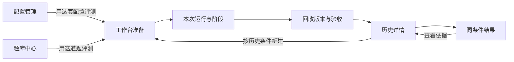

# 前端页面、交互与数据合同

依据 U07/U10：采用 Gemini 有效产品逻辑，补全真实功能，视觉冗杂以后调整。本文与 [总架构](PROJECT_SPEC.md)共同约束实现，不以“保留主题/导航”代替产品对齐。差异证据见 [Gemini 对齐审计](architecture/GEMINI_ALIGNMENT.md)，实施状态见总架构第8节。

## 1. 信息架构与用户方向感

保留六个入口：评测工作台、配置管理、题库中心、评测历史、同条件结果、原理与规范。它们分别回答：本次怎么做、用什么规则、做什么、以前发生了什么、结果差在哪、判断依据是什么。

主线是单配置、单项目。对比与批量准备由用户主动开启，不让初次使用者先面对两套配置、五道题和复杂参数。说明与动作贴近，不在顶部堆多张重复解释同一件事的卡片。

图中“用这套/道评测”和“按历史条件新建”是目标连接，当前尚未完整实现。跳转必须携带实体ID和版本语境，不能只切页面让用户重新找。

## 2. 评测工作台：准备

|区域|目标信息与动作|当前情况/补齐项|
|---|---|---|
|选择配置|名称、revision、模型/档位、规则/技能摘要；默认一套|基础已接；来自配置页的指定选择需补|
|可选对照|字段矩阵、规则差异、技能内容变化、未知条件|当前是正文+JSON，矩阵缺失|
|选择题目|项目/修复、方向、难度、搜索；一次聚焦一道|只有题类和标题搜索|
|题目预览|总体需求、项目契约、阶段、起点、验收计划、来源准备度|主要显示题面文本与检查数，结构化契约缺失|
|评分策略|主分支、适用人工维度、必要证据、即时公式解释|可改数值，说明需增强；示例不进入历史|
|准备摘要|配置×题目对应几个目录、从哪里复制、尚不调用模型|基础已接；实际规则合成与冲突需补|

未选配置/题目时按钮禁用并指向对应入口；无脚本时明确提示可选纯人工策略，不假定“必须先会写Docker测试”。选择批量时显示准备数量与分别执行方式，不自动发送多个需求。

创建请求返回不确定时复用requestId，避免重复目录。成功进入该Run详情；不能只弹“已保存”让用户找不到任务。当前已有幂等准备与进入详情。

## 3. 本次运行：桌面执行与验收

持续可见：题目/配置版本、当前阶段、实际工作目录、当前快照、下一可做动作。左侧切换Trial，主体聚焦当前一题；多题列表不是多个并行自动进度条。

按阶段显示“打开目录 → 核对并发送 → 等待 → 回收 → 验收 → 确认继续/结束”。打开、复制、记录开始明确不同；不显示虚假的“已发给Codex”。动作前提见 [执行合同](architecture/EXECUTION_AND_EVIDENCE.md)。

目标复审区保留 Gemini 六类材料的信息分工，使用页内区域或有明确上下文的详情，不恢复巨型无关联弹窗：

|材料区|用户看什么|操作与证据|
|---|---|---|
|需求与契约|冻结需求、故事/接口/数据/验收条目|逐条达成状态，引用证据|
|代码与文件|新增/修改/删除、完整文件、比较基点|选择回收版本；定位具体文件与行|
|检查输出|检查类别、目标条目、镜像、退出状态、时间和输出|检查当前/历史快照；重试保留旧尝试|
|AI意见|模型、材料范围、引用、遗漏、意见|显式启动；接受/驳回/待核实及理由|
|运行事实|日志归属、真实用量、条件变化、人工介入|明确导入日志，未知来源不标已核实|
|人工评价|适用维度、依据、交付等级、个人约束|初值为空，保存新版本，逐条依据可追踪|

当前具备文件/差异、检查、AI和人工基础区块；缺逐题契约、引用定位、处理争议和完整材料关联。这些属于功能接入。

验收区顶部显示“正在看哪一轮哪一份回收”。选旧回收只改变查看/补验目标，不改变活动阶段；人工评分当前只允许最新回收，旧评分只读。新回收后提示原评分属于旧版。

## 4. 配置管理

左侧选择命名配置，主体编辑模型、推理、AGENTS、技能、交互和个人约束。支持新建、保存新版本、另存、归档和恢复；导入当前全局内容标明部分导入。

目标补充：revision时间线、正文/技能/约束差异、从旧版恢复副本、用该配置进入工作台。用户不需要从巨大JSON找改了哪条规则。技能目录、hash和启用状态可读，不展示没有实际文件绑定的“技能已生效”勾。

个人约束每条有标题、具体要求、验证方式与启停；空配置不预填某位用户的镜像或反技能偏好。specialFeatures若没有执行语义，不保留能改变成绩的假开关。详见 [配置合同](architecture/CONFIGURATION.md)。

## 5. 题库中心

列表支持三个独立分类轴和搜索；详情先显示需求与契约，再是阶段、起点、验收、来源。不要让镜像命令成为最显眼的产品内容。

新建可从需求与人工验收条目开始，自动化检查为后续增强。JSON导入需预览、准备度和字段校验；不只读进内存却不提供可执行说明。

目标操作：“保存版本”“另存新题”“用于评测”“导入题包”“导入起点”。起点目录与实际工作区目录文案区分。ProjectSpec字段见 [任务合同](architecture/TASKS_AND_CONTRACTS.md)。

## 6. 评测历史

列表显示时间、名称、配置/题目版本、状态、回收数量、异常与证据完整性；可搜索题目、配置、备注和编号。详情看当时冻结条件，不用当前编辑版本替换。

目标详情包含阶段时间线、需求达成明细、快照与复审、检查尝试、实际用量和缺失原因。可导出、归档/恢复、恢复配置副本、按历史条件准备新运行。复用明确新ID和仍需核对的环境条件。

当前有历史、导出、归档、冻结配置和配置副本恢复；尚无完整按历史新建试次、任意配置revision浏览和逐题验收历史。

## 7. 同条件结果与原理说明

结果页先选可比较的题目/条件组，再看每次结果和分项差异；不足条件的记录仍在历史，并说明未纳入原因。不预设冠军，不把项目和Bug合成总榜。

说明页提供操作、公式和方法边界，不能替代准备页的“叠加层”、结果页的“样本不足”或验收页的“AI只是意见”。用户提出的细则应影响对应功能，不只变成FAQ。

## 8. 页面状态、反馈与恢复

|情形|目标行为|禁止行为|
|---|---|---|
|首次进入|读后端真实数据；展示加载或连接失败|假数据兜底、随机进度|
|空配置/空题库|具体入口与下一动作|永久显示“正在加载”|
|保存成功|就近反馈对象名和版本|所有操作只写“已保存”|
|校验失败|错误贴近字段，保留草稿|清空输入或换默认值|
|版本冲突|解释另一页面已更新，可复制草稿/另存|自动覆盖|
|后台检查|真实状态、目标快照、停止拥有任务|假装能停止桌面|
|服务重启|重载记录，解释恢复动作|清空数据恢复默认|
|渲染异常|安全错误边界、返回/重试|原型localStorage全清空动作|
|未保存切页|提示或保留草稿，明确另存/放弃|无提示丢失编辑|

当前有请求错误与忙态，不等于恢复体验全部实现；B05逐项验证。草稿可以暂存，但已保存业务事实仍以服务端为准。

## 9. 公共显示规则

- 未知显示“—”，旁边说明缺少哪种证据；真实0不能显示成空。
- 测试失败、环境错误、超时、取消、未执行分开；状态不只靠颜色。
- 时间注明含义，不把等待确认的墙钟时间称为模型速度。
- 公式使用冻结策略的实际适用项；模拟算例标“演算”。
- 编号可复制；默认显示友好名称和版本，技术ID作补充。
- AI引用指向冻结版本，不能跳到仍在改的工作区。
- 差异基点明确；文件行数不直接兑换“纯净度”分。
- 字体/主题属于显示偏好，不改变实验条件。

## 10. 视觉与工程边界

保留浅色、炭黑深色、字体选择和必要过渡；不用雷达站权威换算、IQ口号和用户背景堆砌。布局使人看见“选择什么、现在做什么、结果在哪”。

输入有标签/单位；键盘焦点可见；展开区紧贴触发按钮并有状态；错误用alert、完成反馈用status。窄屏按主操作顺序排列，表格局部滚动，不以极小字体解决拥挤；尊重减少动态效果。

大规模视觉减法在B09；功能补全可调整必要布局，但不另起一套产品导航。截图、构建通过、控制台无错误都不能单独证明交互合格。

现有App负责主题/导航/请求/轮询；Runner负责准备/试次/验收；Editors负责配置/题库；Records负责历史/结果/说明。目标按需拆出项目契约、逐项验收、配置差异、证据引用和版本历史组件，不先造通用组件平台。

类型必须覆盖真实业务字段。扩展Task却不更新types/编辑器/提示词/历史，是本轮发现的断点；后续各工作包必须一起接通。

## 11. 页面验收路径

- **F-AC1**：题库选题进入工作台仍是该题；配置同理；历史定位具体Run。
- **F-AC2**：新建含故事/接口/数据/验收的题，保存重载、准备、验收各处一致。
- **F-AC3**：逐项人工复审能同时看目标与证据，0/未知/不适用区分，历史可解释。
- **F-AC4**：A/B矩阵显示真实差异，结果分项能回到当时证据。
- **F-AC5**：断网、冲突、无效输入、后台失败和刷新不丢已存数据，草稿有处理。
- **F-AC6**：浅/深色、字体、键盘、窄屏、减少动画实际操作检查。

浏览器验收使用本机Python同源入口。TypeScript/Vite只能证明编译层，真实桌面项目评测另见 [后端完成合同](architecture/BACKEND_DELIVERY.md)。
