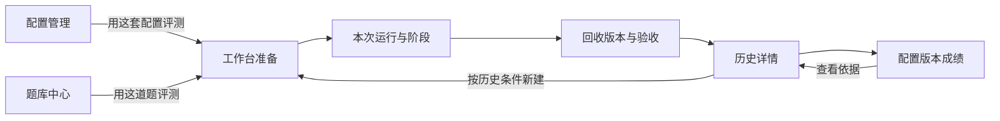

# 前端页面、交互与数据合同

依据U27：Gemini为初始前端来源，产品以Codex桌面底座上的个人配置评测为中心。本文与总架构共同约束当前交互和真实数据，不用原型题目或说明决定功能。实施状态只看总架构第8节。

## 1. 信息架构与用户方向感

七个入口：评测工作台、评测历史、配置成绩、任务库、配置库、数据与存储、方法说明。分别回答本次怎么做、以前发生了什么、各配置版本的成绩与原始记录、做什么、用什么规则、数据在哪与如何清理、判断依据是什么。配置成绩替代单独横向比较页；仍可按模型筛选，个人 Harness 比较优先保持同模型。

主线是单配置、单项目。批量选题由用户主动开启，同一配置可选最多十题；创建后形成逐项手动执行的独立工作区队列。说明与动作贴近，不在顶部堆多张重复解释同一件事的卡片。

图中题库“保存并用于评测”已携带所保存题ID进入准备页；配置“保存并用于评测”也已带入配置；“按历史条件新建”仍为目标连接。跳转必须携带实体ID和版本语境，不能只切页面让用户重新找。

## 2. 评测工作台：准备

准备流程使用“选题 / 配置 / 创建工作区”三个顺序步骤，切换保留选择。第三步实际包含评分方案核对，只有该步的最后按钮才创建独立工作区。顶部步骤本身可点击返回已可达步骤，按钮按选择前提禁用；底部仍提供上一步/下一步，面包屑返回工作空间。不把视觉步骤名称误当成已执行的模型轮次。异步准备按已完成题数和当前阶段展示真实进度；复制工作区阶段不冒充下载字节百分比。

### U37 暖色编辑式工作台视觉合同

原始视觉目标为 [用户选中的参考图](design/2026-09-24/generated-direction-01.png)。上一版深色看板只保存在 Git 备份分支 `codex/frontend-redesign-u36`；U37 从改版前的 `3084335` 建新分支实现，避免前后两套样式叠加。参考图只提供排版、层级、配色与字体方向，题目、仓库、统计及操作必须使用当前真实数据。

- 宽屏左侧约 248px 暖白导航；橘红方标和当前页左侧细线；标题以自托管 Noto Serif SC 重字重接近参考图的宋体笔画，正文为自托管 Noto Sans SC。保留可选阅读字体和深色模式。字体、许可证在 `frontend/public/fonts/`，波形装饰在 `frontend/public/visuals/`。
- 工作台首屏用大标题、低对比等高线和横向三步流程；下方约 56/44 双栏，左侧搜索、真实分类与可滚动任务列表，右侧当前任务、固定仓库起点、要求预览和明确的继续配置按钮。示例图中的星数、日期和题号不编造到页面。
- 分类、搜索、方向与难度始终取真实题库；单题模式下筛选让右侧详情跟随可见选择。批量选题放在列表工具栏，跨筛选保留已选清单，逐项聚焦题面或移除；十题上限直接禁选新题，不能悄悄挤掉旧题。高级过滤仍可展开。详情短览可展开完整题面与工作区存放说明；准备和运行的现有状态机不因换皮改变。
- 平板折叠为上下布局，手机隐藏侧栏改菜单；筛选浮层不得溢出视口，任务列表与详情各自滚动。键盘可达、清晰焦点、减少动态效果设置继续有效。

配置下拉旁提供独立预览面板，模型/档位、规则、原生设置和工具开关不堆在准备正文。准备页只读展示已保存配置的模型、档位、速度和 Skills 数量；修改统一跳转配置库并保存新版本。本次不再提供临时 Skills 覆盖或两配置混合创建入口。配置库中的技能选择面板合并来源、搜索和列表；勾选时调用已有冻结导入接口并立即选中。取消选择不删除历史快照；上限30、同名冲突与源文件变化校验沿用现有协议。

配置预览和技能面板采用原生dialog，支持Esc关闭、焦点返回与窄屏。技能详情浮层在dialog内显示。配置管理也共用勾选即冻结的技能面板，不再要求先导入再到另一列表选中。

新评分步骤显示机器维度、联动权重滑条和可展开的评分锚点；合计100%。非UI题排除UX。旧比例方案只用于已有记录。结果页用圆环显示最终/暂定分、条形显示分项；机器原分与人工修正同时保留，修正需理由/证据，可撤回。完整规则见评分合同。

最后一步的主要按钮为“创建评测工作区”，执行规则/技能装载后进入Run详情；不表示已切换宿主全局设置或发送桌面任务。评分在独立步骤展开，备注保留在该步骤。旧记录可能有历史临时 Skills 覆盖，仍标出但不合入配置均分。

|区域|目标信息与动作|当前情况/补齐项|
|---|---|---|
|选择配置|名称、revision、模型/档位、规则/技能摘要；默认一套|只选已有配置并预览；导入、编辑集中在配置管理，保留配置页带入|
|配置成绩|版本均分、按题分数、重复测试与原记录|同题先平均、各题等权，归档保留；无有效最终分时显示原因|
|选择题目|项目/修复、方向、难度、搜索；一次聚焦一道|共用三轴筛选与标题/描述/提示词搜索|
|题目预览|总体需求、项目契约、阶段、起点、验收计划、来源准备度|已有Spec/范围/逐项条目阅读；统一准备度模型待补|
|评分策略|机器维度权重、实际检查计划、评分依据|联动合计100%；新方案机器先评，旧Run沿用冻结策略|
|准备摘要|配置×题目对应几个目录、从哪里复制、尚不调用模型|基础已接；实际规则合成与冲突需补|

未选配置/题目时按钮禁用并指向对应入口；无脚本也可用机器裁判；缺源码的修复题提示导入起点，不允许直接开始。选择批量时显示准备数量与分别执行方式，不自动发送多个需求。

创建请求返回不确定时复用requestId，避免重复目录。成功进入该Run详情；不能只弹“已保存”让用户找不到任务。当前已有幂等准备与进入详情。

## 3. 本次运行：桌面执行与验收

持续可见：题目/配置版本、当前阶段、实际工作目录、当前快照、下一可做动作。目录标“已创建的工作区”，复制按钮标“复制路径”；有技能时可展开查看来源、版本和本次路径。批量时顶部显示逐题待办队列、状态及原分，点击聚焦一个试次；多个目录不是并行自动进度条，也不能保证手工同时运行不受共享宿主设置影响。

默认显示“完整需求 → 桌面执行/按需继续对话 → 回收版本 → 整题评分”。不显示1/2轮作为完成门槛；配置决定真实交互策略。准备页默认完整交付，分阶段为可选项。已回收随时可标记整题结束；若选择下一预设步骤，正文展示提示词和复制按钮。新工作区执行页先显著展示“应用冻结配置”，明确写入模型、档位、速度、规则和 Skills；完成应用后开放桌面新对话入口，已有桌面任务仍需核对实际模型。桌面开始由原生日志自动同步，手动记录在后备入口；不显示虚假的“已发给Codex”。动作前提见 [执行合同](architecture/EXECUTION_AND_EVIDENCE.md)。

目标复审区保留 Gemini 六类材料的信息分工，使用页内区域或有明确上下文的详情，不恢复巨型无关联弹窗：

|材料区|用户看什么|操作与证据|
|---|---|---|
|需求与契约|冻结需求、故事/接口/数据/验收条目|逐条达成状态，引用证据|
|代码与文件|新增/修改/删除、完整文件、比较基点|选择回收版本；定位具体文件与行|
|检查输出|检查类别、目标条目、镜像、退出状态、时间和输出|检查当前/历史快照；重试保留旧尝试|
|AI意见|模型、材料范围、引用、遗漏、意见|显式启动；接受/驳回/待核实及理由|
|运行事实|日志归属、输入/输出、缓存比例条、活动时间|自动读取匹配会话，保留手动导入；未知来源不标已核实|
|人工评价|适用维度、依据、交付等级、个人约束|初值为空，保存新版本，逐条依据可追踪|

当前具备冻结契约、逐条验收、文件/检查引用与历次复审；逐行引用跳转、AI争议处理、截图/运行预览仍待补。这些属于功能接入。

验收区顶部显示“正在看哪一轮哪一份回收”。选旧回收只改变查看/补验目标，不改变活动阶段；人工评分当前只允许最新回收，旧评分只读。新回收后提示原评分属于旧版。

模型统一使用完整选项下拉框，切换不需先删除当前值。机器评分动作集中为模型、环境、评分按钮；本机环境为新页面默认，Docker仍可选。原始证据和完整量表按需展开，执行/评分/产物页保持分工。

多阶段题在执行页列出阶段和当前位置。非最后阶段回收后留在执行页，可直接继续；评分页标“阶段检查（可选）”，其分数标“阶段参考分”。最后阶段才进入最终产物评分，交付结束及证据齐全后形成整题总分。模型下拉只显示一次友好名称，API仍使用原模型ID。

## 4. 配置管理

左侧选择命名配置，主体编辑模型、推理、AGENTS、技能、交互和个人约束。支持新建、保存新版本、另存、归档、恢复及归档后的显式永久删除；初始保护配置不走普通永久删除。导入当前全局内容标明部分导入。Skills 面板按用户级、指定项目、自定义技能库读取列表，支持搜索、多选、批量导入并加入草稿；保存后自动装载到工作区。来源与调用规则见[配置合同](architecture/CONFIGURATION.md)。

Skills 在配置库使用紧凑列表：默认勾选框、名称、详情入口；同名才附来源标识。悬停名称提供用途与路径，详情用页面层浮层呈现文件数与哈希，支持键盘焦点、点击固定、Esc关闭，不把完整路径正文常驻列表。工作台只读显示冻结后的技能数量和调用方式。

已接全局一键导入、项目规则预览后导入、来源文件/默认值说明、技能调用方式、保存并用于评测。revision时间线、正文/技能/约束差异和任意旧版恢复副本仍待补。用户不需要从巨大JSON找改了哪条规则。技能目录、hash和启用状态可读，不展示没有实际文件绑定的“技能已生效”勾。

个人约束每条有标题、具体要求、验证方式与启停；空配置不预填某位用户的镜像或反技能偏好。specialFeatures若没有执行语义，不保留能改变成绩的假开关。详见 [配置合同](architecture/CONFIGURATION.md)。

## 5. 题库中心

列表支持三个独立分类轴和搜索；详情先显示需求与契约，再是阶段、起点、验收、来源。不要让镜像命令成为最显眼的产品内容。

新建可从原始需求开始，机器裁判复用通用取证流程，专用脚本为增强。起点支持本地目录或公开GitHub URL+完整commit SHA下载；保存后才用于新评测。源码下载完成不能显示成依赖环境已就绪。JSON导入需预览、准备度和字段校验；不只读进内存却不提供可执行说明。

目标操作：“保存版本”“另存新题”“用于评测”“导入题包”“导入起点”。起点目录与实际工作区目录文案区分。ProjectSpec字段见 [任务合同](architecture/TASKS_AND_CONTRACTS.md)。

## 6. 评测历史

列表显示时间、名称、配置/题目版本、状态、回收数量、异常与证据完整性；可搜索题目、配置、备注和编号。详情看当时冻结条件，不用当前编辑版本替换。

目标详情包含阶段时间线、需求达成明细、快照与复审、检查尝试、实际用量和缺失原因。可导出、归档/恢复、恢复配置副本、按历史条件准备新运行。复用明确新ID和仍需核对的环境条件。

历史列表可直接展开本次评测的目录：逐试次清理工作区、恢复或永久删除工作区文件，与整次评测及记录永久删除分开。删除只覆盖本站管理的目录；Codex 桌面侧栏任务/对话和手动 ZIP 不会随之清理。当前还有导出、归档、冻结配置/项目契约、逐题验收及复审修订历史、配置副本恢复；尚无完整按历史新建试次和任意配置revision浏览。

## 7. 配置成绩与原理说明

结果页默认展示当前配置版本与参考均分，可按当前／历史／已归档配置及模型筛选。展开后先按 DeepSWE、项目内置、开放需求、自定义等来源分组，再列题目版本、重复测试和原评测链接；来源均分只是阅读辅助，总分仍按题等权。归档配置与归档评测仍在，未完成或条件变化列在明细并解释排除；已归档配置可在此永久删除，成绩卡随配置版本消失，但已冻结在评测中的副本与证据保留。配置版本一旦修改就另算，评分方案或裁判模型、档位、提示词协议不同不合成均分。同题对照只用两边共同的题目版本，在模型、档位、速度、评分与裁判协议一致时显示差值。不同配置题目覆盖不同时不直接排高低；同题同条件分析仍需人工核对源码、桌面版本和随机性；不预设冠军或置信区间。公开模型发布表格可借鉴多指标、样本和方法来源的表达，不能把示例榜单逐项列成本站必答 FAQ。

说明页提供操作、公式和方法边界，不能替代准备页的“叠加层”、结果页的“样本不足”或验收页的“AI只是意见”。用户提出的细则应影响对应功能，不只变成FAQ。

## 8. 页面状态、反馈与恢复

|情形|目标行为|禁止行为|
|---|---|---|
|首次进入|读后端真实数据；展示加载或连接失败|假数据兜底、随机进度|
|空配置/空题库|具体入口与下一动作|永久显示“正在加载”|
|保存成功|就近反馈对象名和版本|所有操作只写“已保存”|
|校验失败|错误贴近字段，保留草稿|清空输入或换默认值|
|版本冲突|解释另一页面已更新，可复制草稿/另存|自动覆盖|
|后台检查|真实状态、目标快照、停止拥有任务|假装能停止桌面|
|服务重启|重载记录，解释恢复动作|清空数据恢复默认|
|渲染异常|安全错误边界、返回/重试|原型localStorage全清空动作|
|未保存切页|提示或保留草稿，明确另存/放弃|无提示丢失编辑|

当前有请求错误与忙态，不等于恢复体验全部实现；B05逐项验证。草稿可以暂存，但已保存业务事实仍以服务端为准。

## 9. 公共显示规则

- 未知显示“—”，旁边说明缺少哪种证据；真实0不能显示成空。
- 测试失败、环境错误、超时、取消、未执行分开；状态不只靠颜色。
- 时间注明含义，不把等待确认的墙钟时间称为模型速度。
- 公式使用冻结策略的实际适用项；模拟算例标“演算”。
- 编号可复制；默认显示友好名称和版本，技术ID作补充。
- AI引用指向冻结版本，不能跳到仍在改的工作区。
- 差异基点明确；文件行数不直接兑换“纯净度”分。
- 主题属于显示偏好，不改变实验条件；统一字体，不提供无实际区别的切换。

## 10. 视觉与工程边界

保留浅色、炭黑深色和必要过渡，移除字体选择；不用雷达站权威换算、IQ口号和用户背景堆砌。布局使人看见“选择什么、现在做什么、结果在哪”。

输入有标签/单位；键盘焦点可见；展开区紧贴触发按钮并有状态；错误用alert、完成反馈用status。窄屏按主操作顺序排列，表格局部滚动，不以极小字体解决拥挤；尊重减少动态效果。

大规模视觉减法在B09；功能补全可调整必要布局，但不另起一套产品导航。截图、构建通过、控制台无错误都不能单独证明交互合格。

现有App负责主题/导航/请求/轮询与题目选择语境；Prepare负责本次准备；Runner负责试次/验收；Editors负责配置/题库；Skills共用来源导入和紧凑选择；Contracts负责契约编辑/阅读、共享筛选、JSON预览和复审明细；Records负责历史/结果/说明。目标按需拆出配置差异、证据引用和版本历史组件，不先造通用组件平台。

类型必须覆盖真实业务字段。9月15日发现的Task断点已通过Contracts与后端版本2接通；后续扩展仍需同步类型、编辑器、提示词和历史，不能只透传字段。

## 11. 页面验收路径

- **F-AC1**：题库选题进入工作台仍是该题；配置同理；历史定位具体Run。
- **F-AC2**：新建含故事/接口/数据/验收的题，保存重载、准备、验收各处一致。
- **F-AC3**：逐项人工复审能同时看目标与证据，0/未知/不适用区分，历史可解释。
- **F-AC4**：A/B矩阵显示真实差异，结果分项能回到当时证据。
- **F-AC5**：断网、冲突、无效输入、后台失败和刷新不丢已存数据，草稿有处理。
- **F-AC6**：浅/深色、文字可读性、键盘、窄屏、减少动画实际操作检查。

浏览器验收使用本机Python同源入口。TypeScript/Vite只能证明编译层，真实桌面项目评测另见 [后端完成合同](architecture/BACKEND_DELIVERY.md)。

## 12. 配置应用与指标入口

配置页分清“从Codex导入”和“保存并应用到Codex”；应用区展示全局目标、替换范围、当前活动应用和撤销。评测详情使用冻结版本应用。评分方案显示依据、可选项及自定义项；结果把必要项/检查/约束/Token/时长/未知指标展开呈现。有效配置与实际模型行为仍需桌面执行证据，按钮成功只显示写入回执。

U19旧评分交互：主比例用一根滑条联动客观/人工。维度权重拖动时固定当前项，其余按原比例分配剩余基点，增删后仍合计100.00%，不用手工归一。结果页真实评分/裁定使用滑条并保留精确输入与清除；未知不默认为0，分数不联动。Skills同时只有一个预览，90ms悬停、80ms离开宽限、120ms淡入，快速切项立即替换旧卡；Esc只关闭预览，尊重减少动画。检查区优先展示数量/状态/要求，执行原理按需展开。

单配置单题创建页默认勾选“创建后打开Codex新对话并预填提示词”；批量不自动打开多个窗口。试次首轮可重新打开草稿，后续轮次继续原对话。失败保留已创建工作区并给出复制入口；成功提示仅为打开请求，不标记执行开始。首次目录信任由用户在桌面确认。

## 13. U20机器评分默认交互

新准备页仅展示统一维度权重，不再要求无脚本题选择纯人工。需求依据和环境说明分别按需展开。结果页主卡展示机器原分、已评分权重、最终分；裁判模型与“自动检查并评分”为一个主入口。分项显示静态/运行/未验证标签，证据按需展开，单项“修正”使用独立弹窗和0–100滑条，必须说明理由，支持恢复机器原分。后台错误保留记录，失败保存不关闭修正弹窗。

机器缺项标暂定，不把覆盖率叫成功率。旧记录明确保留旧算法；新回收/重评不继承旧修正。过程指标收拢为次级区。真实AI/浏览器链路仍须运行验证，UI测试夹具不可出现在正式数据或冒充成绩。

## 14. U21评测详情减法

详情改为“执行 / 评分 / 产物与记录”三页签；单题取消重复侧栏，多试次通过顶部选择器切换。准备/执行/待确认默认执行页，已回收默认评分页；进入下一阶段回执行页。页签切换保留未提交说明、裁判选择和证据选择，支持方向键、Home/End。

顶部只展示题目、交付方式/可选步骤、已回收版本数、状态、配置预览及Codex配置入口。配置变更/读取失败摘要保持可见，应用、撤销、核对、写入位置集中在弹窗；原权限限制不变。执行页集中打开、复制提示词、回收和结束/继续；目录与说明按需展开，完整提示词/契约和配置/Skills通过独立预览保留。

评分页将模型选择与评分/停止放在同一行。无报告时不渲染空分数卡和重复“等待评分”行；失败原因仍可展开，原始报错不改写。有报告才显示原分、覆盖率、最终分、逐项证据与人工修正。空需求/空执行日志不占折叠行，评分标准始终可查。产物页保留快照、文件、差异、历次复审、JSONL导入、完整用量、冻结条件/恢复及活动记录；无日志时不铺空Token卡。说明删除重复部分，功能和证据不删除。

引用局部失败显示“引用校验·N项未计分”，不清空其他有效项；原行号与唯一原文定位后的行号同时可查。Windows本机浏览器取证未接通须在裁判环境说明中明确显示，不把环境未验证当项目失败。

### U25 模型、执行监控和阅读设置

配置模型与推理档位联动，只显示本机已确认支持项；旧无效值标明不支持，不伪装已修正。裁判默认 Luna/max，无能力记录不自动换模型。评分过程集中在评分卡的单个折叠入口，展开时刷新命令证据，不堆在主操作区。

侧栏“阅读设置”提供微软雅黑、等线、宋体、楷体和系统字体，字号标准/舒适/大字；默认微软雅黑、18px根字号。偏好仅保存在本机浏览器，未安装字体使用同类后备，代码保持等宽。测试应核对字体实际计算样式及窄屏，不能仅因选项存在宣称视觉验证通过。

### U26 配置库、题库与选题工作区

维持Gemini六个产品入口；配置管理和题库改为左侧对象库、右侧集中工作区。对象库单独滚动，编辑器顶部固定标题和主要动作，分区导航只展示当前内容，避免巨型纵向表单。配置四区为模型与规则、Skills、工具与原生设置、应用；删除位于标题旁，导入/回收站位于对象库底部。

题库四区为题目概览、编辑需求、验收与步骤、源码与导入；默认概览横向展示需求和环境。工作台选择题目时，左侧卡片、右侧即时预览，不再把完整详情追加到长列表底部。可开始与待补全分开，缺源码的修复题禁用选用，来源和源码文件清单可查。准备页只读展示所选配置，Skills 的修改在配置库完成。原有题目编辑、检查、来源许可、归档恢复及自定义导入能力保留。

U28采用暖灰底、墨绿导航与陶土橙主操作，选中线统一层级；暗色使用对应对比色。标题、导航与控件使用清晰无衬线字体，题面正文/规则使用用户选定阅读字体，代码路径保留等宽字体。窄屏改成单列并限制列表高度，编辑内容自然展开；折叠只用于次要明细，主要操作不埋入说明段落。

### U27 原理页与公开题源

原理页重写为“项目定位 / 使用与评分 / 题库与公开来源”三个分区。首屏三层图说明桌面底座、模型条件和主要比较变量个人配置；使用区给出四步流程及程序/AI/人工分工，权重读当前策略并转成可读百分比。实际使用限制收进相关明细，不显示原型题面数量和旧算法迁移过程。

公开题源展示固定版本DeepSWE113条元数据，支持名称/仓库搜索、语言筛选和题面/环境/验收器链接；题库中心提供同一浏览面板。U29题库面板增加题包与固定源码下载，成功后才加入state.tasks；索引本身不计入可运行数。不得在指南中把调研完成写成已接入运行。

### U28 全站视觉与交互升级

参考用户提供的三条X链接和photo-abstract-editorial，选择OpenAI Product Design作为唯一设计工作流；其余参考面向海报/插画，不混入应用界面。选用版本为openai/plugins `1dc195897af4161d039b80d8471ec0a10c9bbc89`。下载集中在本机 `.local/frontend-redesign/`，来源回执为其中SOURCES.md；不安装到C盘或全局Skills，不提交下载内容。

六入口改为固定侧栏，顶栏只保留位置和刷新；小屏为可关闭抽屉，关闭后不能聚焦隐藏菜单，支持Esc返回按钮。全站使用共享颜色/间距/控件样式，暖灰画布、墨绿侧栏、陶土橙强调；暗色有独立色值。导航/控件用无衬线字体，正文和规则保留阅读字体选择，代码使用等宽。

工作台首屏显示真实配置/可开始题目/记录数量；三步进度与底部动作一致。题目为紧凑列表加预览，配置与Skills并列，预览和技能选择共用弹窗。配置/题库保留左库右编辑结构；历史改成任务/条件/状态/时间/操作对齐的行列表，提供搜索及无匹配状态。评分、产物、比较与说明沿用同一组件层级，未知分数和失败原因继续真实显示。

按钮、选中、页内内容与弹窗使用160–260ms轻过渡；遵循prefers-reduced-motion。保留键盘焦点、原生dialog的Esc关闭和焦点返回，技能详情继续互斥。图标操作有名称和提示，不以视觉改版移除业务入口。新增样式集中在workspace.css，页面结构仍由现有组件提供；不新增UI运行依赖。

### U29 操作入口与数据管理

题库与准备页优先“已有仓库任务”，另有“从零构建”“仅Bug修复”；起点就绪与待补全分开，前者不声称依赖已安装。U31改为直接选题、创建时按需准备，全部类型默认可见（4修复/106功能/3改进）；不再以预下载作为必经步骤。公开题按可选数展示，不称环境全已准备；旧缺源码题面仍放待补全。后台阶段、失败重试和中断可查，准备期间禁用修改；完成后自动进入评测。环境和原测试状态分别保留。

第七入口“数据与存储”：顶部真实占用摘要；搜索/筛选和紧凑记录列表，选中后右侧显示目录占用、产物入口和当前可用清理动作；窄屏列表有高度上限，详情在下方。存储分区与路径放二级详情。清理确认保留证据范围，永久删除必须输入指定文字；错误在对话框内展示，不静默关闭。没有用户记录时给空态，不造示例。

### U30 运行环境与测试验收

Tengo两题与Yaegi Embed在创建时自动准备Windows环境；题库保留“核对本机环境”次级动作。准备中显示阶段并禁用重复提交；成功显示本机环境已验证。评分页的项目测试验收与AI评分分区，目标测试数、回归数和结论横向展示，窄屏换行。运行/停止为主操作；逐组日志、未通过列表、同快照历史放次级明细。产物版本切换后能查看对应测试历史；旧成绩不会冒充新版本结果。数据页计入固定工具链、环境核验与测试日志占用。

U31历史标签将文字和数字徽标固定同行，按钮不压缩、暗色容器不额外铺底；工具栏空间不足时搜索移到下一行。工作台题目预览明确缓存复用/新工作区，路径规则放次级详情。准备阶段必须与实际后台状态一致，失败保留重试入口，不显示假成功。

### U32 筛选与任务状态可读性

方向/难度选项来自当前来源、搜索和可选/待补全列表，各自按另一筛选维度显示数量；切换范围后失效选择清空，未标注不猜等级。完整需求是默认行为，分步提供仅多步题显示二级实验入口，不限制对话次数。历史按当前回收证据显示已评分待结束、部分评分、待评分、失败待处理和执行状态；评分不自动结束交付。

DeepSWE主行仅选用与来源/缓存入口，展开区域独占一行，缓存与上游链接集中；不再全局显示陈旧下载完成通知。原生dialog覆盖父级space-y外边距、视口居中，固定标题、内部正文滚动；任务文本采用阅读正文样式，来源哈希/合同折叠保留。API等值在用量区一行显示，公式、单价日期/官方来源、未知值与附加费边界折叠，不充作实际账单。

## U33–U34 评分与人工操作

评分页按原题验收→产物查阅/人工复核→AI质量参考组织，说明结果参考性质。裁判模型、有效思考档位、预算、环境相邻；长说明收进详情。评分过程展示实际提示词、公开进度、耗时/预算和位置。

人工复核弹窗采用文件列表/内容双栏、窄屏单栏；选择回收版本后才读取。运行说明、副本操作、预览地址与人工评价各折叠展开；UX须实际体验，未检项留空。人工历史展示覆盖率和依据；不能因为AI失败就屏蔽人工入口。数据页分别提供工作区清理与整评测删除的范围确认，配置页显示最初备份及显式恢复。原理新增八项榜单来源页和两类评价说明。

## U35 本机清单、速度与阅读修正

工具与插件只解释和列出当前本机 `config.toml` 中的已配置项，提供手动刷新；标题不引用任何私人插件名称，不声称后台自动发现安装或更新。配置模型/推理/执行速度同屏，Fast 不支持时禁用；准备预览可看到冻结的速度档位。评分页独立选择裁判模型/思考/速度/预算/环境，Docker 不能选择未验证的 Fast。实际报告写“请求 Fast”，不冒充服务端生效值。

题库窄侧栏的方向与难度各占整行，大字设置下保留完整选项和数量。评分过程概要字级与相邻说明一致，命令折叠列表限高滚动，完整命令和输出仍可展开。API等值估算改为纵向先给金额、再全宽展开换算依据，避免压成窄栏。裁判报告校验失败且保存原文时显示“重新校验已保存报告 · 不调用模型”；恢复后仍显示未验证项和原报告来源。归档与整评测删除保留数据页既有入口。
