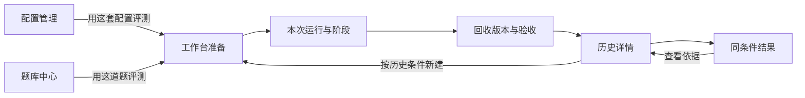

# 前端页面、交互与数据合同

依据 U07/U10：采用 Gemini 有效产品逻辑，补全真实功能，视觉冗杂以后调整。本文与 [总架构](PROJECT_SPEC.md)共同约束实现，不以“保留主题/导航”代替产品对齐。差异证据见 [Gemini 对齐审计](architecture/GEMINI_ALIGNMENT.md)，实施状态见总架构第8节。

## 1. 信息架构与用户方向感

保留六个入口：评测工作台、配置管理、题库中心、评测历史、同条件结果、原理与规范。它们分别回答：本次怎么做、用什么规则、做什么、以前发生了什么、结果差在哪、判断依据是什么。

主线是单配置、单项目。对比与批量准备由用户主动开启，不让初次使用者先面对两套配置、五道题和复杂参数。说明与动作贴近，不在顶部堆多张重复解释同一件事的卡片。

图中题库“保存并用于评测”已携带所保存题ID进入准备页；配置“保存并用于评测”也已带入配置；“按历史条件新建”仍为目标连接。跳转必须携带实体ID和版本语境，不能只切页面让用户重新找。

## 2. 评测工作台：准备

准备流程使用“选择题目 / 配置与Skills / 评分方案”三个全宽顺序步骤，切换保留选择。顶部仅显示进度，底部统一上一步/下一步，最终步骤才显示“创建评测工作区”。不再同时提供可点击页签和多个正文跳转按钮。

配置下拉旁提供独立预览面板，模型/档位、规则、原生设置和工具开关不堆在准备正文；对比只保留复选框入口。本次Skills仅显示数量、选中项、调用方式和“选择技能”。选择面板合并来源、搜索和列表；打开自动读本机技能，勾选时调用已有冻结导入接口并立即选中，不再先导入再到另一列表勾选。取消选择不删除历史快照。项目/自定义来源输入目录后读取；保存失败保留错误，不伪装选中；上限30、同名冲突与源文件变化校验沿用现有协议。

配置预览和技能面板采用原生dialog，支持Esc关闭、焦点返回与窄屏。技能详情浮层在dialog内显示。配置管理的批量导入入口仍保留，准备页不再使用其两阶段选择流程。

评分步骤依次显示主比例、实际客观检查计划、人工内部百分比与锚点、AI辅助意见说明。每项人工占比显式带%，内部合计100%，同时显示折合总分占比；非UI题显示排除UX后的比例。结果页同时保留自动原分与人工裁定，裁定需理由/证据并可查看或撤回历史。完整规则见评分合同。

最后一步的主要按钮为“创建评测工作区”，执行规则/技能装载后进入Run详情；不表示已切换宿主全局设置或发送桌面任务。评分在独立步骤展开，备注保留在该步骤。临时Skills选择不保存新配置版本，Run显示“本次技能已调整”，其来源版本与实际选择一并保留。

|区域|目标信息与动作|当前情况/补齐项|
|---|---|---|
|选择配置|名称、revision、模型/档位、规则/技能摘要；默认一套|只选已有配置并预览；导入、编辑集中在配置管理，保留配置页带入|
|可选对照|字段矩阵、规则差异、技能内容变化、未知条件|可切换两套配置查看正文/约束及本次技能，字段矩阵仍缺失|
|选择题目|项目/修复、方向、难度、搜索；一次聚焦一道|共用三轴筛选与标题/描述/提示词搜索|
|题目预览|总体需求、项目契约、阶段、起点、验收计划、来源准备度|已有Spec/范围/逐项条目阅读；统一准备度模型待补|
|评分策略|客观/人工主比例、实际检查计划、人工内部百分比与评分依据|人工内部须合计100%；显示折合总分比例，旧Run沿用冻结策略|
|准备摘要|配置×题目对应几个目录、从哪里复制、尚不调用模型|基础已接；实际规则合成与冲突需补|

未选配置/题目时按钮禁用并指向对应入口；无脚本时明确提示可选纯人工策略，不假定“必须先会写Docker测试”。选择批量时显示准备数量与分别执行方式，不自动发送多个需求。

创建请求返回不确定时复用requestId，避免重复目录。成功进入该Run详情；不能只弹“已保存”让用户找不到任务。当前已有幂等准备与进入详情。

## 3. 本次运行：桌面执行与验收

持续可见：题目/配置版本、当前阶段、实际工作目录、当前快照、下一可做动作。目录标“已创建的工作区”，复制按钮标“复制路径”；有技能时可展开查看来源、版本和本次路径。左侧切换Trial，主体聚焦当前一题；多题列表不是多个并行自动进度条。

按阶段显示“打开目录 → 核对并发送 → 等待 → 回收 → 验收 → 确认继续/结束”。打开、复制、记录开始明确不同；不显示虚假的“已发给Codex”。动作前提见 [执行合同](architecture/EXECUTION_AND_EVIDENCE.md)。

目标复审区保留 Gemini 六类材料的信息分工，使用页内区域或有明确上下文的详情，不恢复巨型无关联弹窗：

|材料区|用户看什么|操作与证据|
|---|---|---|
|需求与契约|冻结需求、故事/接口/数据/验收条目|逐条达成状态，引用证据|
|代码与文件|新增/修改/删除、完整文件、比较基点|选择回收版本；定位具体文件与行|
|检查输出|检查类别、目标条目、镜像、退出状态、时间和输出|检查当前/历史快照；重试保留旧尝试|
|AI意见|模型、材料范围、引用、遗漏、意见|显式启动；接受/驳回/待核实及理由|
|运行事实|日志归属、真实用量、条件变化、人工介入|明确导入日志，未知来源不标已核实|
|人工评价|适用维度、依据、交付等级、个人约束|初值为空，保存新版本，逐条依据可追踪|

当前具备冻结契约、逐条验收、文件/检查引用与历次复审；逐行引用跳转、AI争议处理、截图/运行预览仍待补。这些属于功能接入。

验收区顶部显示“正在看哪一轮哪一份回收”。选旧回收只改变查看/补验目标，不改变活动阶段；人工评分当前只允许最新回收，旧评分只读。新回收后提示原评分属于旧版。

## 4. 配置管理

左侧选择命名配置，主体编辑模型、推理、AGENTS、技能、交互和个人约束。支持新建、保存新版本、另存、归档和恢复；导入当前全局内容标明部分导入。Skills 面板按用户级、指定项目、自定义技能库读取列表，支持搜索、多选、批量导入并加入草稿；保存后自动装载到工作区。来源与调用规则见[配置合同](architecture/CONFIGURATION.md)。

Skills共用紧凑列表：默认勾选框、名称、详情入口；同名才附来源标识。悬停名称提供用途与路径，详情用页面层浮层呈现文件数与哈希，支持键盘焦点、点击固定、Esc关闭，不把完整路径正文常驻列表。工作台已选项显示可移除的名称标签。

已接全局一键导入、项目规则预览后导入、来源文件/默认值说明、技能调用方式、保存并用于评测。revision时间线、正文/技能/约束差异和任意旧版恢复副本仍待补。用户不需要从巨大JSON找改了哪条规则。技能目录、hash和启用状态可读，不展示没有实际文件绑定的“技能已生效”勾。

个人约束每条有标题、具体要求、验证方式与启停；空配置不预填某位用户的镜像或反技能偏好。specialFeatures若没有执行语义，不保留能改变成绩的假开关。详见 [配置合同](architecture/CONFIGURATION.md)。

## 5. 题库中心

列表支持三个独立分类轴和搜索；详情先显示需求与契约，再是阶段、起点、验收、来源。不要让镜像命令成为最显眼的产品内容。

新建可从需求与人工验收条目开始，自动化检查为后续增强。JSON导入需预览、准备度和字段校验；不只读进内存却不提供可执行说明。

目标操作：“保存版本”“另存新题”“用于评测”“导入题包”“导入起点”。起点目录与实际工作区目录文案区分。ProjectSpec字段见 [任务合同](architecture/TASKS_AND_CONTRACTS.md)。

## 6. 评测历史

列表显示时间、名称、配置/题目版本、状态、回收数量、异常与证据完整性；可搜索题目、配置、备注和编号。详情看当时冻结条件，不用当前编辑版本替换。

目标详情包含阶段时间线、需求达成明细、快照与复审、检查尝试、实际用量和缺失原因。可导出、归档/恢复、恢复配置副本、按历史条件准备新运行。复用明确新ID和仍需核对的环境条件。

当前有历史、导出、归档、冻结配置/项目契约、逐题验收及复审修订历史、配置副本恢复；尚无完整按历史新建试次和任意配置revision浏览。

## 7. 同条件结果与原理说明

结果页先选可比较的题目/条件组，再看每次结果和分项差异；不足条件的记录仍在历史，并说明未纳入原因。不预设冠军，不把项目和Bug合成总榜。

说明页提供操作、公式和方法边界，不能替代准备页的“叠加层”、结果页的“样本不足”或验收页的“AI只是意见”。用户提出的细则应影响对应功能，不只变成FAQ。

## 8. 页面状态、反馈与恢复

|情形|目标行为|禁止行为|
|---|---|---|
|首次进入|读后端真实数据；展示加载或连接失败|假数据兜底、随机进度|
|空配置/空题库|具体入口与下一动作|永久显示“正在加载”|
|保存成功|就近反馈对象名和版本|所有操作只写“已保存”|
|校验失败|错误贴近字段，保留草稿|清空输入或换默认值|
|版本冲突|解释另一页面已更新，可复制草稿/另存|自动覆盖|
|后台检查|真实状态、目标快照、停止拥有任务|假装能停止桌面|
|服务重启|重载记录，解释恢复动作|清空数据恢复默认|
|渲染异常|安全错误边界、返回/重试|原型localStorage全清空动作|
|未保存切页|提示或保留草稿，明确另存/放弃|无提示丢失编辑|

当前有请求错误与忙态，不等于恢复体验全部实现；B05逐项验证。草稿可以暂存，但已保存业务事实仍以服务端为准。

## 9. 公共显示规则

- 未知显示“—”，旁边说明缺少哪种证据；真实0不能显示成空。
- 测试失败、环境错误、超时、取消、未执行分开；状态不只靠颜色。
- 时间注明含义，不把等待确认的墙钟时间称为模型速度。
- 公式使用冻结策略的实际适用项；模拟算例标“演算”。
- 编号可复制；默认显示友好名称和版本，技术ID作补充。
- AI引用指向冻结版本，不能跳到仍在改的工作区。
- 差异基点明确；文件行数不直接兑换“纯净度”分。
- 主题属于显示偏好，不改变实验条件；统一字体，不提供无实际区别的切换。

## 10. 视觉与工程边界

保留浅色、炭黑深色和必要过渡，移除字体选择；不用雷达站权威换算、IQ口号和用户背景堆砌。布局使人看见“选择什么、现在做什么、结果在哪”。

输入有标签/单位；键盘焦点可见；展开区紧贴触发按钮并有状态；错误用alert、完成反馈用status。窄屏按主操作顺序排列，表格局部滚动，不以极小字体解决拥挤；尊重减少动态效果。

大规模视觉减法在B09；功能补全可调整必要布局，但不另起一套产品导航。截图、构建通过、控制台无错误都不能单独证明交互合格。

现有App负责主题/导航/请求/轮询与题目选择语境；Prepare负责本次准备；Runner负责试次/验收；Editors负责配置/题库；Skills共用来源导入和紧凑选择；Contracts负责契约编辑/阅读、共享筛选、JSON预览和复审明细；Records负责历史/结果/说明。目标按需拆出配置差异、证据引用和版本历史组件，不先造通用组件平台。

类型必须覆盖真实业务字段。9月15日发现的Task断点已通过Contracts与后端版本2接通；后续扩展仍需同步类型、编辑器、提示词和历史，不能只透传字段。

## 11. 页面验收路径

- **F-AC1**：题库选题进入工作台仍是该题；配置同理；历史定位具体Run。
- **F-AC2**：新建含故事/接口/数据/验收的题，保存重载、准备、验收各处一致。
- **F-AC3**：逐项人工复审能同时看目标与证据，0/未知/不适用区分，历史可解释。
- **F-AC4**：A/B矩阵显示真实差异，结果分项能回到当时证据。
- **F-AC5**：断网、冲突、无效输入、后台失败和刷新不丢已存数据，草稿有处理。
- **F-AC6**：浅/深色、文字可读性、键盘、窄屏、减少动画实际操作检查。

浏览器验收使用本机Python同源入口。TypeScript/Vite只能证明编译层，真实桌面项目评测另见 [后端完成合同](architecture/BACKEND_DELIVERY.md)。

## 12. 配置应用与指标入口

配置页分清“从Codex导入”和“保存并应用到Codex”；应用区展示全局目标、替换范围、当前活动应用和撤销。评测详情使用冻结版本应用。评分方案显示依据、可选项及自定义项；结果把必要项/检查/约束/Token/时长/未知指标展开呈现。有效配置与实际模型行为仍需桌面执行证据，按钮成功只显示写入回执。

U19旧评分交互：主比例用一根滑条联动客观/人工。维度权重拖动时固定当前项，其余按原比例分配剩余基点，增删后仍合计100.00%，不用手工归一。结果页真实评分/裁定使用滑条并保留精确输入与清除；未知不默认为0，分数不联动。Skills同时只有一个预览，90ms悬停、80ms离开宽限、120ms淡入，快速切项立即替换旧卡；Esc只关闭预览，尊重减少动画。检查区优先展示数量/状态/要求，执行原理按需展开。

单配置单题创建页默认勾选“创建后打开Codex新对话并预填提示词”；批量不自动打开多个窗口。试次首轮可重新打开草稿，后续轮次继续原对话。失败保留已创建工作区并给出复制入口；成功提示仅为打开请求，不标记执行开始。首次目录信任由用户在桌面确认。

## 13. U20机器评分默认交互

新准备页仅展示统一维度权重，不再要求无脚本题选择纯人工。需求依据和环境说明分别按需展开。结果页主卡展示机器原分、已评分权重、最终分；裁判模型与“自动检查并评分”为一个主入口。分项显示静态/运行/未验证标签，证据按需展开，单项“修正”使用独立弹窗和0–100滑条，必须说明理由，支持恢复机器原分。后台错误保留记录，失败保存不关闭修正弹窗。

机器缺项标暂定，不把覆盖率叫成功率。旧记录明确保留旧算法；新回收/重评不继承旧修正。过程指标收拢为次级区。真实AI/浏览器链路仍须运行验证，UI测试夹具不可出现在正式数据或冒充成绩。

## 14. U21评测详情减法

详情改为“执行 / 评分 / 产物与记录”三页签；单题取消重复侧栏，多试次通过顶部选择器切换。准备/执行/待确认默认执行页，已回收默认评分页；进入下一阶段回执行页。页签切换保留未提交说明、裁判选择和证据选择，支持方向键、Home/End。

顶部只展示题目、阶段、状态、配置预览及Codex配置入口。配置变更/读取失败摘要保持可见，应用、撤销、核对、写入位置集中在弹窗；原权限限制不变。执行页集中打开、复制提示词、回收和结束/继续；目录与说明按需展开，完整提示词/契约和配置/Skills通过独立预览保留。

评分页将模型选择与评分/停止放在同一行。无报告时不渲染空分数卡和重复“等待评分”行；失败原因仍可展开，原始报错不改写。有报告才显示原分、覆盖率、最终分、逐项证据与人工修正。空需求/空执行日志不占折叠行，评分标准始终可查。产物页保留快照、文件、差异、历次复审、JSONL导入、完整用量、冻结条件/恢复及活动记录；无日志时不铺空Token卡。说明删除重复部分，功能和证据不删除。
