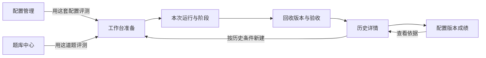

# 前端页面、交互与数据合同

依据U27：Gemini为初始前端来源，产品以Codex桌面底座上的个人配置评测为中心。本文与总架构共同约束当前交互和真实数据，不用原型题目或说明决定功能。实施状态只看总架构第8节。

## 1. 信息架构与用户方向感

七个入口：评测工作台、评测历史、配置成绩、任务库、配置库、数据与存储、方法说明。分别回答本次怎么做、以前发生了什么、各配置版本的成绩与原始记录、做什么、用什么规则、数据在哪与如何清理、判断依据是什么。配置成绩替代单独横向比较页；仍可按模型筛选，个人 Harness 比较优先保持同模型。

主线是单配置、单项目。批量选题由用户主动开启，同一配置可选最多十题；创建后形成逐项手动执行的独立工作区队列。说明与动作贴近，不在顶部堆多张重复解释同一件事的卡片。

```mermaid
flowchart LR
  C[配置管理] -->|用这套配置评测| W[工作台准备]
  T[题库中心] -->|用这道题评测| W
  W --> R[本次运行与阶段]
  R --> E[回收版本与验收]
  E --> H[历史详情]
  H -->|按历史条件新建| W
  H --> B[配置版本成绩]
  B -->|查看依据| H
```

图中题库“保存并用于评测”已携带所保存题ID进入准备页；配置“保存并用于评测”也已带入配置；“按历史条件新建”仍为目标连接。跳转必须携带实体ID和版本语境，不能只切页面让用户重新找。

## 2. 评测工作台：准备

准备流程使用“选题 / 配置 / 创建工作区”三个顺序步骤，切换保留选择。第三步实际包含评分方案核对，只有该步的最后按钮才创建独立工作区。顶部步骤本身可点击返回已可达步骤，按钮按选择前提禁用；底部仍提供上一步/下一步，面包屑返回工作空间。不把视觉步骤名称误当成已执行的模型轮次。异步准备按已完成题数和当前阶段展示真实进度；复制工作区阶段不冒充下载字节百分比。

从已有评测详情点“返回选题与配置（新评测）”时，工作台以该批题目、仍可用的配置和冻结评分方案预填新的 1–3 步。用户可改后重新创建；已建立工作区的题面、配置和评分记录不可逆向改写。多题准备页按每题独立的 `taskOverrides[taskId]` 选择预制项或调整权重，未自定义的题继续采用各自题型自动卡；公开原题的程序验收权重固定。后端按每题验证并冻结，裁判提示词、评分卡、人工复核与雷达标签都读取同一题的方案。移除题目后提交时剔除其未用的覆盖，避免污染新批次协议。

### U37 暖色编辑式工作台视觉合同

原始视觉目标为 [用户选中的参考图](design/2026-09-24/generated-direction-01.png)。上一版深色看板只保存在 Git 备份分支 `codex/frontend-redesign-u36`；U37 从改版前的 `3084335` 建新分支实现，避免前后两套样式叠加。参考图只提供排版、层级、配色与字体方向，题目、仓库、统计及操作必须使用当前真实数据。

- 宽屏左侧约 248px 暖白导航；橘红方标和当前页左侧细线；标题以自托管 Noto Serif SC 重字重接近参考图的宋体笔画，正文为自托管 Noto Sans SC。保留深色模式。字体、许可证在 `frontend/public/fonts/`，波形装饰在 `frontend/public/visuals/`。
- 工作台首屏用大标题、低对比等高线和横向三步流程；下方约 56/44 双栏，左侧搜索、真实分类与可滚动任务列表，右侧当前任务、固定仓库起点、要求预览和明确的继续配置按钮。示例图中的星数、日期和题号不编造到页面。
- 分类、搜索、方向与难度始终取真实题库；单题模式下筛选让右侧详情跟随可见选择。批量选题放在列表工具栏，跨筛选保留已选清单，逐项聚焦题面或移除；十题上限直接禁选新题，不能悄悄挤掉旧题。高级过滤仍可展开。详情短览可展开完整题面与工作区存放说明；准备和运行的现有状态机不因换皮改变。
- 平板折叠为上下布局，手机隐藏侧栏改菜单；筛选浮层不得溢出视口，任务列表与详情各自滚动。键盘可达、清晰焦点、减少动态效果设置继续有效。

配置下拉旁提供独立预览面板，模型/档位、规则、原生设置和工具开关不堆在准备正文。准备页只读展示已保存配置的模型、档位、速度和 Skills 数量；修改统一跳转配置库并保存新版本，显式“应用到 Codex”可按该已保存版本写入宿主配置。配置库编辑区如有未保存修改，应用按钮须先保存新版本再应用，不得因旧版本已应用而禁用；无修改则不额外保存一个 revision。本次不再提供临时 Skills 覆盖或两配置混合创建入口。配置库中的技能选择面板合并来源、搜索和列表；勾选时调用已有冻结导入接口并立即选中。取消选择不删除历史快照；上限30、同名冲突与源文件变化校验沿用现有协议。

配置预览和技能面板采用原生dialog，支持Esc关闭、焦点返回与窄屏。技能详情浮层在dialog内显示。配置管理也共用勾选即冻结的技能面板，不再要求先导入再到另一列表选中。

新评分步骤默认按题型自动显示每道题的评分卡：开放项目三组 60/25/15，DeepSWE 原题目标/回归/可维护性 70/20/10。主界面不要求从 18 个指标逐项选择或拖权重；高级自定义才集中展示标准方案、增减项和权重滑条。结果页仅在交付结束且全部适用项有分时用圆环显示整题本地综合分；缺项显示空圆环、已评分项均值与覆盖权重，不能把局部均值称为总分。机器原分与人工修正并列，修正需理由/证据，可撤回。旧评测按冻结协议呈现。完整规则见评分合同。

最后一步的主要按钮为“创建评测工作区”，执行规则/技能装载后进入Run详情；不表示已切换宿主全局设置或发送桌面任务。评分在独立步骤展开，备注保留在该步骤。旧记录可能有历史临时 Skills 覆盖，仍标出但不合入配置均分。

|区域|目标信息与动作|当前情况/补齐项|
|---|---|---|
|选择配置|名称、revision、模型/档位、规则/技能摘要；默认一套|只选已有配置并预览；导入、编辑集中在配置管理，保留配置页带入|
|配置成绩|版本的交付与评分状态、按题分数、重复测试与原记录|U47 起最近完整题集内同题重复取均值、不同题等权成配置分；U50 展示证据驱动的多轴画像；归档保留，无有效最终分时显示原因|
|选择题目|项目/修复、方向、难度、搜索；一次聚焦一道|共用三轴筛选与标题/描述/提示词搜索|
|题目预览|总体需求、项目契约、阶段、起点、验收计划、来源准备度|已有Spec/范围/逐项条目阅读；统一准备度模型待补|
|评分策略|机器维度权重、实际检查计划、评分依据|联动合计100%；新方案机器先评，旧Run沿用冻结策略|
|准备摘要|配置×题目对应几个目录、从哪里复制、尚不调用模型|基础已接；实际规则合成与冲突需补|

未选配置/题目时按钮禁用并指向对应入口；无脚本也可用机器裁判；缺源码的修复题提示导入起点，不允许直接开始。选择批量时显示准备数量与分别执行方式，不自动发送多个需求。

创建请求返回不确定时复用requestId，避免重复目录。成功进入该Run详情；不能只弹“已保存”让用户找不到任务。当前已有幂等准备与进入详情。

## 3. 本次运行：桌面执行与验收

持续可见：题目/配置版本、当前阶段、实际工作目录、当前快照、下一可做动作。目录标“已创建的工作区”，复制按钮标“复制路径”；有技能时可展开查看来源、版本和本次路径。批量时顶部显示逐题待办队列、状态及原分，点击聚焦一个试次；多个目录不是并行自动进度条，也不能保证手工同时运行不受共享宿主设置影响。

默认显示“完整需求 → 桌面执行/按需继续对话 → 回收版本 → 整题评分”。不显示1/2轮作为完成门槛；配置决定真实交互策略。准备页默认完整交付，分阶段为可选项。已回收随时可标记整题结束；若选择下一预设步骤，正文展示提示词和复制按钮。新工作区已写入项目级模型、档位、速度、规则和 Skills；配置选择步骤和准备态的试次执行区均提供显式“应用到 Codex”，由用户点击后才备份并写入宿主全局配置，同配置的试次可沿用已应用结果。已有桌面任务以及新任务的实际模型、档位与工作区仍需核对；文件写入成功不等于桌面任务已采用。桌面开始由原生日志自动同步，手动记录在后备入口；不显示虚假的“已发给Codex”。动作前提见 [执行合同](architecture/EXECUTION_AND_EVIDENCE.md)。

目标复审区保留 Gemini 六类材料的信息分工，使用页内区域或有明确上下文的详情，不恢复巨型无关联弹窗：

|材料区|用户看什么|操作与证据|
|---|---|---|
|需求与契约|冻结需求、故事/接口/数据/验收条目|逐条达成状态，引用证据|
|代码与文件|新增/修改/删除、完整文件、比较基点|选择回收版本；定位具体文件与行|
|检查输出|检查类别、目标条目、镜像、退出状态、时间和输出|检查当前/历史快照；重试保留旧尝试|
|AI意见|模型、材料范围、引用、遗漏、意见|显式启动；接受/驳回/待核实及理由|
|运行事实|日志归属、输入/输出、缓存比例条、活动时间|自动读取匹配会话，保留手动导入；未知来源不标已核实|
|人工评价|适用维度、依据、交付等级、个人约束|初值为空，保存新版本，逐条依据可追踪|

当前具备冻结契约、逐条验收、文件/检查引用与历次复审；逐行引用跳转、AI争议处理、截图/运行预览仍待补。这些属于功能接入。

验收区顶部显示“正在看哪一轮哪一份回收”。选旧回收只改变查看/补验目标，不改变活动阶段；人工评分当前只允许最新回收，旧评分只读。新回收后提示原评分属于旧版。

模型统一使用完整选项下拉框，切换不需先删除当前值。机器评分动作集中为模型、环境、评分按钮；本机环境为新页面默认，Docker仍可选。原始证据和完整量表按需展开，执行/评分/产物页保持分工。

多阶段题在执行页列出阶段和当前位置。非最后阶段回收后留在执行页，可直接继续；评分页标“阶段检查（可选）”，其分数标“阶段参考分”。最后阶段才进入最终产物评分，交付结束及证据齐全后形成整题总分。模型下拉只显示一次友好名称，API仍使用原模型ID。

## 4. 配置管理

左侧选择命名配置，主体编辑模型、推理、AGENTS、技能、交互和个人约束。支持新建、保存新版本、另存、归档、恢复及归档后的显式永久删除；初始保护配置不走普通永久删除。导入当前全局内容标明部分导入。Skills 面板按用户级、指定项目、自定义技能库读取列表，支持搜索、多选、批量导入并加入草稿；保存后自动装载到工作区。来源与调用规则见[配置合同](architecture/CONFIGURATION.md)。

Skills 在配置库使用紧凑列表：默认勾选框、名称、详情入口；同名才附来源标识。悬停名称提供用途与路径，详情用页面层浮层呈现文件数与哈希，支持键盘焦点、点击固定、Esc关闭，不把完整路径正文常驻列表。工作台只读显示冻结后的技能数量和调用方式。

已接全局一键导入、项目规则预览后导入、来源文件/默认值说明、技能调用方式、保存并用于评测。revision时间线、正文/技能/约束差异和任意旧版恢复副本仍待补。用户不需要从巨大JSON找改了哪条规则。技能目录、hash和启用状态可读，不展示没有实际文件绑定的“技能已生效”勾。

个人约束每条有标题、具体要求、验证方式与启停；空配置不预填某位用户的镜像或反技能偏好。specialFeatures若没有执行语义，不保留能改变成绩的假开关。详见 [配置合同](architecture/CONFIGURATION.md)。

## 5. 题库中心

列表支持三个独立分类轴和搜索；详情先显示需求与契约，再是阶段、起点、验收、来源。不要让镜像命令成为最显眼的产品内容。

新建可从原始需求开始，机器裁判复用通用取证流程，专用脚本为增强。起点支持本地目录或公开GitHub URL+完整commit SHA下载；保存后才用于新评测。源码下载完成不能显示成依赖环境已就绪。JSON导入需预览、准备度和字段校验；不只读进内存却不提供可执行说明。

目标操作：“保存版本”“另存新题”“用于评测”“导入题包”“导入起点”。起点目录与实际工作区目录文案区分。ProjectSpec字段见 [任务合同](architecture/TASKS_AND_CONTRACTS.md)。

## 6. 评测历史

列表显示时间、名称、配置/题目版本、状态、回收数量、异常与证据完整性；可搜索题目、配置、备注和编号。详情看当时冻结条件，不用当前编辑版本替换。

目标详情包含阶段时间线、需求达成明细、快照与复审、检查尝试、实际用量和缺失原因。可导出、归档/恢复、恢复配置副本、按历史条件准备新运行。复用明确新ID和仍需核对的环境条件。

历史列表保留导出、归档和就近删除。U43起删除改为两步：先删除本次全部工作区和精确关联的Codex对话，完成后才可永久删除剩余快照、评分及整次记录；不再显示逐试次清理和“移出历史”。旧已移出记录仍可在活动或归档列表访问。Codex项目文件夹独立于对话，需从Codex项目菜单移除，手动ZIP不受影响。当前还有冻结配置/项目契约、逐题验收及复审修订历史、配置副本恢复；尚无完整按历史新建试次和任意配置revision浏览。

## 7. 配置成绩与原理说明

结果页默认展示当前配置版本，可按当前／历史／已归档配置及模型筛选。完整且具原题或任务专属程序验收支撑的批次显示本地题集综合分；仅有通用网页烟检或 AI 意见的完整批次**主分位置留空**，旁边标 **AI 参考均值**，不用于配置胜负。专属检查须对应未改动的单阶段原题和最新快照；旧阶段检查不能替最终回归。即使具备程序证据，综合分中的 AI 质量项也未完成盲评及重复校准，数值差不自动代表配置优劣。批次未完整时保留上次完整批次结果或显示空白，不能将局部结果冒充全批成绩。同题重复先取均值、不同题等权；当前批次以 run 为边界，跨批重复归并和自定义具名题集版本仍待实现。展开后按 DeepSWE、项目内置、开放需求、自定义等来源列逐题结果和原评测链接。原题 reward 与本地分分别标注；宿主指纹变化仍可看本地分，但跨配置控制变量比较受限。归档配置与评测仍可查；配置修改另算版本，同题协议不一致不合算。不预设冠军、置信区间或跨题排名。细则见本文末尾。

说明页提供操作、公式和方法边界，不能替代准备页的“叠加层”、结果页的“样本不足”或验收页的“AI只是意见”。用户提出的细则应影响对应功能，不只变成FAQ。

## 8. 页面状态、反馈与恢复

|情形|目标行为|禁止行为|
|---|---|---|
|首次进入|读后端真实数据；展示加载或连接失败|假数据兜底、随机进度|
|空配置/空题库|具体入口与下一动作|永久显示“正在加载”|
|保存成功|就近反馈对象名和版本|所有操作只写“已保存”|
|校验失败|错误贴近字段，保留草稿|清空输入或换默认值|
|版本冲突|解释另一页面已更新，可复制草稿/另存|自动覆盖|
|后台检查|真实状态、目标快照、停止拥有任务|假装能停止桌面|
|服务重启|重载记录，解释恢复动作|清空数据恢复默认|
|渲染异常|安全错误边界、返回/重试|原型localStorage全清空动作|
|未保存切页|提示或保留草稿，明确另存/放弃|无提示丢失编辑|

当前有请求错误与忙态，不等于恢复体验全部实现；B05逐项验证。草稿可以暂存，但已保存业务事实仍以服务端为准。

## 9. 公共显示规则

- 未知显示“—”，旁边说明缺少哪种证据；真实0不能显示成空。
- 测试失败、环境错误、超时、取消、未执行分开；状态不只靠颜色。
- 时间注明含义，不把等待确认的墙钟时间称为模型速度。
- 公式使用冻结策略的实际适用项；模拟算例标“演算”。
- 编号可复制；默认显示友好名称和版本，技术ID作补充。
- AI引用指向冻结版本，不能跳到仍在改的工作区。
- 差异基点明确；文件行数不直接兑换“纯净度”分。
- 主题属于显示偏好，不改变实验条件；统一字体，不提供无实际区别的切换。

## 10. 视觉与工程边界

保留浅色、炭黑深色和必要过渡，移除字体选择；不用雷达站权威换算、IQ口号和用户背景堆砌。布局使人看见“选择什么、现在做什么、结果在哪”。

输入有标签/单位；键盘焦点可见；展开区紧贴触发按钮并有状态；错误用alert、完成反馈用status。窄屏按主操作顺序排列，表格局部滚动，不以极小字体解决拥挤；尊重减少动态效果。

大规模视觉减法在B09；功能补全可调整必要布局，但不另起一套产品导航。截图、构建通过、控制台无错误都不能单独证明交互合格。

现有App负责主题/导航/请求/轮询与题目选择语境；Prepare负责本次准备；Runner负责试次/验收；Editors负责配置/题库；Skills共用来源导入和紧凑选择；Contracts负责契约编辑/阅读、共享筛选、JSON预览和复审明细；Records负责历史/结果/说明。目标按需拆出配置差异、证据引用和版本历史组件，不先造通用组件平台。

类型必须覆盖真实业务字段。9月15日发现的Task断点已通过Contracts与后端版本2接通；后续扩展仍需同步类型、编辑器、提示词和历史，不能只透传字段。

## 11. 页面验收路径

- **F-AC1**：题库选题进入工作台仍是该题；配置同理；历史定位具体Run。
- **F-AC2**：新建含故事/接口/数据/验收的题，保存重载、准备、验收各处一致。
- **F-AC3**：逐项人工复审能同时看目标与证据，0/未知/不适用区分，历史可解释。
- **F-AC4**：A/B矩阵显示真实差异，结果分项能回到当时证据。
- **F-AC5**：断网、冲突、无效输入、后台失败和刷新不丢已存数据，草稿有处理。
- **F-AC6**：浅/深色、文字可读性、键盘、窄屏、减少动画实际操作检查。

浏览器验收使用本机Python同源入口。TypeScript/Vite只能证明编译层，真实桌面项目评测另见 [后端完成合同](architecture/BACKEND_DELIVERY.md)。

## 12. 配置应用与指标入口

配置页分清“从Codex导入”和“保存并应用到Codex”；应用区展示全局目标、替换范围、当前活动应用和撤销。评测详情使用冻结版本应用。评分方案显示依据、可选项及自定义项；结果把必要项/检查/约束/Token/时长/未知指标展开呈现。有效配置与实际模型行为仍需桌面执行证据，按钮成功只显示写入回执。

U19旧评分交互：主比例用一根滑条联动客观/人工。维度权重拖动时固定当前项，其余按原比例分配剩余基点，增删后仍合计100.00%，不用手工归一。结果页真实评分/裁定使用滑条并保留精确输入与清除；未知不默认为0，分数不联动。Skills同时只有一个预览，90ms悬停、80ms离开宽限、120ms淡入，快速切项立即替换旧卡；Esc只关闭预览，尊重减少动画。检查区优先展示数量/状态/要求，执行原理按需展开。

单配置单题创建页默认勾选“创建后打开Codex新对话并预填提示词”；批量不自动打开多个窗口。试次首轮可重新打开草稿，后续轮次继续原对话。失败保留已创建工作区并给出复制入口；成功提示仅为打开请求，不标记执行开始。首次目录信任由用户在桌面确认。

## 13. U20机器评分默认交互

新准备页仅展示统一维度权重，不再要求无脚本题选择纯人工。需求依据和环境说明分别按需展开。结果页主卡展示机器原分、已评分权重、最终分；裁判模型与“自动检查并评分”为一个主入口。分项显示静态/运行/未验证标签，证据按需展开，单项“修正”使用独立弹窗和0–100滑条，必须说明理由，支持恢复机器原分。后台错误保留记录，失败保存不关闭修正弹窗。

机器缺项标暂定，不把覆盖率叫成功率。旧记录明确保留旧算法；新回收/重评不继承旧修正。过程指标收拢为次级区。真实AI/浏览器链路仍须运行验证，UI测试夹具不可出现在正式数据或冒充成绩。

## 14. U21评测详情减法

详情改为“执行 / 评分 / 产物与记录”三页签；单题取消重复侧栏，多试次通过顶部选择器切换。准备/执行/待确认默认执行页，已回收默认评分页；进入下一阶段回执行页。页签切换保留未提交说明、裁判选择和证据选择，支持方向键、Home/End。

顶部只展示题目、交付方式/可选步骤、已回收版本数、状态、配置预览及Codex配置入口。配置变更/读取失败摘要保持可见，应用、撤销、核对、写入位置集中在弹窗；原权限限制不变。执行页集中打开、复制提示词、回收和结束/继续；目录与说明按需展开，完整提示词/契约和配置/Skills通过独立预览保留。

评分页将模型选择与评分/停止放在同一行。无报告时不渲染空分数卡和重复“等待评分”行；失败原因仍可展开，原始报错不改写。有报告才显示原分、覆盖率、最终分、逐项证据与人工修正。空需求/空执行日志不占折叠行，评分标准始终可查。产物页保留快照、文件、差异、历次复审、JSONL导入、完整用量、冻结条件/恢复及活动记录；无日志时不铺空Token卡。说明删除重复部分，功能和证据不删除。

引用局部失败显示“引用校验·N项未计分”，不清空其他有效项；原行号与唯一原文定位后的行号同时可查。Windows本机浏览器取证未接通须在裁判环境说明中明确显示，不把环境未验证当项目失败。

### U25 模型、执行监控和阅读设置

配置模型与推理档位联动，只显示本机已确认支持项；旧无效值标明不支持，不伪装已修正。裁判默认 gpt-6-luna/max（仍须账号实际可调用）；不可用或档位不受支持时阻止启动并提示，不静默换成 Sol/medium。评分过程集中在评分卡的单个折叠入口，展开时刷新命令证据，不堆在主操作区。

U40 后侧栏不再提供局部生效的字体、字号控件；正文固定使用 Noto Sans SC，标题使用 Noto Serif SC，根字号固定 18px，代码保持等宽。侧栏底部改为直达使用与评分说明，避免阅读偏好只改部分文字而破坏既定排版。

U57：机器评分失败的具体账号/模型错误在评分卡内直接显示；历史日志中的明确失败原因只在展示时重新解释，原作业和数据库历史不改写。目录列出模型不代表账号权限，推荐项也不是保证可用。前端裁判选择本机时继续明确标出 Windows 浏览器取证限制；Docker 下的程序烟检、AI 视觉意见、人工视觉复核分开呈现，不以任何一项代替其他项。AI 提示词和版本在评分过程可查，主观分是可复核参考值。

### U26 配置库、题库与选题工作区

维持Gemini六个产品入口；配置管理和题库改为左侧对象库、右侧集中工作区。对象库单独滚动，编辑器顶部固定标题和主要动作，分区导航只展示当前内容，避免巨型纵向表单。配置四区为模型与规则、Skills、工具与原生设置、应用；删除位于标题旁，导入/回收站位于对象库底部。

题库四区为题目概览、编辑需求、验收与步骤、源码与导入；默认概览横向展示需求和环境。工作台选择题目时，左侧卡片、右侧即时预览，不再把完整详情追加到长列表底部。可开始与待补全分开，缺源码的修复题禁用选用，来源和源码文件清单可查。准备页只读展示所选配置，Skills 的修改在配置库完成。原有题目编辑、检查、来源许可、归档恢复及自定义导入能力保留。

U28采用暖灰底、墨绿导航与陶土橙主操作，选中线统一层级；暗色使用对应对比色。标题、导航与控件使用清晰无衬线字体，题面正文/规则使用用户选定阅读字体，代码路径保留等宽字体。窄屏改成单列并限制列表高度，编辑内容自然展开；折叠只用于次要明细，主要操作不埋入说明段落。

### U27 原理页与公开题源

原理页重写为“项目定位 / 使用与评分 / 题库与公开来源”三个分区。首屏三层图说明桌面底座、模型条件和主要比较变量个人配置；使用区给出四步流程及程序/AI/人工分工，权重读当前策略并转成可读百分比。实际使用限制收进相关明细，不显示原型题面数量和旧算法迁移过程。

公开题源展示固定版本 DeepSWE 113 条元数据，支持名称/仓库搜索、语言筛选和题面/环境/验收器链接。题库与工作台共用可选题目索引；未下载的题也可选，创建时才下载固定源码。`state.tasks` 只表示本机已保存的题目版本，不能拿它的数量当完整可选题数。源码已缓存、本机环境可用、原测试可用仍分别计数。不得在指南中把调研完成写成已接入运行。

### U28 全站视觉与交互升级

参考用户提供的三条X链接和photo-abstract-editorial，选择OpenAI Product Design作为唯一设计工作流；其余参考面向海报/插画，不混入应用界面。选用版本为openai/plugins `1dc195897af4161d039b80d8471ec0a10c9bbc89`。下载集中在本机 `.local/frontend-redesign/`，来源回执为其中SOURCES.md；不安装到C盘或全局Skills，不提交下载内容。

七入口改为固定侧栏，顶栏只保留位置和刷新；小屏为可关闭抽屉，关闭后不能聚焦隐藏菜单，支持 Esc 返回按钮。全站使用共享颜色/间距/控件样式；导航和正文固定使用已内置字体，代码使用等宽。筛选弹层支持点击外部或 Esc 关闭，不要求用户再次点击原按钮。

工作台首屏显示真实配置/可开始题目/记录数量；三步进度与底部动作一致。题目为紧凑列表加预览，配置与Skills并列，预览和技能选择共用弹窗。配置/题库保留左库右编辑结构；历史改成任务/条件/状态/时间/操作对齐的行列表，提供搜索及无匹配状态。评分、产物、比较与说明沿用同一组件层级，未知分数和失败原因继续真实显示。

按钮、选中、页内内容与弹窗使用160–260ms轻过渡；遵循prefers-reduced-motion。保留键盘焦点、原生dialog的Esc关闭和焦点返回，技能详情继续互斥。图标操作有名称和提示，不以视觉改版移除业务入口。新增样式集中在workspace.css，页面结构仍由现有组件提供；不新增UI运行依赖。

### U29 操作入口与数据管理

题库与准备页优先“已有仓库任务”，另有“从零构建”“仅Bug修复”；起点就绪与待补全分开，前者不声称依赖已安装。U31改为直接选题、创建时按需准备，全部类型默认可见（4修复/106功能/3改进）；不再以预下载作为必经步骤。公开题按可选数展示，不称环境全已准备；旧缺源码题面仍放待补全。后台阶段、失败重试和中断可查，准备期间禁用修改；完成后自动进入评测。环境和原测试状态分别保留。

U48/U49/U53 的 50 道原创开放网页题及 U57 新增的 1 道短时三维题创建时复制同一套空白 HTML/CSS/JS 文件；U54 起工作台默认显示24道“跨类型精选”，其中文网页创意题只选七种不同交付机制。原50题均保留于“全部题目”和网页分类，不删改已创建的评测；不再设置内容重叠的“原创网页与插画”并列入口。另有12道业务、数据、工程、长期和协作开放题，各有不同文件起点但尚无独立程序验收。列表与预览显示来源、子类和起点状态，标题/子类/题面可搜索；题型导航可用左右箭头或可见滚动条访问后面的类别。创意题起点写“空白网页已打包”，12道开放题写实际起点，均不得描述成“独立验收已就绪”。网页烟检只证明基础可打开/少量交互；作品表达、业务逻辑和审美仍按本题观察点与真实页面复核。精选是浏览入口，不是默认统计题集或新成绩。

第七入口“数据与存储”：顶部真实占用摘要；搜索/筛选和紧凑记录列表，选中后右侧显示目录占用、产物入口和当前可用清理动作；窄屏列表有高度上限，详情在下方。存储分区与路径放二级详情。清理确认保留证据范围，永久删除必须输入指定文字；错误在对话框内展示，不静默关闭。没有用户记录时给空态，不造示例。

U57：精选仍为24题，七道创意题中的 SVG/交互SVG 只保留金门大桥一项，以短时三维展台替换水獭缆车。水獭题和原50题仍在全库；新增三维题使用共享 `interactive` 烟检，不能凭按钮变化自动证明真实空间建模。题卡应显示其 `Short` 时长档，不把原有 `Long` 观测舱当作本次推荐的低预算替代。

### U30 运行环境与测试验收

Tengo两题与Yaegi Embed在创建时自动准备Windows环境；题库保留“核对本机环境”次级动作。准备中显示阶段并禁用重复提交；成功显示本机环境已验证。评分页的项目测试验收与AI评分分区，目标测试数、回归数和结论横向展示，窄屏换行。运行/停止为主操作；逐组日志、未通过列表、同快照历史放次级明细。产物版本切换后能查看对应测试历史；旧成绩不会冒充新版本结果。数据页计入固定工具链、环境核验与测试日志占用。

U31历史标签将文字和数字徽标固定同行，按钮不压缩、暗色容器不额外铺底；工具栏空间不足时搜索移到下一行。工作台题目预览明确缓存复用/新工作区，路径规则放次级详情。准备阶段必须与实际后台状态一致，失败保留重试入口，不显示假成功。

### U32 筛选与任务状态可读性

方向/难度选项来自当前来源、搜索和可选/待补全列表，各自按另一筛选维度显示数量；切换范围后失效选择清空，未标注不猜等级。完整需求是默认行为，分步提供仅多步题显示二级实验入口，不限制对话次数。历史按当前回收证据显示已评分待结束、部分评分、待评分、失败待处理和执行状态；评分不自动结束交付。

DeepSWE主行仅选用与来源/缓存入口，展开区域独占一行，缓存与上游链接集中；不再全局显示陈旧下载完成通知。原生dialog覆盖父级space-y外边距、视口居中，固定标题、内部正文滚动；任务文本采用阅读正文样式，来源哈希/合同折叠保留。API等值在用量区一行显示，公式、单价日期/官方来源、未知值与附加费边界折叠，不充作实际账单。

## U33–U34 评分与人工操作

评分页按原题验收→产物查阅/人工复核→AI质量参考组织，说明结果参考性质。裁判模型、有效思考档位、预算、环境相邻；长说明收进详情。评分过程展示实际提示词、公开进度、耗时/预算和位置。

人工复核弹窗采用文件列表/内容双栏、窄屏单栏；选择回收版本后才读取。运行说明、副本操作、预览地址与人工评价各折叠展开；UX须实际体验，未检项留空。人工历史展示覆盖率和依据；不能因为AI失败就屏蔽人工入口。数据页分别提供工作区清理与整评测删除的范围确认，配置页显示最初备份及显式恢复。原理新增八项榜单来源页和两类评价说明。

## U35 本机清单、速度与阅读修正

工具与插件只解释和列出当前本机 `config.toml` 中的已配置项，提供手动刷新；标题不引用任何私人插件名称，不声称后台自动发现安装或更新。配置模型/推理/执行速度同屏，Fast 不支持时禁用；准备预览可看到冻结的速度档位。评分页独立选择裁判模型/思考/速度/预算/环境，Docker 不能选择未验证的 Fast。实际报告写“请求 Fast”，不冒充服务端生效值。

题库窄侧栏的方向与难度各占整行，大字设置下保留完整选项和数量。评分过程概要字级与相邻说明一致，命令折叠列表限高滚动，完整命令和输出仍可展开。API等值估算改为纵向先给金额、再全宽展开换算依据，避免压成窄栏。裁判报告校验失败且保存原文时显示“重新校验已保存报告 · 不调用模型”；恢复后仍显示未验证项和原报告来源。归档与整评测删除保留数据页既有入口。

## U42 批量与存储入口

多题详情页显示未请求过的独立对话草稿数量；每次点击仅请求打开一题，并聚焦该题。用户须先在 Codex 处理目录信任与预填提示词，再回来点击下一题，避免后续深链覆盖前一道尚未处理的草稿。请求成功只记录 `draftOpenedAt`，不代表信任、发送或任务启动；取消弹窗或丢失预填时，准备态且未关联会话的题可从该题执行区重新请求打开。批量 API 必须指定 `trialId`，不能由一次请求遍历全部试次。六道指定 DeepSWE 题的评分页显示上游 Linux 原题程序验收，执行前说明 Docker 镜像和结果范围；验收动作在 Windows 自动尝试启动 Docker Desktop，环境配置提示词可在面板复制，应用本身崩溃时仍保留未知而不混入 AI 质量分。数据页显示每个存储分区的绝对路径，并可把公开题包缓存迁移到新的绝对目录；第一步删除弹窗显示精确工作区关联的 Codex 对话数量，并同步清理这些对话与工作区。项目侧栏分组仍由 Codex 自身项目菜单管理。

批量按钮旁和单题“在 Codex 执行”按钮前均要可见提醒：文件应用及草稿打开无法证明桌面当前模型、思考档位、速度已生效；展示本题冻结目标值，缺项注明“未固定/沿用”，发送前必须在桌面核对并在需要时手动调整。未核实或不一致时不把本次结果表述为可靠的配置比较；手动标记开始的确认文字也包含速度。

## U60 均衡随机选题与结果可信度

第一步列表工具栏前提供“每类 1–5 道”和“一键均衡选题”；一次抽取相同数量的已接入验收协议 SWE 仓库题、短/中型网页题，交替排列并尽量分散仓库/网页交付机制。抽样立即显示全部题目供逐题核对和替换，批量上限仍为十题；下一步沿用一个保存配置和冻结评分方案。它只生成独立工作区待办，不后台执行 Codex 桌面任务或同时打开多个预填草稿。来源池不足时数量选项收窄或按钮禁用，过滤器不偷偷删改已经抽中的题。

多题页待确认草稿是跨整行的一块提示，两个等高操作按钮在宽屏右侧并列、窄屏各占整行；只有用户反馈草稿保留才请求下一道。配置成绩中的能力图与六张速览卡宽度均衡、同一表面色，细项仍在下方整行显示。旧版自动卡未给“推理决策”独立证据时写明旧记录未测；新卡有证据时才填轴。仅单次前端 AI 评分的高分旁直接写明通用浏览器检查覆盖范围及未校准状态，不把 90+ 分解释为视觉真值、准确率或正式模型排名。

评分失败区显示启动前错误的可读原因，保留诊断记录和原始证据；失败不出分、不记零。新审查沿用默认 Luna/max 与单次额度确认，界面不能为了绕过错误暗换 Sol、消耗第二次额度或篡改旧分。程序浏览器检查更细，但题意与美学仍须按本题证据另行判断。

## U43 两步删除覆盖旧入口

历史页只有活动与归档两类记录，旧已移出记录重新可见；不再显示“移出历史”或逐试次清理按钮。U44 将删除拆为并列可见的两个独立入口与单一目的弹窗：“删除工作区文件”只同步删除本次工作区和精确关联对话，保留记录与证据；完成后“删除整次评测”才可另行点击，不能自动转入第二步。弹窗只显示数量与当前操作，不铺开路径和完整对话标题。失败在弹窗内说明并刷新进度，不在全局顶部显示重复报错或 Docker 计划文案。Codex 保存项目与对话是不同对象，不能将关联对话已删写成项目已删。

## U46–U47：逐题、批次、配置与比较的结果界面（v1 已接入）

当前五题在 U45 完成上游验收，原题 reward 为 1/0/1/1/1（旧映射 100/0/100/100/100、旧批次 80.0）。U47 本地追溯分为 98.8/61.8/98.3/98.7/98.3，最近完整批次为 91.2；两套数字来源不同。单题与配置页已分别显示本地分、原题结果、分项权重和证据。其余未接语义评分卡的公开题保持无本地总分；后续 UI 目标仍需逐项验收。

|界面|第一眼给用户看|展开后的可核对内容|分数缺失时|
|---|---|---|---|
|单题执行/评分|一个本地任务分、必要项结论；公开题另列原生通过/失败；测试/AI/人工状态|每项分值权重、完成系数与贡献、证据链接、测试原文、人工修正历史和量表版本|“未完成：缺什么证据、系统下一步做什么、能否对同一回收补验”，不显示局部分冒充综合分|
|多题批次|预先选定题集的已完成数与批次均值；当前五题旧结果标原生分口径|每题独立分、题目类型/版本、阶段、试次重复、排除原因|只看已有逐题分与待补列表，不用已评分子集称全批次总分|
|配置成绩|当前 configId+revision 在具名题集中的一个配置分、题集版本、有效/计划数与日期|同题重复均值、不同题等权、SWE/网页/开放项目画像、历史版本、归档记录、成本/时间、稳定性|可显示上次完整题集分并标日期；当前计划不完整则提示“待齐”，不沿用旧分冒充新分|
|配置比较|共同题配对差值与差异是否有足够证据|变量差异、匹配/排除条件、每次试次、顺序、分布、评审者与人工帮助|无共同题、协议不同或样本太少时显示原因和下一步，不能给假胜负|

单题权重默认收成 3–5 个可理解的组，组内条目按需展开；不用把指标库的全部十一项排成必填滑条。比如网页题显示目标/实际交互/视觉与可访问性，纯库题不出现视觉分；模糊需求题明确显示澄清与范围；长期项目顶部显示里程碑和当前最终版本，但最终仍只有一个任务分。可以借鉴发布榜单的逐项可核对表格，不搬运其模型成绩，不把 Elo、整题解决率和人工偏好数混进同一百分比。

配置成绩展开区默认展示一张六轴能力雷达：目标兑现、工程实现、网页体验、推理决策、协作沟通、稳健交付。每轴显示分数、已计分题数、重复试次以及可点击的原评测证据；题型标签不产生分。雷达从已取证的适用分项计算诊断均值，同题重复先均分、不同题等权，不重新生成配置综合分。规则与范围约束在单题目标组中计一次，不单列轴；同一分项可服务多个分析视角，但不在单题总分重复扣分。没有证据的轴显示“未测”，不能填零。至少三个轴有分时用半透明填充连接实测点，跨未测轴用虚线。DeepSWE 的 0/1 原题结果另列，五道既有题无法推断网页或协作能力。图下并列 Token、活动时长、API 等值估算和重复最大分差。同题对照使用现有控制变量条件与共同题，顶部配置综合分不随图形切换。网页视觉分需要实际运行与视觉证据，合并 UX 分不能推导原创、响应或无障碍专项。

U54 的布局把六轴图和 2×3 数字速览并置：速览卡直接显示轴名、分数或“未测”、有效题数与试次数，选择速览卡后，在**整行宽度**呈现该轴的逐题、逐项分数、来源和原评测入口。不要把长证据文本压进右侧窄栏或让左图占满空白。窄屏时图、速览卡和明细依次堆叠；图与卡上的已测/未测语义保持一致，深色主题颜色和焦点状态可辨。布局只重排现有证据，不改轴映射和单题/配置综合分。来源区新增 Terminal-Bench、BrowserGym、τ³-bench、SWE-bench 四张研究卡，显著标注“仅接入评估、不可直接选题运行”，不与 DeepSWE 可选任务混数。

效率放在结果主卡的分数旁，而非藏在“用量详情”：输入/输出/缓存 Token、被测活动时间与总历时、可识别等待、**API 等值估算**及其价格日期/假设。裁判消耗单独一行，用户订阅实际账单未知时明确写未知；速度没有真实遥测不写“快”。稳定性只在同题重复后展示有效次数、成功/中断和分布。成本、速度、稳定性是默认并列轴，除非事先另定目标，不进入质量主分。

人工入口只出现在允许判断的项上。面板先给快照文件、图片、已声明启动说明与可观察对象；用户填写观察、理由与新分，页面并列显示机器原分和调整后贡献。原题 reward、程序输出、Token、时间、快照哈希没有可编辑滑条；疑似原题测试误判走复验/申诉，保留原结果。修改后重算同一题与配置派生分，并展示修正标志，比较时可筛掉人工调整。

预检与故障文案应只给用户可操作的信息：缺少哪个固定源码/镜像/工具、系统已经尝试什么、是否仍在重试、何时可以在同一快照继续；可用 Docker 时由工具按题准备，不能让用户手工新建 113 个目录。开源安装页提供按操作系统复制的诊断/配置命令，以及让廉价模型辅助检查的**可复制提示词**，但必须标明人工生成步骤未通过预检前不能算环境就绪。若只是裁判或验收器故障，提示“无需被测模型重新做题”。

验收页面需真实演示：Anko 原题失败、连续分按核心目标失分且不被大量回归用例冲淡（已实测）；纯代码题无空白前端栏；网页任务浏览器功能取证与人工视觉复核；长期项目各里程碑有独立证据而最终只一分；具名题集的配置卡可追到每题和原题 reward；估算成本和实际耗时在主结果可见（已实测）；样本仅一次时不宣布 1 分差显著。括号内未标已实测的仍是退出标准，详细计算见[评分合同](architecture/EVALUATION.md#u46连续单题分与配置分已批准v1-已接入校准仍在进行)，实施顺序只看[主架构第8节](PROJECT_SPEC.md#8-唯一实施路线与完成标准)。

### U63 专项功能验收与评分稳定性

评分页在AI分数前提供独立专项区：五道受支持原版题由服务器返回，逐项“通过/失败/待验证”自适应两列或多列卡片，手机单列；展开显示操作说明、前后哈希与实际数值。截图选择与原图可本地预览。始终列明未覆盖需求，不显示误导性整体100分；失败提示优先，AI原分保留。一个不调用AI的重新检查按钮，忙碌/归档禁用。AI分区另显示同协议独立作业数和已观察极差；未重复明确不足，未校准不冒充客观认证。不同裁判、提示词或材料不合并。

## U64：组卷、详情与评分证据

快速组卷位于任务双栏上方，占独立整行；总数2/4/6/8/10，不再将两侧控制强塞左栏。名称用“代码与逻辑 / 界面与交互”，来源仍在题目详情如实标注。展开“如何抽题”显示候选数、先分散题组再补齐、无重复但非全库等概率、seed和版本；用户可手动调整。

已选题在详情栏使用两列紧凑列表，有独立最大高度与内部滚动，标题省略但有完整提示；标题、选题区、底部动作不被flex压缩而互相覆盖。长原题展开/收起随当前题重置。WebGen显示空白起点和原UI检查来源，不声称附带官方可运行测试。

机器评分下可展开统一等级说明、原题逐条检查与三项观察；显示证据、反例和上限约束。旧报告明确旧协议。信息层次是总分状态→原始需求→维度观察→证据；缺证据有解释，不能为了让雷达闭合而补分。全量浏览器视觉验收尚未完成，以当前交接的实测范围为准。

## U65：Harness对照主流程

配置步骤在既有A配置下面加入同模型B配置、精简副本、重复次数、活动预算和可选Token预算；假设一句话即可，不要求用户重新分配所有评分比例。核对页写明A/B与计划次数。运行详情先显示A/B结果，再显示有高度限制的独立执行队列，逐项打开保持现有确认机制。配对证据双列、每页6对；窄屏单列。不同配置不再被合成“本批AI均值”。配置成绩顶端可选择已创建的对照并进入继续执行；旧单配置档案和雷达保留为诊断。

结果主卡是验收次数、未知、超预算、包含失败的资源与每次有效交付成本。条件不匹配时仍显示观测差及原因，不伪造提升率或胜负。深色使用既有主题变量。暂停/取消Codex目录信任仍需用户反馈，不宣称网页能读取桌面弹窗。

## U66：筛选布局与方法说明

任务题型导航单独占工具栏整行；下一行左侧多选、右侧筛选，避免类别箭头与批量开关争用空间。筛选浮层中六类字段同级等宽，桌面两列、手机单列，任务方向/难度不再嵌套一层网格；浮层保持在视口内。沿用现有主题和搜索、滚动、筛选状态。

方法说明保留项目定位、流程、来源与方法四分区，沿用Gemini的动机叙述：配置冗余→固定条件→真实项目→对照结果。事实与README一致：React、同模型配对、程序事实/AI/人工分存、0–4等级后程序算分、无未经实测的误差承诺、无虚构官方成绩。

## U67：说明背景与旧协作视图纠偏

方法说明首页以日常失败场景说明项目动机：答不到点、反复纠正、过度架构、流程替代结果、开发指令混入产品。方法页链接Harbor、τ-bench、AlpacaEval、AgentRx，列可借鉴部分与边界，具体计数方法在折叠说明中，不向操作页追加冗长开发指令。

旧collaboration诊断轴保持ID/计算/历史数据，标签由“协作沟通”改为“协作与交付”。选择该轴时解释包含旧沟通项、阶段推进、交接，尚未测量首次命中/纠正落实/无谓打断；不伪装成已完成的人机沟通评分。

## U68：对话观察展示

执行回收入口说明本题可见文本会随快照封存，下次主动审查读取；评分页列封存/总回合数、未纳入数与来源缺口。三项计数是切题、纠正后回答、不必要打断，宽屏并列，窄屏单列；符合/偏离/未知/不适用分别列出。展开可见具体回合理由及双方引文、另可查看待送裁判文本。旧快照明确无冻结对话，不猜得分；报告必须匹配本快照对话SHA。A/B逐次列偏离次数和证据入口，不能单凭话少/失误计数小判胜负。使用既有明暗主题，不追加第二个综合分。

## U69：固定程序结果与新题源

评分区EvaluationTrack在当前回收快照直接显示programAcceptance：范围、通过/失败/未知、固定分母与逐项证据。函数题显示扩展输入数，0/100只表示整套测试结果；社区百分比只表示核心用例。缺项保持待验证，无需先结束交付或调用裁判。现有AI、视觉意见和旧评分保留。题源页可幂等导入HumanEval+163题，解释32号排除及桌面适配范围；8个社区新题进入32题精选与按机制随机，函数题不挤占默认项目随机组。

## U70：准备与执行的信息层级

- 选题、配置、创建三步共享常驻底栏，下一步/创建按钮在首屏可见；正文预留空间，不遮挡最后输入和说明。选题详情中的来源/起点事实平级；验收范围及Docker条件移入所属详情，不删除。
- 单配置选择与摘要上下排列；双配置同模型对照默认收起，仅显式启用后展示设置。评分依据展开内容完整包在边框内，正文缩进并有左边界；“本次备注”是容器外平级区块。
- Codex应用卡分别列出文件阶段与桌面核实阶段。匹配须满足冻结ID/revision、回执管理设置以及实际模型/档位/固定速度读回；保存成功不能认证现有对话切换。日志只认证已记录的模型/档位，速度仍提示桌面核对。
- 应用/撤销错误走已有localError通道，不重复显示到页面顶部；操作锁定直到回执结束，后续成功清除旧错误。冲突保留修改，回执列变动文件，不新增强制覆盖。
- 批次摘要、草稿确认、队列说明分组；确认操作靠右等高，“未保留”保留同题重试。执行页按运行条件→打开操作→路径详情→回收状态/按钮→用量→会话说明与可选记录排列，辅助说明14px，完整技术说明折叠保留。
- 方法说明改为“从一个模糊想法到可用作品”，不要求用户先写完整规格；原始意图、澄清、纠正和作品分别留证，不能事后指定唯一实现。

## U71–U72：评分工作台与自动补查回执

全站操作字体统一为本机Segoe UI/微软雅黑UI，正文14px；标题、状态、数值有固定层次。共享折叠标题与正文用完整边框、左缩进及“展开/收起”区分，子折叠在父容器内；备注等平级内容不放进前一折叠。

评分区五个分区为结果总览、程序验收、AI评分、对话观察、人工复核。总览读服务器已有单题总分，旁列程序事实/AI均值，贡献表解释冻结公式；配置总评按钮跳转冻结configId+revision，历史版本同样可达。SWE原题0/1及通过率独立，连续卡只在五道已支持题显示，六轴取已有能力映射，不能复制通过结果或另造一个雷达总分。旧人工/程序混合算法仍按旧权重解释。

AI评分内分结果、启动与过程、标准与验收。裁判设置宽屏三列、窄屏一列，长标准两列或一列；原题需求与状态对齐。命令、账号/环境、图片、用量、限界和历史完整保留在所属详情，不能在主界面散落小字。顶部导航置顶；切换分区滚动到静态内容容器，标题和按钮不被置顶条遮住。

对话观察首先说明用途与三项标准，再展示四种计数、逐回合理由和双方引文；缺真实材料不猜判断，报告须匹配当前对话SHA。代码纠正是否落实由产物验收另证。人工体验入口独立于AI是否成功。

v7新审查的启动确认说明同一时间预算内最多一次自动补查、每次CLI可能消耗额度。“启动与过程”显示补查阶段与累计用量；报告详情显示每次缺项原因、job、用时及补查结束状态。partial表示仍有未验证项，不假装已成功形成总分。旧报告没有补查回执时不伪造。仍缺环境/材料的项保留未知，不能在界面补数。

## U73：程序结果、缺项贡献与使用记录

SWE总览首先显示目标测试完成比例、原题结果、AI参考；0/1和F2P/P2P由当前快照程序报告读取，失败仍显示。冻结本地连续分与公式放在所属详情，不等待AI才显示程序结果。配置成绩即使无完整质量分，也显示已验收原题通过/失败计数；逐题卡保留0/1与目标/回归比例，未测仍空，不给无连续卡任务套新公式。

scoreProgress显示固定权重的knownPoints、unknownWeight、minimum/maximum、coverage与细项rows；范围不是统计误差/最终分。自动评分组部分缺失时仍保留组内已测贡献，总分与原组points不改变。ScoreCoverage统一用于总览与AI结果，列实际缺反例、缺检查、旧快照/验收记录过期和未有机器报告；按钮分别去程序验收或AI“启动与过程”。AI结果的环图显示已评分贡献，不再仅放空值。

未接程序验收器时导航改称“验收方式”，明确起点源码和验收器不同；不能冒充程序通过。总览把执行Token/活动时间与当前对话SHA匹配的切题/纠正/追问四类计数集中，未判定不填0；雷达来源收进完整详情，不删除。悬停只改文字颜色，取消整块背景和横移；选中红线及键盘轮廓保留。宽窄与明暗实测范围以当前交接为准。
