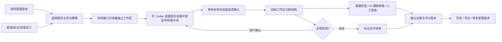
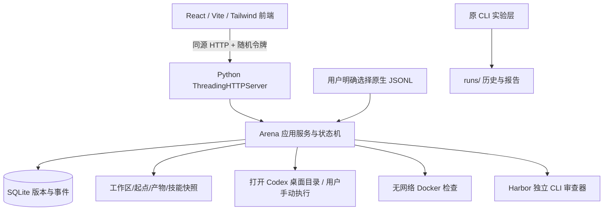

# Codex Harness Bench：当前架构与实施路线

> 当前依据：2026-09-15 用户原文与正式执行方式裁决（requirements.md 的 U07/U08）。本文是唯一当前架构与路线。它是助手依据 U07/U08 整理并实施的版本，尚未获得用户对重写架构的整体验收；U09 要求进度与依据持续可审查。旧 F1/F2 设计保存在 docs/archive，不能作为继续实施指令。当前验证状态见“实施与验收”及 当前交接.md。

## 1. 项目目标

帮助用户在 **Codex 桌面** 固定使用场景下检查自己的个性化 Harness：规则、技能、模型档位和交互要求如何影响实际项目交付。重点是用户提出需求后，Agent 是否理解、完成并交付可用结果，以及为此用了多少可观察资源。

默认一套配置、一道项目构建题。两套对比和多题准备是可选能力，绝不把选择五道题解释成自动向桌面发送五份需求。Bug 修复是独立题类；项目构建可以经历头脑风暴、Spec、前后端实现等多轮，不能将轮次当独立题数。

本工具保存可复核材料，不把一个分数包装成模型或 Harness 的普遍能力。用户原文和禁止事项统一在 requirements.md；本文只保存当前设计。

## 2. 用户实际操作流



1. 配置管理保存 AGENTS 内容、模型标识、推理档位、实际技能文件和个人约束。导入全局配置只取规则、模型、推理档位；不假定全部 Codex 设置支持。
2. 题库选择项目构建或 Bug 修复，查看需求与阶段；需要已有代码时显式导入具体起点目录。只保存题面不自动克隆未知 URL。
3. 准备操作冻结配置、题目、评分策略，生成每个配置×题目的独立 Git 目录。准备不调用模型，不需要 Docker 引擎。
4. “在 Codex 桌面打开”调用本机实际支持的 `codex app <path>`。打开目录不等于新任务已开始，也不保证模型设置正确。用户核对并复制本轮提示词，手动发送后记录开始。
5. 第一轮提示词包含总体需求与当前阶段。后续在**同一桌面任务**发送下一阶段；明确回收后再确认继续。模式要求等待用户时绝不自动确认。
6. 桌面停止写入后回收产物；工作台只读取本题所拥有的工作区，保存新文件快照、哈希、差异和可选回复记录。
7. 检查和 AI 复审均针对快照，不针对仍变化的活动工作区。人工实际查看结果后打分。标记交付结束只表示阶段结束，不等于测试通过。
8. 历史保存当时配置、题目、证据与评分版本。恢复配置生成新 ID；归档是可恢复状态；不覆盖旧实验。

## 3. 前后端及执行边界



|模块|职责|不能做什么|
|---|---|---|
|frontend/src/workbench|表单、主从视图、回收、验收和历史|不能模拟运行、生成分数或将浏览器缓存当事实|
|webapp.py|127.0.0.1 服务、静态资源、Host/Origin/令牌、受限路由|不提供宿主 shell、任意文件路径或认证浏览接口|
|arena/api.py|显式配置/题目/导入/运行/导出操作|不扫描 Vault、home 或自动选全局技能|
|arena/service.py|输入校验、冻结、准备、阶段状态、配置恢复|不修改宿主 Codex 配置、不发送桌面提示词|
|arena/database.py|SQLite 当前版本、不可变版本表、归档事件|不以 localStorage 保存业务数据|
|arena/files.py|有界回收、哈希、差异、路径与链接校验|不跟随目录联接，不悄悄吞掉超限文件|
|arena/jobs.py|明确拥有的后台检查与 Harbor 审查、停止和结果合并|不停止用户桌面任务，不把审查 reward 当验收成绩|
|arena/scoring.py|证据适用性、权重与人工评分验证|不能凭 AI 意见填测试分，不能为空值补默认高分|
|arena/telemetry.py|原生日志归属与最终累计值校验|不扫描全部会话，不重复加缓存，不猜账单费用|
|原 cli/adapter/results/analysis|独立 Harbor/CLI 试验与历史分析|不混入桌面正式结果、不改写旧证据|

### Codex 规则实际装载

工作区根是独立 Git 仓库；选定 AGENTS 与有效个人约束写入 `AGENTS.override.md`，原题目根规则合并保留；选定技能复制到 `.agents/skills/<name>/`。只改变这次试验目录。

**这属于工作区规则叠加，不是完整全局隔离。** Codex 桌面仍会继承用户全局 AGENTS、技能、插件和配置；更深层规则也可能影响执行。记录宿主 `.codex/AGENTS.md`、`AGENTS.override.md` 和 `config.toml` 的哈希，仅作为部分条件证据。回收时比较所有 AGENTS/override、选定技能文件及工作区 .codex 文件，新增或改动同样标记条件变化。选定文件存在不能证明模型遵循或实际触发了技能。不同全局规则的严格替换实验不在当前桌面实现支持范围，不能夸大为完整 Harness 比较。

官方依据（2026-09-15 已核对）：[规则发现与优先级](https://learn.chatgpt.com/docs/agent-configuration/agents-md)、[技能目录与发现](https://learn.chatgpt.com/docs/build-skills)。本机 `codex app --help` 确认 PATH 入口；不存在 `codex harness run` 子命令。

### 客观检查

题目检查使用 `image + argv + weight + timeout + 可选 stageIndex`。默认只检查最终阶段。镜像须已在本机；首次实际检查记录内容 ID，同一运行中同一检查后续复用已固定 ID，跨运行分组核对实际镜像 ID；标签本身不证明可复现。Docker Desktop 标签查找失效时，只从精确且唯一的标签映射核对内容 ID；保留内容标签，绝不自动更换历史镜像。

检查容器只读挂载冻结产物，复制到容器 `/app` 后执行参数数组。网络关闭、无 Docker socket/宿主 home、有限 CPU/内存/PID、移除 capabilities、不允许新增权限。测试脚本推荐内置在独立验收镜像 `/tests`；模型自己的测试能提供信号，但不等于独立验收。记录真实退出码、输出与时长。超时、取消、环境错误不等价于题目失败。进入下一轮后，仍可在产物与证据中选择上一轮封存版本补验；只有每轮最新回收版本的检查计入总分。

### AI 辅助复审

独立审查器使用 reviewer/Dockerfile 的 Node + Codex 专用镜像（prepare_arena_review.py 准备），复用 Harbor 的 Docker/Codex adapter，明确标为 `cli-review-only`。输入为需求、文件、差异与真实检查结果；材料按单文件 30k 字符、总计 100k 字符限制，遗漏项明确记录。输出结构含 summary、findings(path/line/quote/comment)。程序检查引用是否确实存在，不成立的引用排除；引用成立也不能保证意见正确。无实际视觉材料时不声称完成视觉验收。

AI 不写入人工分或测试通过率。用户点击使用模型额度启动，Agent 超时 180 秒（环境准备与清理时间另计）、不自动重试或换模型。审查档位固定 low、搜索关闭；独立登录认证不继承宿主工具进程的本机代理地址。认证不进入题目文件、不传回浏览器。审查用量不并入正式桌面用量。当前容器实测状态必须与实现状态分开报告。

## 4. 数据模型与不可变边界

本机根 `.local/arena/`：

```text
arena.sqlite3                    # 当前记录、逐版本快照
skills/<id>/files/                # 明确导入的技能快照
baselines/<id>/files/             # 明确导入的题目起点
runs/<run-id>/<trial-id>/
  workspace/                     # 唯一交给桌面修改的目录
  baseline/                      # 准备完成时的起点快照
  captures/<capture-id>/files/    # 每次回收的文件证据
  traces/<trace-id>.jsonl         # 仅本地原始日志
  reviews/job-.../                # Harbor 复审记录
```

- Config、Task 均有 ID 与 revision；过期版本写入拒绝，避免多个页面覆盖。导入/恢复生成命名新副本。
- Run 保存输入的完整版本、策略、宿主指纹、备注和事件，requestId 支持同一请求幂等；同 ID 不同内容拒绝。
- Trial 对应一个配置×题目工作区，含当前阶段、状态、captures、reviews、usage。
- Capture 保存阶段、manifest、相对初始起点差异、检查和环境变化标记。旧快照不得覆写；验收与导出前重新核对哈希。
- Review 绑定 captureId；新增回收后旧分数不自动迁移。人工修订是新版本，AI 意见单独保存。
- SQLite 记录可由本机用户编辑，因此是可追溯记录而非防恶意篡改的签名系统。文件哈希用于发现意外修改，不作为第三方认证。
- 基础快照限制：单文件 8 MB，总 50 MB，5000 个文件；依赖目录和 `.git` 忽略，凭据文件列入排除清单。链接拒绝，回收期间变化拒绝。ZIP 最大 200 MB，不含认证或原生完整日志；**包含私有规则与产物**，不自动上传。

## 5. 状态与故障恢复

主线 `prepared → working → captured → waiting_confirmation → working … → captured → completed`。开始需显式确认桌面设置；进入下一轮需已回收当前阶段，进入后仍等待用户开始。

- prepared/waiting_confirmation：未从工作台启动模型。外部已完成但漏记开始时，API 可回收；页面引导正常顺序。
- working：用户声明正在桌面工作，工作台不能据此证明进程存活。
- captured/completed：可再回收新版本；评分绑定最新捕获版本，旧版保留。
- checking/judging：后台任务排他，不允许并发二次启动/改阶段/归档。结束恢复此前状态；失败事件与已有快照保留。
- interrupted：保存原因；不能把这个按钮解释为停止桌面。可回收已完成部分。
- 后台服务重启：未完成检查标为中断待重试，依据已保存的精确容器 ID 清理本工具检查容器。正常关闭会通知 Harbor 取消 AI 审查；进程被强制结束时，不保证 Harbor 审查容器已经清理，需核对对应 job 的拥有信息，不能凭名字前缀清理所有 Docker 容器。

## 6. 评分、用量与可比性

三类证据分别保存：

1. 客观分 = 各阶段最新快照中已通过检查权重 / 全部预定检查权重 × 100。必须所有预定检查都有 passed/failed 结果；没有检查或存在环境错误则未知。
2. 人工分 = 适用维度加权平均。当前四项：需求完成与切中度、可维护性、边界与健壮性、交互与视觉。非 UI 题排除视觉，其他维度重新归一化。每项 0–100、支持小数，必须有依据和交付可用程度。
3. AI 只提供复审意见。个人约束另记录 met/unmet/unverified/not_applicable，不转换成对所有用户公平的通用分。

默认客观50%/人工50%，维度30/25/25/20是可调整的产品约定，不是研究证明的唯一比例。准备前可选择纯人工；策略随评测冻结。要求的证据缺失或交付未结束，总分为空。原型预设成绩、固定 ±2–3 分误差、默认人工高分均废止。

原生日志需用户明确选取；校验 session_meta.cwd 等于工作区、多轮 session ID 相同。读最终累计 input/output/cached，拒绝累计回退；缓存包含在 input 内。没有可靠起止事件时活动时长为空，费用始终未估算。任务中间等待用户的墙钟时间不冒充模型速度。

同条件结果仅接纳证据齐、实际日志模型/档位一致、全部回收时规则与宿主指纹未变的记录；按任务版本、执行方式、模型/档位、策略、宿主指纹和实际检查镜像分组。当前不排名、不算置信区间；未知全局技能/插件、人工介入、桌面版本与随机性仍是限制。CLI 历史单独保留。

## 7. API 合同

所有 `/api/` 读取要求 `X-CHB-Token`，写入再校验 Origin 与 Host。令牌通过同源首页 meta 获取，不使用 wildcard CORS。写入 `application/json`，一般上限 1 MB，trace 上限 20 MB HTTP / 15 MB 原文。错误不回传认证或任意异常堆栈。

|方法与路径（前缀 /api/arena）|含义|
|---|---|
|GET /state|配置、题目、导入清单、运行/归档、模型缓存、策略|
|GET /runs/{id}|完整运行视图，分数由当前证据派生|
|GET /runs/{id}/export|ZIP 本地下载，快照验哈希|
|GET /runs/{id}/trials/{tid}/files/{capture}/{relative}|只读该快照清单内文件，最大500k|
|POST /configs/save、/tasks/save|新建或按 revision 更新|
|POST /configs/import-current|规则/模型/推理档位部分导入|
|POST /skills/import、/baselines/import|显式 path 导入，不递归发现用户 home|
|POST /configs/{id}/archive、/tasks/{id}/archive、/runs/{id}/archive|按 revision 归档/恢复|
|POST /runs/prepare|configIds 1–2、taskIds 1–10、requestId、policy、notes|
|POST /runs/{id}/restore-config|configId 对应历史配置恢复新副本|
|POST /runs/{id}/trials/{tid}/{action}|open/start/capture/continue/complete/interrupt/trace/review/check/judge/stop|

## 8. 实施与验收

|模块|当前状态|验收标准与证据|
|---|---|---|
|Gemini 前端接收|完成|原目录不变，源文件哈希回执在 .local；导航/主题/卡片语言保留|
|真实配置/题库/历史接口|通过后端与浏览器验证|SQLite 重启持续、版本冲突拒绝、历史恢复生成新副本|
|独立工作区与多轮回收|后端与两轮浏览器软件验收通过|样例草稿/交付分轮封存，确认门控、哈希与新增文件正确|
|评分/日志/AI 引用过滤|13 项新增测试通过|没有默认成绩，日志会话不混用，引用捏造排除|
|容器检查|真实验收通过|三题错误代码拒绝与参考解通过、存储两阶段、超时未知、停止清理；私有回执见交接|
|AI 辅助复审|真实复审通过|gpt-6-astra / low 返回结构化意见；Harbor 清理完成，AI 不计入验收总分|
|React 构建与原有回归|通过|TypeScript/Vite build；原有28项回归通过；新增13项，共41项|
|浏览器操作与文档/发布|主要操作通过，源码交付就绪|实际创建→两轮回收→人工复审→历史恢复/归档；原创题导入、参数校验与浏览器控制台无错误。最终回执写 当前交接 与 CODEX_HISTORY|

当前实施顺序：完成本表功能联调与发布 → 用户审查新流程并用一项真实需求完成桌面验收 → 根据实际使用反馈做前端减法 → 再扩充题库与评测覆盖。用户桌面整题尚未在本轮实测；两轮浏览器样例是软件功能验证，不是模型成绩。题库扩展与进一步视觉简化在当前功能验证之后；不会把31份题面宣称为完整基准覆盖。

## 9. 启动与分发

仓库 editable 安装为支持方式。Python 依赖 `uv sync --frozen`；前端 `pnpm --dir frontend install --frozen-lockfile`、`pnpm --dir frontend build`；`launch-ui.cmd` 或 `.venv/Scripts/python.exe -X utf8 -m chb.cli ui`。生产构建由同一本机 Python 服务提供，无独立公网 API。Vite dev 仅调试静态页面，正式功能使用 Python 同源入口。

旧 CLI 命令、三道完整原创容器题与只读历史重分析继续保留。详见 README 与 docs/archive 的旧合同，旧实现不能充当新桌面工作流已验收的证据。
