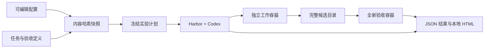

# Codex Harness Bench

本地运行的 Codex 配置实验工具。保存配置、固定实验条件、运行同一组公开工程任务，以独立验收判断交付是否正确，保留结果供恢复和复测。

需求原文和 R01–R19 只保存在 [requirements.md](requirements.md)。本文件描述实现合同，不把旧对话中模型提出的设想当成已实现功能。

## 产品判断

可做。市场上已有 skills、AGENTS.md 和 coding agent 的评测项目，因此价值在于面向个人 Codex 配置的清晰实验闭环：**改了什么 → 生效了什么 → 做成了什么 → 用了多少 → 差异能否相信 → 如何重跑**。

最小版本使用 Harbor 的 Codex adapter、Docker 生命周期、网络控制、单独验收环境和轨迹采集。本项目只增加冻结配置、控制变量、运行顺序和中文静态报告。既有能力与缺口见 [调研](research/landscape.md)。

## 首轮范围

用户在 2026-09-12 选择“两套配置、一题、一次对比”的最小可运行验证，并要求远端连接不要阻碍本地工作。

- 两套示例：minimal / focused。它们不是用户整套个人配置的镜像，也不是 superpowers 的对照实验。
- 一个原创 Python 笔记搜索任务，验收 Unicode、标签、归档过滤、空查询、输入保真和既有工具复用。
- 固定 Codex CLI 0.154.0、Harbor 0.23.0、模型请求标识、推理档位、镜像内容、任务和预算。
- 执行器提供一次性真实运行，失败保留结果；报告能离线重建。
- 题源源码准备公开，但本轮不上传 GitHub，不能把尚未发布的任务称作已公开基准。

退出标准：错误起点被拒绝，参考解通过；两个 profile 实际装载内容可核对；两次 Codex 调用在独立容器中完成；候选产物在另一容器验收；结果、时长、用量、配置差异可查看。服务或环境失败必须如实记录，不能用模拟结果替代。

## 架构

代码边界：

- `profiles.py`：严格限定输入、拒绝凭据文件和链接、按文件 SHA-256 生成内容摘要。
- `cli.py`：预检、镜像准备、配置差异、实验冻结、顺序调度 Harbor、状态提取。
- `adapter.py`：扩展 Harbor Codex，仅注入全局 AGENTS.md 与可选 skill 文件，保存装载证据。
- `report.py`：转义后输出本地 HTML，不创建服务。
- `tasks/`：原创题面、基础代码、参考解、外部验收器。只把 environment/fixture 放进 agent 镜像。

不把“目录层次”变成额外服务；不设置数据库、队列、账号或网络后台。

## 配置合同

每套配置有 `profile.json`、`config.toml`、`AGENTS.md`，可选 `skills/<name>/SKILL.md`。

当前原生设置白名单：`model_reasoning_effort`、`web_search`。模型在实验层指定。首轮固定搜索 disabled、固定推理档位。未知字段拒绝，MCP 等后续能力明确未支持。

每次 plan 复制配置和题目；执行前核对快照与 runner 摘要。源 profile 修改不影响旧快照；旧快照被手工修改则禁止执行。重复执行已产生的 attempt 会报错，建立新计划保留旧记录。

内容寻址提供可检测的不可变性，不等于操作系统不可写：本机所有者可以改文件，但校验能发现差异。计划本身目前不是签名包。

全局指令上传到独立 CODEX_HOME；skills 上传到独立容器 HOME 的 `.agents/skills`。容器无用户个人目录。上传成功与实际使用分开记录：校验指令文件哈希是装载证据，最终回复中的 profile 标记是遵循该指令的观察证据，不能据此推断每条规则都被遵循。

原生系统 skills 仍属于固定 Codex 二进制提供的环境；不能宣称“零 skills”。初始两套示例不附加用户 skills。

## 题库与验收

先验证原创小题，后续接入经验证的 SWE-bench Lite 固定子集。每题记录来源、许可、revision、group、环境、约束和是否改编；第三方工具许可不等于题目许可。

原创工作流路线保留四类：复用现有能力、替换并清理旧实现、连续需求变更、局部修改与回归。不能只选让代码越少越占优的题；也要保留合理复杂任务。

公开材料包含参考解和验收规则，但运行时 agent 只获得起点代码与当前题面。Git 未来历史、验收器、其他 trial 和完整 benchmark 不进入工作容器。候选代码导出整个 /app，包含新增和删除；验收时覆盖全新容器的 /app，避免只取 diff 漏掉 untracked 文件。

Harbor 的验收容器在 agent 结束后建立；题目的 verifier 文件预先打入独立验收镜像，不进入 agent 镜像，agent 修改自己的 tests 不会替换外部验收器。只使用公开题面明确的约束，不以隐藏审美偏好扣分。

本工具验证正常编码 agent 的效果，不对蓄意攻击验收器的任意恶意代码提供安全承诺。

## 实验协议

- 每个独立任务和重复使用新环境、新会话；题内多轮续接为后续里程碑。
- 固定同一镜像 ID；首次构建耗时与 agent 时间分开。
- A/B 交错，下一次重复反转顺序；当前单题每配置一次，无随机性结论。
- 每 trial agent 300 秒；一次两套配置总 agent 上限 600 秒，环境准备和验收另算。token/账单没有硬预算控制，不声称有。
- 无自动重试。环境异常后先停止，修因后新建 attempt；历史不删。
- 首版使用固定用户消息，不引入随机 AI 用户或临时人工救场。
- 允许访问模型服务域名，其余出站受 Harbor allowlist 控制；验收断网。远程模型别名和服务端缓存无法完全冻结。

## 保存和展示

`runs/<experiment>/plan.json` 固定配置哈希、任务哈希、runner 摘要、镜像、模型、版本、预算和顺序；`inputs/` 保留材料；`trial-*/harbor/` 保留框架完整产物；每 trial 的 `result.json` 为清晰摘要；HTML 可重新生成。

结果区分：完成通过、完成失败、超时、执行异常、基础设施异常、验收异常、未开始。拿不到的用量/耗时是 null，不能写 0；订阅使用不套 API 单价冒充真实费用。更精细的限流和交互阻塞分类留待有真实事件证据后补充。

所有本地轨迹默认不提交 Git，不自动上传。公开发布结果需先审查日志中可能出现的配置和个人内容。

## 评分和误差

主指标为统一预算内关键验收通过率。速度必须同时展示失败和超时；比较速度时限制在双方成功的配对任务，并报告覆盖数。

任务链只算一个独立组，同题重复不虚增独立任务数。置信区间应按预定义 group 做配对重采样；当前只有一个组，不输出看似精确的区间或总榜分。

代码行数、文件数、工具次数是诊断信号，不直接扣分。主观设计质量可匿名审查，与行为验收分开展示。微量改动只能在多样任务和重复实验后判断；“未测出差异”不代表等效。调参集与冻结后的验证集应分开，公開保留集仍可能有训练污染。

## 后续范围

配置 clone/restore/export/import、MCP、更多原生字段、多轮 resume、失败重跑、公开任务子集、分组统计、逐题轨迹对比和本地交互界面按 [路线图](ROADMAP.md) 推进。每项必须有独立验收证据后才标为支持。

## 复现与撤销

同机复测依赖保存的镜像 ID 和快照。跨机器完整复现仍需镜像分发或锁定 OS 软件包；基础镜像 tag 的重建不保证逐字节一致。使用 `chb prepare` 构建一次、随后 plan 固定实际镜像 ID。

停止测试不改用户全局 Codex 配置。代码以本地 Git 提交回退；实验目录先归档再移除。容器由 Harbor 清理；镜像留作复测缓存，删除时精确指定本项目镜像，不运行全局 Docker prune。
