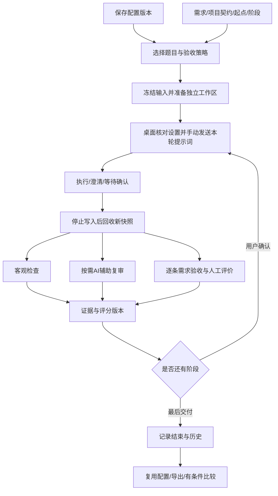
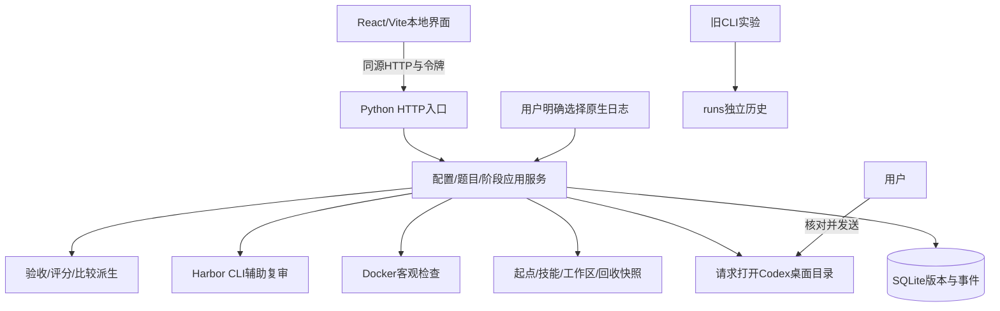

# Codex Harness Bench：总架构与唯一实施路线

依据：用户原文与裁决 U01–U10，尤其 U07采用Gemini、U08桌面正式评测、U10要求来源核对与详细架构。本文是唯一总架构和实施路线；[ROADMAP](ROADMAP.md)只作入口，模块文档拥有细则与验收案例，不重复维护阶段状态。

**当前定性：桌面评测基础链路已实现并经过有限软件验证；Gemini产品逻辑尚未完整接入。** 此前“功能版已交付”的范围过大，本轮纠正。已有测试和调用回执仍有效，但不能证明结构化需求、逐条验收和配置对照等产品功能已经完成。用户尚未对本轮修订架构作整体验收。

## 1. 项目要解决的问题

用户希望知道：在Codex桌面这个固定场景中，自己的规则、技能和交互约定怎样影响真实项目交付；改动配置以后，是否更能理解需求、做出可用结果，过程与资源使用是否合适。

这里的“直击有效”是理解并完成需求，不是代码越少、轮次越少、技能越少越好。配置要求阶段确认时，等待是约定的一部分；个人镜像同步之类要求仅在本次启用时验收。详见 [产品模型](architecture/PRODUCT_MODEL.md)。

默认一套配置、一道项目构建题。Bug修复独立分类；A/B比较可选；批量只是准备多个独立工作区，不自动向桌面发五道题。结果是可复核的个人实验记录，不是跨所有Harness的普遍能力认证。

## 2. 输入依据与Gemini承接原则

1. 用户要求与裁决优先，不把此前助手设计当不可改变的框架。
2. Gemini是前端和产品逻辑输入：保留单配置主线、两类题、配置矩阵、项目契约、证据复审、细粒度评价及历史。
3. 原型的随机分、默认通过、虚假命令、凭技能数量扣分和“100%确定”宣传不进入真实功能。
4. 原型合理的交互不能因为去掉模拟代码一并丢掉。需要调整时逐项写明原因和功能替代。
5. 保留已有本地后端基础，不重做通用Agent运行平台；视觉减法按U07后置。

[Gemini对齐审计](architecture/GEMINI_ALIGNMENT.md)列出30项对照及源文件摘要。本轮发现：7道已有结构化Spec保留在catalog/数据库中，但活动编辑器、桌面提示词和逐项验收没有完整贯通；这属于功能缺口。

## 3. 产品对象与完整操作流

|对象|含义|版本/归属|
|---|---|---|
|Config|规则、技能、模型/档位、交互与个人约束|命名ID+revision；运行保存全文|
|Task|项目/修复需求、契约、阶段、起点、验收、来源|独立版本；不能后改旧Run|
|Run|一次冻结的配置/题目选择与策略|可含多个Trial，不代表自动批跑|
|Trial|一个配置×一道题的独立工作区|多轮仍是一题|
|Capture|一次回收的文件证据|所属阶段、hash、差异、检查|
|Review|针对回收的人工评价或AI意见|证据类型分开、追加版本|
|Comparison|有条件的结果与差异解释|不把不同题类/策略混成总榜|

图表示目标完整流程。当前已有文本题和文件回收主链，结构化契约与逐条验收由B01/B02补齐。

用户实际步骤是：选择 → 准备 → 打开目录 → 核对模型/档位 → 复制并手动发送 → 等本轮完成 → 回收 → 查看文件与验收 → 确认下一轮或结束。打开桌面不等于已发消息；记录开始是用户声明，不是进程监控。完整动作说明见 [执行合同](architecture/EXECUTION_AND_EVIDENCE.md)。

## 4. 系统分层与执行边界

|模块|现有落点|负责|边界|
|---|---|---|---|
|界面|frontend/src/workbench|表单、操作、材料、历史|不造结果，localStorage不存业务事实|
|HTTP|src/chb/webapp.py|静态资源、Host/Origin/Token、路由|仅127.0.0.1，无任意宿主shell/文件接口|
|应用|arena/api.py、service.py|校验、版本、准备、阶段、恢复|不修改宿主Codex、不代发桌面提示词|
|数据|arena/database.py|records/revisions事务|Trial等目前内嵌Run JSON，非独立SQL表|
|文件|arena/files.py|限定路径、快照、hash、差异|不跟随链接，不吞超限或变化错误|
|后台|arena/jobs.py|拥有的检查与Harbor审查|只停止本工具工作，AI不写人工分|
|评分|arena/scoring.py|公式、适用项、证据齐备性|未知不填默认高分|
|用量|arena/telemetry.py|明确日志归属、累计值|不扫描全部会话，不猜费用|
|旧实验|cli/adapter/results/analysis|CLI执行与只读历史分析|不混入桌面正式成绩|

### 4.1 配置装载

准备时复制题目起点，合并起点根规则和本次配置为AGENTS.override.md，复制选定技能到.agents/skills，初始化独立Git并冻结baseline。**这是工作区叠加，不是完整全局隔离。**

桌面仍继承宿主全局规则、技能、插件和设置。当前宿主指纹只有AGENTS.md、AGENTS.override.md、config.toml。回收比较工作区规则/技能/.codex变化，只能提供部分条件证据。文件存在不能证明模型已遵守或技能已触发。详细能力表和冲突规则见 [配置合同](architecture/CONFIGURATION.md)。

2026-09-15已有本机codex app帮助与官方规则/技能文档核对记录；本轮沿用其证据，不宣称重新验证全部当前模型组合。旧CLI能力说明在codex-capabilities.md，不可套成桌面支持表。

### 4.2 客观检查与AI审查

客观检查采用image+argv+weight+timeout+可选stageIndex，镜像需预先准备，执行固定内容ID。只读挂载本次冻结文件并复制到容器/app；网络关闭、无宿主home/Docker socket，资源与权限受限。退出码、输出、时间真实记录；超时/取消/环境错误不当作题目失败。

AI复审通过Harbor管理的Codex CLI、专用reviewer镜像执行，标cli-review-only；显式点击使用额度，Agent超时180秒，准备/清理另计，不自动换模型或重试。单文件30k字符、总100k字符，遗漏项记录；输出引用验证仅证明引用存在，不能保证判断正确。没有视觉材料时不声称视觉验收。

工作区继续变化不影响旧快照。前轮补验检查的是旧版本，不是最终回归；完整回归关联待B02/B04。详情见执行和评分合同。

## 5. 数据、状态与证据约束

本地业务根.local/arena，包含arena.sqlite3、skills、baselines、runs；每个Trial含workspace、baseline、captures、traces、reviews。原生日记、配置、轨迹、产物只本地保存，不进入Git；Obsidian镜像none。

主要约束：

- Config/Task编辑创建revision，旧版不覆盖；Run冻结完整输入和策略。
- Capture文件不可改写；检查尝试和人工复审有历史，新回收不继承旧人工分。
- 评分和导出核对目标快照hash；hash不是第三方签名或防恶意编辑系统。
- 快照单文件8 MB、总50 MB、5000文件；凭据/依赖/Git元数据排除，链接和回收期间变化报错。
- ZIP最大200 MB，含私有规则与产物，不含认证/原生完整日志；当前没有ZIP导入恢复功能。
- SQLite与文件系统非同一事务；失败残留和恢复仍需B05补强。
- 服务重启保留证据并标记中断。强制结束后Harbor环境清理不能保证，只按精确拥有信息核对，不全局清Docker。

状态主线：prepared → working → captured → waiting_confirmation → working… → captured → completed；后台checking/judging是有目标快照的临时状态，另有interrupted。completed只表示交付结束，不表示质量通过。

现有HTTP路由、请求/响应、后台动作、错误和拟新增实体完整列于 [数据与API](architecture/DATA_AND_API.md)。它保留了原接口合同，没有把实现细则压缩掉。

## 6. 评分方法与比较边界

三类评价证据是客观、人工、AI；个人约束另有逐项验收结果。目标将题目条目与证据关联，避免只打四个泛泛数字。

现有公式：客观分=全部预定检查中的通过权重比例；人工分=适用维度加权平均；总分按冻结主权重合成。默认客观50/人工50，人工30/25/25/20，是可调整的产品约定。非UI题排除UX并归一化；证据不齐或未结束时总分null。AI不计总分，个人偏好不变成所有人的加分。

目标补“必要条目是否满足”的验收结论，与连续分数并列。分高不自动等于需求通过，行数少不自动等于切中需求，等待确认不自动等于效率差。详见 [验收与评分](architecture/EVALUATION.md)。

用量读取明确导入的原生日志最终累计，验证cwd/session与模型/档位；缓存属于input，reasoning不盲目重复相加。活动区间不是纯推理时间；费用未知。小幅规则修改可能被随机性和评分误差淹没；没有固定误差、100%正确或单次因果结论。比较方法与未实现部分见 [用量与比较](architecture/MEASUREMENT_AND_COMPARISON.md)。

## 7. 前端与模块文档的责任

[FRONTEND_SPEC](FRONTEND_SPEC.md)保存六页职责、跳转、表单、复审材料、空态/异常、公共UI规则和操作验收。[文档索引](README.md)给出阅读顺序和模块归属。

|设计问题|唯一细则文档|
|---|---|
|背景、对象、范围、固定场景|architecture/PRODUCT_MODEL.md|
|Gemini哪些保留、哪些更改、哪里遗漏|architecture/GEMINI_ALIGNMENT.md|
|配置、技能、全局继承、矩阵和恢复|architecture/CONFIGURATION.md|
|两类题、三轴、项目Spec、新题与来源|architecture/TASKS_AND_CONTRACTS.md|
|桌面手动步骤、阶段、回收和恢复|architecture/EXECUTION_AND_EVIDENCE.md|
|逐条验收、公式、人工/AI分工与误判|architecture/EVALUATION.md|
|实体、版本、HTTP、迁移与导出|architecture/DATA_AND_API.md|
|Token/时间/异常/可比性/随机性|architecture/MEASUREMENT_AND_COMPARISON.md|
|后端切片、测试层次、完整项目验收|architecture/BACKEND_DELIVERY.md|

## 8. 唯一实施路线与完成标准

本节统一维护工作包状态。B编号是功能交付范围，不是每次对话只做一个按钮。当前状态不以测试数换算百分比，不把本轮文档完成写成其描述的功能已编码。

状态口径：**审计完成**表示文档/来源核对完成；**基础已有，待补齐**表示部分现有代码可复用；**未开始**表示该工作包的目标实现尚未开展；**未验证**表示实现与实际使用证明分开。后续完成需附版本和对应回执。

### 8.1 工作包总表

|编号|工作包|依赖|本轮状态|完成判断|
|---|---|---|---|---|
|B00|来源审计与架构合同|用户原文、Gemini输入、当前代码|审计和文档已完成；用户尚未整体验收|30项对齐、22项原文细则、模块/页面/API/路线一致|
|B01|项目契约与题库接入|B00|基础保存已有，结构化接入未完成|契约从编辑→提示词→历史保真，三轴筛选和题包导入|
|B02|逐条验收与评分合同|B01|基础公式已有，逐项功能未完成|条目/证据/必要项结论/评分版本完整|
|B03|配置矩阵、装载与版本|B00|基础配置已有，矩阵/版本浏览未完成|可读比较、实际装载说明、旧版副本和选中跳转|
|B04|多轮与完整复审入口|B01、B02|多轮和基础证据已有，契约关联未完成|阶段回归、材料定位、AI意见处理、介入记录|
|B05|异常恢复与数据一致性|B01–B04相关合同|基础保护已有，恢复体验待补强|互斥、草稿、失败残留、恢复和错误分类验证|
|B06|用量、历史复用与比较|B02、B03、B05|基础日志/历史已有，复用/比较未完成|真实分项/条件解释、版本历史、重复运行与用量诊断|
|B07|原创完整项目题与题包验证|B01、B02、B04|未开始；现有3题不能替代|一套前后端项目的负例/参考解/多轮回归验收|
|B08|方法边界与重复评测记录|B02、B06、B07|方法合同已写，记录功能待补|条件/样本/介入/未知解释；不承诺统计胜出|
|B09|页面减法与可用性收尾|B01–B08必要功能完成|未开始；不先重做视觉|功能不丢，浅深色/键盘/窄屏/上下文操作通过|
|B10|正式桌面整题与发布验收|B01–B09|未验证，尚无正式桌面整题证据|实际项目闭环、用户流程审查、回执与版本对应|

### 8.2 B01：项目契约与题库接入

问题：Gemini Spec和逐题细则虽然保留在catalog，却未完整进入工作台。对应G05/G11–G14、D15-12/13/14。

交付内容：
1. Task契约schema、稳定条目ID、旧字段迁移；保留来源与准备度。
2. ProjectSpec编辑/预览、三轴筛选、完整搜索、指定题进入工作台。
3. 新题JSON导入预览和逐项错误，创建副本，不覆盖已有题。
4. 统一冻结提示词编排，明确总体需求、项目契约和当前阶段，历史保存同份文本/来源。

修改面：Task类型、题库编辑器、save_task、prepare、提示词显示、历史。退出条件T-AC1/2/3/4、F-AC1/2、D-AC1；从新建到历史实际走通。没有脚本也能以明确人工策略开始，不能硬塞默认npm test。

### 8.3 B02：逐条验收与评分

问题：当前四维数字和整体说明不足以验收项目契约。对应G18–G21/G28、D15-07/10/14/19。

交付内容：
1. 按冻结条目保存满足/部分/不满足/未核实/不适用、依据和证据。
2. 通用量表与逐题条目关联，个人约束单列；必要项结论与分数分开。
3. 检查类型、条目引用与最终回归关联定义；不自动猜测试性质。
4. 公式可见、未知/0/不适用区分，评分修订留理由，旧策略只读兼容。

修改面：scoring/Review模型/Task checks、复审UI、历史/导出。退出条件S-AC1/2/3/4/6、F-AC3；必要持久化失败时不能显示验收通过，旧分回放不变。

### 8.4 B03：配置、矩阵与装载

问题：当前JSON显示不够直观，版本表存在但用户不能完整浏览。对应G06–G10/G26、D15-05/07/11。

交付内容：字段矩阵、规则正文与技能内容差异；实际生成规则预览和来源；模型/档位能力来源；约束类别与验收提示；版本时间线、恢复副本和用于评测入口。specialFeatures须转成真实规则或显式停用。

修改面：配置API/差异服务、Editors/Prepare/版本视图。退出条件C-AC1至C-AC5、F-AC4；同名技能内容变动可识别，宿主配置不被修改。

### 8.5 B04：阶段、回归与复审材料

问题：前轮补验不是最终回归，材料尚未与条目连起来，AI意见缺处理过程。对应G15/G17/G22、D15-08/18。

交付内容：阶段合同与冻结提示词；带未完成事项继续的明确记录；最终快照回归；统一需求/文件/输出/事实/人工复审入口；AI意见引用定位、接受/驳回/待核实；人工操作证据与介入记录。

修改面：mutate/jobs、阶段/证据模型、Runner复审区。退出条件T-AC5、E-AC2/3/4、S-AC5；保留手动同一桌面任务，多轮不冒充独立样本。需求探索模式的候选Spec确认先做可审查例子，不静默改旧合同。

### 8.6 B05：恢复与一致性

问题：现有基础错误拦截不能覆盖用户完整恢复流程。对应G24/G29、D15-15。

交付内容：服务端动作互斥和错误分类；prepared/working/interrupted恢复指引；准备失败的文件/DB一致性；旧检查尝试可查；后台重启的拥有信息核对；表单草稿、版本冲突、渲染错误边界。

修改面：webapp/api/service/jobs/files、App和表单。退出条件E-AC1/5、D-AC2/3/4、F-AC5；模拟断开/重启/重复请求后，旧证据不丢，无清库兜底。

### 8.7 B06：历史、用量与比较

问题：现有历史可查看但不能完整复用，比较只是少数列，日志诊断不够细。对应G23/G25–G27、D15-05/15/20。

交付内容：完整契约/条目/复审历史；按冻结条件新建评测而非覆盖；reasoning指标校验与显示、日志协议/事件诊断；异常细类；后端统一同条件分组、分项/用量差异和排除理由。按规模需要拆摘要/详情，避免全量state不断变大。

修改面：telemetry/comparison/历史API、Records、导出。退出条件M-AC1/3/5、D-AC5、F-AC4；重建新目录，原记录不变；未知信息不填估计值。

### 8.8 B07：完整项目题与题包

问题：31题面和3套现有原创题不足以验收完整前后端项目。对应D15-04/12/13/14。

交付内容：至少一套原创项目，含交互、持久化、异常、多轮扩展、明确验收合同；独立检查镜像、负例和参考解；可复用检查模板与人工验收步骤；来源、许可、准备度真实。

退出条件T-AC6和后端完成合同第8节的题包/软件链路阶段。参考解和独立验收器不交给桌面；不宣称覆盖所有项目类型。

### 8.9 B08：方法与不确定性

问题：固定场景和随机误差必须影响结果展示，不只是FAQ。对应D15-02/06/19。

交付内容：实际/请求条件、人工介入、样本次数、失败/中断/未知数量、单次差值解释和重复评测组织记录。等待时间明确来源，无法拆分时标未知。

退出条件M-AC2/4/5。置信区间、自动胜者和多裁判算法不是本包默认交付；若未来要做，另立具体算法/预算/假设合同，不能以固定±分替代。

### 8.10 B09：可用性减法

保持Gemini有效流程，缩减重复文案、无关联弹窗和拥挤卡片；让配置、需求、阶段和结果各有清楚位置。补浅色/炭黑、字体、键盘、窄屏、减少动画的操作验证。

退出条件F-AC6与页面主线复测。不能通过删除契约、对照或验收功能让页面“看起来简洁”。

### 8.11 B10：正式桌面整题与发布

在功能合同补齐后，用B07项目走完整桌面工作流，保留真实会话/工作区/产物/用量与验收；分别说明软件是否工作、模型交付是否合格，不能混为一个通过。

用户手动核对与发送依U08执行；需安排这个动作时给出已准备的明确工作区和提示词，不再询问执行方式。流程审查意见进入requirements裁决。源码/公开题目/文档发布同一授权仓库；不上传私有数据，不部署公网API。

退出条件：后端完成合同第8节全部适用环节有证据；历史可复用；未通过项明确；架构/接口/交接与版本一致。只有此时才称“产品功能闭环已验收”。

### 8.12 下一实施入口与范围

下一实施从B01开始，以一个结构化项目题贯穿保存、提示词和历史，再接B02逐项验收。B03可作为独立能力相邻推进，但不为它阻塞契约主线；不用未经请求的并行子代理。

本轮交付B00文档审计，不把B01–B10描述的未来能力记成已完成。用户审查可以修正设计，不要求用户逐个回复“继续”才处理同一已授权工作包。

## 9. 已验证事实及其边界

|证据|验证了什么|没有验证什么|
|---|---|---|
|41项测试，TypeScript/Vite/compileall/uv build|现有合同、构建与基础回归|本轮新增目标合同已经编码|
|3题容器负例/参考解、存储两阶段、超时/停止|检查器与容器链路|完整前后端项目交付|
|gpt-6-astra/low一次CLI辅助复审|真实调用、结构化输出和保存|AI正确率、桌面模型分数|
|浏览器两轮draft/final样例与人工70.81|回收、计算、历史、恢复等基础流程|正式桌面整题、结构化Spec与逐项验收|
|32份Gemini源文件hash一致|输入来源未被修改|当前UI完全采用原型逻辑|

具体回执路径与版本见 [当前交接](当前交接.md)、[CODEX_HISTORY](CODEX_HISTORY.md)。本轮文档验证仅检查来源、覆盖、链接和一致性，不重新消耗模型额度或重跑无关容器。

## 10. 待审设计与变更规则

|问题|建议及当前边界|归属|
|---|---|---|
|固定Spec还是需求探索|两者区分，先贯通固定契约；探索保留用户确认与版本|任务合同|
|个人约束是否计专属分|先单列证据，不加公共分；专属分需另定策略|配置/评分|
|默认权重是否采用50/50|现有可调约定，不声称唯一合理；策略冻结|评分|
|直接验收外部目录|本期独立工作区已定；外部原地接管未实现|执行|
|是否多裁判/统计自动结论|先真实证据与争议记录；进一步算法另行具体定义|评分/比较|

这些是明确待审取舍，不是把全部功能开发挂起的理由。原话变更只进入requirements；设计改变更新拥有该细则的模块和本路线；接口变更同步类型/页面/历史；进度摘要进入当前交接；重要版本证据进入历史，不复制多套路线。

## 11. 运行、验证与分发

仓库editable安装：uv sync --frozen；pnpm --dir frontend install --frozen-lockfile；pnpm --dir frontend build。双击launch-ui.cmd，或 .venv\Scripts\python.exe -X utf8 -m chb.cli ui；默认127.0.0.1:8765，可--no-browser。Python同源提供React与API。

检查命令以 [AGENTS](../AGENTS.md)和 [README](../README.md)为准。Docker仅在客观/AI验收需要；准备工作区不需启动模型或Docker。独立wheel不是含完整题库/前端的完整分发。

旧CLI实验保留为独立辅助；旧F1/F2合同在docs/archive，不能恢复为当前产品路线。仅源码、可公开题目和文档提交Git，私有原文/配置/轨迹/快照保留本地。
