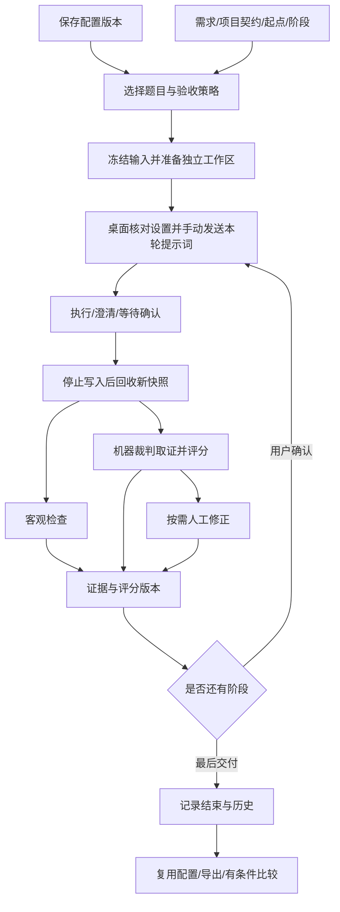
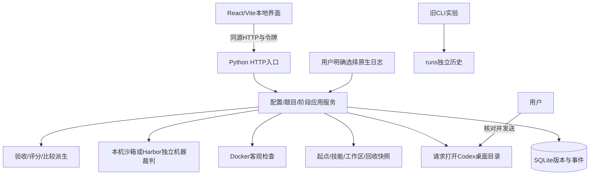

# Codex Harness Bench：总架构与唯一实施路线

依据用户当前裁决U27：本项目独立定义产品与后端，Gemini仅为初始前端来源。正式评测以Codex桌面为固定产品底座，研究模型与个人可配置Harness对真实任务交付的共同影响。本文第8节是唯一实施路线，模块文档保存接口与细则。

## 1. 项目要解决的问题

公开模型成绩来自特定任务、运行框架和评测条件，不能直接回答“我的日常Codex配置是否更有效”。本项目把问题缩到用户真实使用的桌面场景：固定Codex桌面这一既有Harness，记录模型与推理档位，改变可配置层，观察交付、用量及约束遵守的差异。

评测对象分三层：

|层次|具体对象|实验角色|
|---|---|---|
|桌面底座|Codex桌面的执行循环、工具、上下文管理和产品行为|记录版本/平台/宿主条件；不重写它的Agent Loop|
|模型条件|模型、推理档位、可用额度及实际调用记录|配置A/B尽量固定；改变时解释为组合对比|
|个人配置|AGENTS、Skills、交互约定、支持的原生设置及已有工具开关|主要比较变量，冻结版本并记录实际应用证据|

核心问题：规则改动是否更切中需求？技能是否带来可验证的帮助？相同交付需要多少资源与人工介入？需要覆盖项目构建、修复、重构与已有项目扩展，不以一类任务代表全部能力。

默认一套配置、一道题、完整需求，不限定真实对话轮数；对比与分阶段由用户主动选择。判断微小收益需要同题同条件重复样本，当前仅保存可追溯记录和有条件分组，不自动宣布统计胜者。详见[产品模型](architecture/PRODUCT_MODEL.md)与[用量比较](architecture/MEASUREMENT_AND_COMPARISON.md)。

## 2. 产品依据与实施原则

1. 用户当前目标和可核实的实现是依据；前端原型提供界面起点，不定义题库数量、评分算法或后端边界。
2. 正式执行仍在Codex桌面；题库接入借用外部任务与验收方法，不偷换成CLI模型榜。独立CLI裁判只承担回收后的验收。
3. 题目必须说明需求、起点、运行依赖和判分依据。需要已有工程的任务自动准备固定源码；题面链接不算环境已就绪。
4. 评分以机器为主、人工按项修正；原生程序验收指标与开放质量量表分开，证据缺失不编分。
5. 工作区冻结题目/配置/策略，回收生成新快照。宿主全局继承、版本变化和人工介入作为实验条件记录，不宣称天然完全隔离。
6. 对用户的说明只讲当前定位、操作和限制。原型承接、旧算法及历次修补属于历史记录，不作为首页产品叙事。

当前已实现配置管理/显式应用、独立工作区、回收、独立机器评分和人工修正、用量与历史。内置3套源码题；DeepSWE113题可直接选用、创建时按需准备；按原分类提供修复/功能/改进。Tengo两题和Yaegi Embed完成Windows免Docker环境与原测试适配；ABS改进题验证源码准备。**其余外部题环境、Windows本机裁判浏览器取证、评分校准、完整环境指纹仍未完成。**

## 3. 产品对象与完整操作流

|对象|含义|版本/归属|
|---|---|---|
|Config|规则、技能、模型/档位、交互与个人约束|命名ID+revision；运行保存全文|
|Task|项目/修复需求、契约、阶段、起点、验收、来源|独立版本；不能后改旧Run|
|Run|一次冻结的配置/题目选择与策略|可含多个Trial，不代表自动批跑|
|Trial|一个配置×一道题的独立工作区|多轮仍是一题|
|Capture|一次回收的文件证据|所属阶段、hash、差异、检查|
|Review|针对回收的人工评价或AI意见|证据类型分开、追加版本|
|Comparison|有条件的结果与差异解释|不把不同题类/策略混成总榜|

图表示完整操作方向。当前已接固定结构化契约与逐项人工验收；候选Spec的用户确认、配置矩阵和按历史完整重建仍待补。

用户实际步骤是：选择 → 准备 → 打开新桌面任务草稿 → 核对模型/档位并发送 → 自动读取执行日志 → 本轮完成后回收 → 机器评分/人工修正 → 确认下一轮或结束。打开桌面不等于已发消息；开始状态从匹配会话的原生日志自动同步，手动记录只作后备。完整动作说明见 [执行合同](architecture/EXECUTION_AND_EVIDENCE.md)。

## 4. 系统分层与执行边界

|模块|现有落点|负责|边界|
|---|---|---|---|
|界面|frontend/src/workbench|表单、操作、材料、历史|不造结果，localStorage不存业务事实|
|HTTP|src/chb/webapp.py|静态资源、Host/Origin/Token、路由|仅127.0.0.1，无任意宿主shell/文件接口|
|应用|arena/api.py、service.py|校验、版本、准备、阶段、恢复|显式应用可备份写入宿主；不代发桌面提示词|
|契约|arena/contracts.py、task_import.py|结构校验、兼容转换、冻结提示词、事务题包导入|不改旧Run，不从题面猜测已通过|
|数据|arena/database.py|records/revisions事务|Trial等目前内嵌Run JSON，非独立SQL表|
|文件|arena/files.py|限定路径、快照、hash、差异|不跟随链接，不吞超限或变化错误|
|后台|arena/jobs.py|拥有的检查与本机/Harbor审查|只停止本工具工作，机器分与人工修正分开保存|
|评分|arena/scoring.py|公式、适用项、证据齐备性|未知不填默认高分|
|用量|arena/telemetry.py|明确日志归属、累计值|不扫描全部会话，不猜费用|
|旧实验|cli/adapter/results/analysis|CLI执行与只读历史分析|不混入桌面正式成绩|

### 4.1 配置装载

准备时复制题目起点，合并起点根规则和本次配置为AGENTS.override.md，复制选定技能到.agents/skills，初始化独立Git并冻结baseline。**这是工作区叠加，不是完整全局隔离。**

桌面仍继承宿主全局规则、技能、插件和设置。当前宿主指纹只有AGENTS.md、AGENTS.override.md、config.toml。回收比较工作区规则/技能/.codex变化，只能提供部分条件证据。文件存在不能证明模型已遵守或技能已触发。详细能力表和冲突规则见 [配置合同](architecture/CONFIGURATION.md)。

2026-09-15已有本机codex app帮助与官方规则/技能文档核对记录；本轮沿用其证据，不宣称重新验证全部当前模型组合。旧CLI能力说明在codex-capabilities.md，不可套成桌面支持表。

### 4.2 客观检查与AI审查

客观检查采用image+argv+weight+timeout+可选stageIndex，镜像需预先准备，执行固定内容ID。只读挂载本次冻结文件并复制到容器/app；网络关闭、无宿主home/Docker socket，资源与权限受限。退出码、输出、时间真实记录；超时/取消/环境错误不当作题目失败。

AI裁判标cli-review-only，可选固定本机 Codex 原生沙箱或 Harbor 容器。新机器方案默认 `gpt-5.6-luna`/`max`，用户可选择其他可用模型；480秒、旧意见180秒，准备清理另计。本机模式按PATH查找官方 Codex CLI（可用 `CHB_CODEX_BIN` 指定路径），不会打包、安装或登录 CLI；复制冻结快照、使用独立临时 CODEX_HOME，关闭宿主规则加载，不运行 Docker 脚本；使用本机工具并允许安装依赖，环境不能视为跨机器一致。容器模式使用machine-v1镜像及已有Harbor。每次裁判是新的 `codex exec --ephemeral` 进程，不续接前次会话；两者均保存命令/输出并核对引用，缺运行证据不生成UX/性能分，不自动重试或换模型。模型评分可能波动，单次报告不构成准确性保证。

工作区继续变化不影响旧快照。前轮补验检查的是旧版本，不是最终回归；新契约可用runOnFinal明确声明最终快照回归；未勾选的旧阶段检查不会自动重跑。详情见执行和评分合同。

## 5. 数据、状态与证据约束

本地业务根.local/arena，包含arena.sqlite3、skills、baselines、runs；每个Trial含workspace、baseline、captures、traces、reviews。原生日记、配置、轨迹、产物只本地保存，不进入Git；Obsidian镜像none。

主要约束：

- Config/Task编辑创建revision，旧版不覆盖；Run冻结完整输入和策略。
- Capture文件不可改写；检查尝试和人工复审有历史，新回收不继承旧人工分。
- 评分和导出核对目标快照hash；hash不是第三方签名或防恶意编辑系统。
- 快照单文件8 MB、总50 MB、5000文件；凭据/依赖/Git元数据排除，链接和回收期间变化报错。
- ZIP最大200 MB，含私有规则与产物，不含认证/原生完整日志；当前没有ZIP导入恢复功能。
- SQLite与文件系统非同一事务；失败残留和恢复仍需B05补强。
- 服务重启保留证据并标记中断。强制结束后Harbor环境清理不能保证，只按精确拥有信息核对，不全局清Docker。

状态主线：prepared → working → captured → completed；修改后可再次capture；显式分步才使用waiting_confirmation；后台checking/judging是有目标快照的临时状态，另有interrupted。completed只表示交付结束，不表示质量通过。

现有HTTP路由、请求/响应、后台动作、错误和拟新增实体完整列于 [数据与API](architecture/DATA_AND_API.md)。它保留了原接口合同，没有把实现细则压缩掉。

## 6. 评分方法与比较边界

三类评价证据是客观、人工、AI；个人约束另有逐项验收结果。版本2题目已将条目与人工操作说明、文件hash和检查回执关联；旧Run保留原评分语义。

新评测默认arena-machine-v1：裁判依据冻结需求和量表检查项目，逐项给0–100分或null；人工可修正单项，不固定占50%。机器覆盖不足只显示暂定分；各项有有效分且交付结束后产生最终分。脚本结果独立保存，不重复加权。旧arena-review-v1/v2保留原客观/人工公式和AI辅助意见，不重算历史。详见评分合同。

版本2已提供“必要条目是否满足”的独立验收结论，与连续分数并列。分高不自动等于需求通过，行数少不自动等于切中需求，等待确认不自动等于效率差。详见 [验收与评分](architecture/EVALUATION.md)。

用量读取明确导入的原生日志最终累计，验证cwd/session与模型/档位；缓存属于input，reasoning不盲目重复相加。活动区间不是纯推理时间；费用未知。小幅规则修改可能被随机性和评分误差淹没；没有固定误差、100%正确或单次因果结论。比较方法与未实现部分见 [用量与比较](architecture/MEASUREMENT_AND_COMPARISON.md)。

## 7. 前端与模块文档的责任

[FRONTEND_SPEC](FRONTEND_SPEC.md)保存页面职责、跳转、表单、复审材料、空态/异常、公共UI规则和操作验收。[文档索引](README.md)给出阅读顺序和模块归属。

|设计问题|唯一细则文档|
|---|---|
|背景、对象、范围、固定场景|architecture/PRODUCT_MODEL.md|
|初始前端来源的历史核对（不作为当前路线）|architecture/GEMINI_ALIGNMENT.md|
|配置、技能、全局继承、矩阵和恢复|architecture/CONFIGURATION.md|
|两类题、三轴、项目Spec、新题与来源|architecture/TASKS_AND_CONTRACTS.md|
|桌面手动步骤、阶段、回收和恢复|architecture/EXECUTION_AND_EVIDENCE.md|
|逐条验收、公式、人工/AI分工与误判|architecture/EVALUATION.md|
|实体、版本、HTTP、迁移与导出|architecture/DATA_AND_API.md|
|Token/时间/异常/可比性/随机性|architecture/MEASUREMENT_AND_COMPARISON.md|
|后端切片、测试层次、完整项目验收|architecture/BACKEND_DELIVERY.md|

## 8. 唯一实施路线与完成标准

本节统一维护工作包状态。B编号是功能交付范围，不是每次对话只做一个按钮。当前状态不以测试数换算百分比，不把本轮文档完成写成其描述的功能已编码。

状态口径：**审计完成**表示文档/来源核对完成；**基础已有，待补齐**表示部分现有代码可复用；**未开始**表示该工作包的目标实现尚未开展；**未验证**表示实现与实际使用证明分开。后续完成需附版本和对应回执。

### 8.1 工作包总表

|编号|工作包|依赖|本轮状态|完成判断|
|---|---|---|---|---|
|B00|来源审计与架构合同|用户当前需求、公开资料、当前代码|U27重写桌面底座上个人配置评测定位，原型仅保留来源记录|模块/页面/API/路线与当前需求一致|
|B01|项目契约与题库接入|B00|固定契约保留；U22开发提示词与内部评分材料分离；公开GitHub固定提交导入已实测，修复题缺源码被阻止；U26自动装载3套原创题，18份缺源码题面（17份修复、1份重构）单列待补全；完整环境准备度待补|需求与内部契约分别冻结、历史保真，三轴筛选和题包导入|
|B02|逐条验收与评分合同|B01|机器评分/人工修正已接，本机CLI合成题实跑成功；Windows本机浏览器取证IPC未解决，自动量表与校准待补|条目/证据/必要项结论/评分版本完整|
|B03|配置矩阵、装载与版本|B00|双向配置导入、显式Codex应用/切换/撤销与冻结装载已接；U26显著删除/回收站和分区编辑已接；矩阵/版本浏览未完成|可读比较、实际装载说明、旧版副本和选中跳转|
|B04|完整交付与可选分步复审|B01、B02|U24默认不限定对话轮次，支持旧机器记录提前整题交付、阶段/最终分隔离；真实前端取证及介入记录仍待补|阶段回归、材料定位、AI意见处理、介入记录|
|B05|异常恢复与数据一致性|B01–B04相关合同|基础保护已有，恢复体验待补强|互斥、草稿、失败残留、恢复和错误分类验证|
|B06|用量、历史复用与比较|B02、B03、B05|按精确工作区自动绑定原生会话，累计Token/缓存/活动时间已实测；历史复用、完整环境指纹和重复比较待补|真实分项/条件解释、版本历史、重复运行与用量诊断|
|B07|公开题包接入与完整项目题验证|B01、B02、B04|3套内置源码题；DeepSWE113题按需准备，3道Go题Windows正负例验收通过，ABS改进题源码验证；每次独立工作区、同提交缓存复用。其他环境与完整前后端项目题未完成|固定公开工程题的环境/原生验收接通，及一套前后端项目的负例/参考解/可选阶段回归验收|
|B08|方法边界与重复评测记录|B02、B06、B07|方法合同已写，记录功能待补|条件/样本/介入/未知解释；不承诺统计胜出|
|B09|页面减法与可用性收尾|B01–B08必要功能完成|已接准备步骤与评分控件；U21详情按执行/评分/产物分组，配置预览/冲突入口集中，空态精简；U22增加模型全列表、评分圆环和缓存比例条；U23区分可选阶段检查/最终评分，补阶段范围与具体引用错误；U26配置/题库左右工作区、选题预览和按用途排字；U28全站侧栏/主题/控件/历史列表更新，六入口窄屏与关键交互验证通过；全量产品审查仍未完成|功能不丢，浅深色/键盘/窄屏/上下文操作通过|
|B10|正式桌面整题与发布验收|B01–B09|未验证，尚无正式桌面整题证据|实际项目闭环、用户流程审查、回执与版本对应|

### 8.2 B01：项目契约与题库接入

问题：需求、源码起点、运行环境和验收证据必须连接为完整任务。已有字段兼容不等于题包就绪，公开工程题还欠缺桌面环境与原生验收适配。

交付内容：
1. Task契约schema、稳定条目ID、旧字段迁移；保留来源与准备度。
2. ProjectSpec编辑/预览、三轴筛选、完整搜索、指定题进入工作台。
3. 新题JSON导入预览和逐项错误，创建副本，不覆盖已有题。
4. 统一冻结提示词编排，明确总体需求、项目契约和当前阶段，历史保存同份文本/来源。

修改面：Task类型、题库编辑器、save_task、prepare、提示词显示、历史。退出条件T-AC1/2/3/4、F-AC1/2、D-AC1；从新建到历史实际走通。U20无脚本题也可用机器方案开始，旧纯人工策略兼容；不能硬塞默认npm test。

B01本轮证据：31道旧题字段保真、7份Spec兼容；JSON全包校验/事务回滚/幂等；浏览器导入一题后修改故事、按方向/难度/描述搜索、带题跳转、复制完整契约，再改题库并从历史核对旧文本。新增stage/criterion稳定ID；故事/接口/数据仍保留原型字符串数组，细化成结构化对象的长期合同没有取消。正式整题不在此证据范围。

### 8.3 B02：逐条验收与评分

问题：当前四维数字和整体说明不足以验收项目契约。对应G18–G21/G28、D15-07/10/14/19。

交付内容：
1. 按冻结条目保存满足/部分/不满足/未核实/不适用、依据和证据。
2. 通用量表与逐题条目关联，个人约束单列；必要项结论与分数分开。
3. 检查类型、条目引用与最终回归关联定义；不自动猜测试性质。
4. 公式可见、未知/0/不适用区分，评分修订留理由，旧策略只读兼容。

修改面：scoring/Review模型/Task checks、复审UI、历史/导出。退出条件S-AC1/2/3/4/6、F-AC3；必要持久化失败时不能显示验收通过，旧分回放不变。

B02本轮证据：未核实不默认通过；引用未知文件/检查被拒；必要项失败且人工99时仍未通过；0分与null区分；修订需原因且旧版保留；新回收使旧人工分失效。检查类型/criterionIds/runOnFinal已校验和冻结，最终检查漏跑或超时保持未知。旧记录数值公式不变；U20新评测改用机器评分，必要项结论独立。

U16历史语义（U20新策略已替代）：准备采用人工内部百分比合计100%，每个适用维度提交实际依据。客观检查展示真实命令、阶段、规则和覆盖；题库可复用现有检查定义，无脚本题明确选纯人工。人工裁定与自动原分并存、可撤回、绑定证据版本，不改变必要项结论或历史比较原分。旧策略保留原语义，细则/API进入原模块合同。

### 8.4 B03：配置、矩阵与装载

问题：当前JSON显示不够直观，版本表存在但用户不能完整浏览。对应G06–G10/G26、D15-05/07/11。

交付内容：字段矩阵、规则正文与技能内容差异；实际生成规则预览和来源；模型/档位能力来源；约束类别与验收提示；版本时间线、恢复副本和用于评测入口。本轮已接一键全局/项目导入、Skills 来源面板/批量冻结/调用提示、配置带入评测，细则见[配置合同](architecture/CONFIGURATION.md)；矩阵与任意版本浏览仍未完成。specialFeatures须转成真实规则或显式停用。

修改面：配置API/差异服务、Editors/Prepare/版本视图。退出条件C-AC1至C-AC5、F-AC4；同名技能内容变动可识别，宿主配置不被修改。

### 8.5 B04：阶段、回归与复审材料

问题：前轮补验不是最终回归，材料尚未与条目连起来，AI意见缺处理过程。对应G15/G17/G22、D15-08/18。

交付内容：阶段合同与冻结提示词；带未完成事项继续的明确记录；最终快照回归；统一需求/文件/输出/事实/人工复审入口；AI意见引用定位、接受/驳回/待核实；人工操作证据与介入记录。当前保留桌面人工发送；自动准备、复制路径和逐试次提示词见[执行合同](architecture/EXECUTION_AND_EVIDENCE.md)。

修改面：mutate/jobs、阶段/证据模型、Runner复审区。退出条件T-AC5、E-AC2/3/4、S-AC5；保留手动同一桌面任务，多轮不冒充独立样本。需求探索模式的候选Spec确认先做可审查例子，不静默改旧合同。

### 8.6 B05：恢复与一致性

问题：现有基础错误拦截不能覆盖用户完整恢复流程。对应G24/G29、D15-15。

U29已提供工作区数据清理：回收且结束后比较快照，移入可恢复区；永久删除仅该工作目录，保留记录/评分/证据。尚未提供引用感知的任意证据删除。

交付内容：服务端动作互斥和错误分类；prepared/working/interrupted恢复指引；准备失败的文件/DB一致性；旧检查尝试可查；后台重启的拥有信息核对；表单草稿、版本冲突、渲染错误边界。

修改面：webapp/api/service/jobs/files、App和表单。退出条件E-AC1/5、D-AC2/3/4、F-AC5；模拟断开/重启/重复请求后，旧证据不丢，无清库兜底。

### 8.7 B06：历史、用量与比较

问题：现有历史可查看但不能完整复用，比较只是少数列，日志诊断不够细。对应G23/G25–G27、D15-05/15/20。

交付内容：完整契约/条目/复审历史；按冻结条件新建评测而非覆盖；reasoning指标校验与显示、日志协议/事件诊断；异常细类；后端统一同条件分组、分项/用量差异和排除理由。按规模需要拆摘要/详情，避免全量state不断变大。

修改面：telemetry/comparison/历史API、Records、导出。退出条件M-AC1/3/5、D-AC5、F-AC4；重建新目录，原记录不变；未知信息不填估计值。

### 8.8 B07：公开题包接入与完整项目题验证

问题：少量内置样例不能覆盖个人配置的任务分布；公开题源尚未完成桌面环境与验收适配。对应D15-04/12/13/14。

交付内容：先完成DeepSWE固定版本适配切片（源码、运行时、任务提示词、独立验收器与原生指标），再扩展代表性题集；补一套含交互、持久化和异常的完整项目。公开工程题与开放需求题分别统计。每个可运行题包验证故障起点、参考正确解和失败诊断，记录来源、许可、版本及是否偏离原评测环境；不能把113条来源索引当113套已接入题。

U29接入固定题包下载和按题源码导入：113道定义包单独保存，2道Bug修复源码已下载。OPA/Prometheus超过50 MB或5000文件边界；依赖自动准备和原生验收未接入。源码准备成功仅允许生成开发目录，不表示“运行环境已就绪”或官方评分完成。

U30补齐Tengo单题Windows适配：固定Go 1.26.8工具链，题包隐藏测试、23条f2p和122条p2p白名单，原生Go JSON解析保留严格通过/失败。准备时先验证故障起点；工作区带Go脚本入口，隐藏测试/参考解不进入提示词和源码起点。回收后可运行、停止、读日志，结果按快照追加且与AI分数分离。真实故障起点0/23、122/122；参考解23/23、122/122。此完成范围仅Windows适配题，不扩称113题环境已就绪或官方Linux通过率。

退出条件T-AC6和后端完成合同第8节的题包/软件链路阶段。参考解和独立验收器不交给桌面；不宣称覆盖所有项目类型。

U31实现113题按需创建：只获取所选题的固定/校验文件及源码。新增Tengo解构绑定（91目标、132回归）与Yaegi Embed（38目标、58回归）的Windows正负例验收；ABS改进题验证源码准备，依赖仍待适配。缓存按仓库与提交复用，每次复制新run/trial目录；异步持久化进度、重复请求幂等、重启保留缓存，源码失败不创建空工程。

### 8.9 B08：方法与不确定性

问题：固定场景和随机误差必须影响结果展示，不只是FAQ。对应D15-02/06/19。

交付内容：实际/请求条件、人工介入、样本次数、失败/中断/未知数量、单次差值解释和重复评测组织记录。等待时间明确来源，无法拆分时标未知。

退出条件M-AC2/4/5。置信区间、自动胜者和多裁判算法不是本包默认交付；若未来要做，另立具体算法/预算/假设合同，不能以固定±分替代。

### 8.10 B09：可用性减法

U28采用单一Product Design工作流升级现有六入口：固定侧栏、准备步骤、库与编辑器、历史行列表及统一主题/动效。参考资料集中在D盘项目.local/frontend-redesign，不全局安装。当前样式合同见FRONTEND_SPEC的U28；只改变展示与导航，不改评分/冻结/宿主写入协议。

U29增加第七入口“数据与存储”，搜索/筛选评测后在相邻详情执行清理；题库默认已有仓库任务，公开题下载成功后直接进入本地题目。

按当前用户流程缩减重复文案、无关联弹窗和拥挤卡片；让配置、需求、阶段和结果各有清楚位置。补浅色/炭黑、文字可读性、键盘、窄屏、减少动画的操作验证。

退出条件F-AC6与页面主线复测。不能通过删除契约、对照或验收功能让页面“看起来简洁”。

### 8.11 B10：正式桌面整题与发布

在功能合同补齐后，用B07项目走完整桌面工作流，保留真实会话/工作区/产物/用量与验收；分别说明软件是否工作、模型交付是否合格，不能混为一个通过。

用户手动核对与发送依U08执行；需安排这个动作时给出已准备的明确工作区和提示词，不再询问执行方式。流程审查意见进入requirements裁决。源码/公开题目/文档发布同一授权仓库；不上传私有数据，不部署公网API。

退出条件：后端完成合同第8节全部适用环节有证据；历史可复用；未通过项明确；架构/接口/交接与版本一致。只有此时才称“产品功能闭环已验收”。

### 8.12 下一实施入口与范围

U27先纠正产品依据、公开说明和来源研究：网页原理页及README围绕“桌面底座＋模型＋个人配置”重写，公开题源索引可搜索113条。DRadar仅作只读参考，未安装/doctor/领题/执行，未验证其私有服务端。

接下来按B01/B07优先接公开题包，B02/B04补可用验收：

1. **扩展DeepSWE环境适配**：已有Tengo两题、Yaegi Embed的Windows正负例测试；继续覆盖ABS等工程改进题的依赖和原验收。113题可先选题、创建时下载固定源码，未适配依赖显式显示；源码失败不创建工作区，已适配题须通过起点环境校验。缓存与每次可写工作区分离。
2. **原验收指标接入**：回收补丁在干净验收环境应用，解析reward、F2P、P2P、partial、报告与环境错误；与现有AI质量分分列。原验收机制一旦改变必须标为改编，不宣称官方同条件。
3. **扩大代表性任务集**：完成各语言/运行时适配后提供一键准备，不要求用户逐题导入。按准备和验证状态计数，优先任务多样性，不能只堆题面。
4. **开放项目与前端取证**：继续修复Windows本机浏览器IPC路径，保留真实操作/截图证据；补通用量表校准与独立复核。不用工程题通过率代替视觉质量。
5. 再推进B03配置矩阵、B05恢复、B06历史比较/环境指纹和B08–B10重复与发布验收。原生桌面版本采集未完整自动化，不把桌面底座称为完全锁定。

以上为唯一后续路线，具体接口与门槛在题库/评分/执行合同。U27不启动正式题目，不为了验证研究而执行附件运行码。

## 9. 已验证事实及其边界

|证据|验证了什么|没有验证什么|
|---|---|---|
|50项测试，TypeScript/Vite/compileall/uv build|基础回归、新契约保真、导入事务、逐项证据与必要项判定|完整产品、真实桌面交付质量|
|U20全套99项测试、TypeScript/Vite/compileall；隔离浏览器交互|无脚本机器评分协议、引用校验、原分/修正/撤回、重评失效、环境失败反馈|新裁判镜像、真实模型/浏览器评分、科学校准；合成评分不是模型成绩|
|3题容器负例/参考解、存储两阶段、超时/停止|检查器与容器链路|完整前后端项目交付|
|gpt-6-astra/low一次CLI辅助复审|真实调用、结构化输出和保存|AI正确率、桌面模型分数|
|既有两轮样例 + 本轮契约贯通样例|导入、筛选、编辑、提示词、逐项复审99/0、旧契约与两版历史|正式桌面整题、所有视觉/窄屏状态|
|31份原代码文件仍与接收回执一致；README外部更新；新增架构hash已记载|本轮只读使用Gemini来源，变化未被覆盖|当前UI完全采用原型逻辑|

具体回执路径与版本见 [当前交接](当前交接.md)、[CODEX_HISTORY](CODEX_HISTORY.md)。U20未调用模型的描述为历史事实；U22已显式实跑本机裁判并保留证据。测试与页面结果见当前交接，不能把合成CLI评分等同于前端视觉或跨平台验收。

## 10. 待审设计与变更规则

|问题|建议及当前边界|归属|
|---|---|---|
|固定Spec还是需求探索|两者区分，先贯通固定契约；探索保留用户确认与版本|任务合同|
|个人约束是否计专属分|先单列证据，不加公共分；专属分需另定策略|配置/评分|
|默认评分与权重|U20新评测机器先评，人工按项修正；旧50/50保留在历史，不作为新默认；维度权重可调且冻结|评分|
|直接验收外部目录|本期独立工作区已定；外部原地接管未实现|执行|
|是否多裁判/统计自动结论|先真实证据与争议记录；进一步算法另行具体定义|评分/比较|

这些是明确待审取舍，不是把全部功能开发挂起的理由。原话变更只进入requirements；设计改变更新拥有该细则的模块和本路线；接口变更同步类型/页面/历史；进度摘要进入当前交接；重要版本证据进入历史，不复制多套路线。

## 11. 运行、验证与分发

仓库editable安装：uv sync --frozen；pnpm --dir frontend install --frozen-lockfile；pnpm --dir frontend build。双击launch-ui.cmd，或 .venv\Scripts\python.exe -X utf8 -m chb.cli ui；默认127.0.0.1:8765，可--no-browser。Python同源提供React与API。

检查命令以 [AGENTS](../AGENTS.md)和 [README](../README.md)为准。Docker仅在客观/AI验收需要；准备工作区不需启动模型或Docker。独立wheel不是含完整题库/前端的完整分发。

旧CLI实验保留为独立辅助；旧F1/F2合同在docs/archive，不能恢复为当前产品路线。仅源码、可公开题目和文档提交Git，私有原文/配置/轨迹/快照保留本地。

### U32 展示与费用估算约束

B09新增真实列表方向/难度计数、可选分步入口、证据派生历史状态、独立缓存操作区与居中滚动弹窗。B06原生用量记录和cost=null语义不变；前端按2026-09-22已核对标准短上下文价格显示API等值。缺失写入给区间，多模型缺归属不计算，实际账单/Plus额度仍未知。源码缓存与新工作区按U31实现，清理仅作用于结束后的workspace，任意共享缓存删除仍属B05未完成。

### U33–U34 当前能力补充（纳入 B03/B04/B05/B09）

B03已补初始三文件保护、原生连接和模型能力读取；自定义OAuth/任意认证头/密钥链独占凭据仍未接通。B04已补有效思考档位、默认1小时可调裁判预算、实际prompt/公开过程、程序优先与AI质量分分列、独立人工复核和覆盖率。人工可以查看快照文件/图片及独立运行副本；Windows裁判自动浏览器、盲评成对比较、多裁判校准仍未完成。

B05已补整评测文件/证据/DB版本的显式删除，与workspace清理区分；shared baseline任意删除、所有强制中断恢复仍未全部验收。B09已补两类评价解释和八来源调研入口，README/FAQ反映Codex桌面个人配置场景。分类目前按publicSource/checks显示主要判分依据，保留原冻结政策；下一步在B04扩展显式版本化评测协议，不能让通用AI分替代原题通过率。新模块接口细节在EVALUATION/DATA_AND_API/CONFIGURATION，唯一后续路线仍为8.12。
