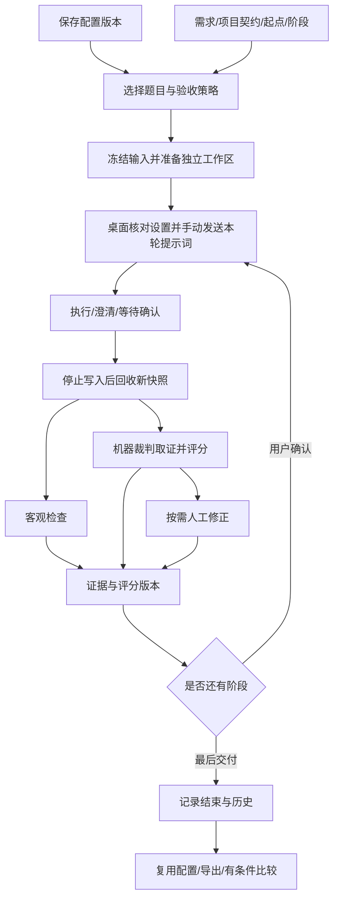
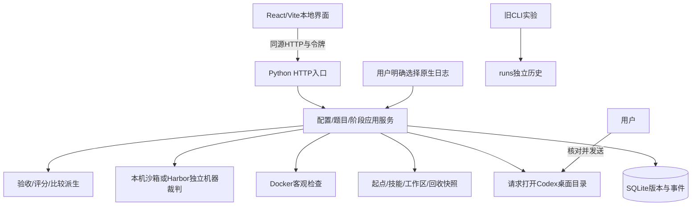

# Codex Harness Bench：总架构与唯一实施路线

依据用户当前裁决U27：本项目独立定义产品与后端，Gemini仅为初始前端来源。正式评测以Codex桌面为固定产品底座，研究模型与个人可配置Harness对真实任务交付的共同影响。本文第8节是唯一实施路线，模块文档保存接口与细则。

## 1. 项目要解决的问题

公开模型成绩来自特定任务、运行框架和评测条件，不能直接回答“我的日常Codex配置是否更有效”。本项目把问题缩到用户真实使用的桌面场景：固定Codex桌面这一既有Harness，记录模型与推理档位，改变可配置层，观察交付、用量及约束遵守的差异。

评测对象分三层：

|层次|具体对象|实验角色|
|---|---|---|
|桌面底座|Codex桌面的执行循环、工具、上下文管理和产品行为|记录版本/平台/宿主条件；不重写它的Agent Loop|
|模型条件|模型、推理档位、可用额度及实际调用记录|配置A/B尽量固定；改变时解释为组合对比|
|个人配置|AGENTS、Skills、交互约定、支持的原生设置及已有工具开关|主要比较变量，冻结版本并记录实际应用证据|

核心问题：规则改动是否更切中需求？技能是否带来可验证的帮助？相同交付需要多少资源与人工介入？需要覆盖项目构建、修复、重构与已有项目扩展，不以一类任务代表全部能力。

默认一套配置、一道题、完整需求，不限定真实对话轮数；对比与分阶段由用户主动选择。判断微小收益需要同题同条件重复样本，当前仅保存可追溯记录和有条件分组，不自动宣布统计胜者。详见[产品模型](architecture/PRODUCT_MODEL.md)与[用量比较](architecture/MEASUREMENT_AND_COMPARISON.md)。

## 2. 产品依据与实施原则

1. 用户当前目标和可核实的实现是依据；前端原型提供界面起点，不定义题库数量、评分算法或后端边界。
2. 正式执行仍在Codex桌面；题库接入借用外部任务与验收方法，不偷换成CLI模型榜。独立CLI裁判只承担回收后的验收。
3. 题目必须说明需求、起点、运行依赖和判分依据。需要已有工程的任务自动准备固定源码；题面链接不算环境已就绪。
4. 评分以机器为主、人工按项修正；原生程序验收指标与开放质量量表分开，证据缺失不编分。
5. 工作区冻结题目/配置/策略，回收生成新快照。宿主全局继承、版本变化和人工介入作为实验条件记录，不宣称天然完全隔离。
6. 对用户的说明只讲当前定位、操作和限制。原型承接、旧算法及历次修补属于历史记录，不作为首页产品叙事。

当前已实现配置管理/显式应用、独立工作区、回收、独立机器评分和人工修正、用量与历史。内置5套带独立功能验收的源码题；51道原创开放网页题共用空白起点与基础烟检，不能算51套独立验收；U54再增12道各有不同文件起点的业务、数据、工程、长期与协作开放题，但它们还没有独立程序验收。工作台默认的32题跨类型精选仅控制浏览顺序，不是已冻结的统计题集。U69补入8道社区机制项目、77个功能核心用例和页面连接检查，另有163道HumanEval+固定扩展测试用于短任务对照，默认不混入项目随机组卷。DeepSWE113条来源可按题选择与准备，少量题已接原生/上游验收；另外四类公开基准目前仅完成来源与适配门槛研究，没有可选题包。U45对五份既有回收完成上游Linux验收，U47为这五题接入本地连续分。**外部基准完整接入、创意题逐题验收/盲评、12道新开放题程序验收、长期项目真实整题及完整环境指纹仍未完成。**状态与数量细账见[U54题集审计](research/task-portfolio-audit-20260927.md)。

## 3. 产品对象与完整操作流

|对象|含义|版本/归属|
|---|---|---|
|Config|规则、技能、模型/档位、交互与个人约束|命名ID+revision；运行保存全文|
|Task|项目/修复需求、契约、阶段、起点、验收、来源|独立版本；不能后改旧Run|
|Run|一次冻结的配置/题目选择与策略|可含多个Trial，不代表自动批跑|
|Trial|一个配置×一道题的独立工作区|多轮仍是一题|
|Capture|一次回收的文件证据|所属阶段、hash、差异、检查|
|Review|针对回收的人工评价或AI意见|证据类型分开、追加版本|
|Comparison|有条件的结果与差异解释|不把不同题类/策略混成总榜|

```mermaid
flowchart TD
  C[保存配置版本] --> P[选择题目与验收策略]
  T[需求/项目契约/起点/阶段] --> P
  P --> F[冻结输入并准备独立工作区]
  F --> D[桌面核对设置并手动发送本轮提示词]
  D --> W[执行/澄清/等待确认]
  W --> S[停止写入后回收新快照]
  S --> O[客观检查]
  S --> A[机器裁判取证并评分]
  A --> H[按需人工修正]
  O --> E[证据与评分版本]
  A --> E
  H --> E
  E --> N{是否还有阶段}
  N -->|用户确认| D
  N -->|最后交付| R[记录结束与历史]
  R --> X[复用配置/导出/有条件比较]
```

图表示完整操作方向。当前已接固定结构化契约与逐项人工验收；候选Spec的用户确认、配置矩阵和按历史完整重建仍待补。

用户实际步骤是：选择 → 准备 → 打开新桌面任务草稿 → 核对模型/档位并发送 → 自动读取执行日志 → 本轮完成后回收 → 机器评分/人工修正 → 确认下一轮或结束。打开桌面不等于已发消息；开始状态从匹配会话的原生日志自动同步，手动记录只作后备。完整动作说明见 [执行合同](architecture/EXECUTION_AND_EVIDENCE.md)。

## 4. 系统分层与执行边界

```mermaid
flowchart TB
  UI[React/Vite本地界面] -->|同源HTTP与令牌| HTTP[Python HTTP入口]
  HTTP --> App[配置/题目/阶段应用服务]
  App --> DB[(SQLite版本与事件)]
  App --> FS[起点/技能/工作区/回收快照]
  App --> Desktop[请求打开Codex桌面目录]
  User[用户] -->|核对并发送| Desktop
  App --> Checks[Docker客观检查]
  App --> Judge[本机沙箱或Harbor独立机器裁判]
  Trace[用户明确选择原生日志] --> App
  App --> Score[验收/评分/比较派生]
  Legacy[旧CLI实验] --> Old[runs独立历史]
```

|模块|现有落点|负责|边界|
|---|---|---|---|
|界面|frontend/src/workbench|表单、操作、材料、历史|不造结果，localStorage不存业务事实|
|HTTP|src/chb/webapp.py|静态资源、Host/Origin/Token、路由|仅127.0.0.1，无任意宿主shell/文件接口|
|应用|arena/api.py、service.py|校验、版本、准备、阶段、恢复|显式应用可备份写入宿主；不代发桌面提示词|
|契约|arena/contracts.py、task_import.py|结构校验、兼容转换、冻结提示词、事务题包导入|不改旧Run，不从题面猜测已通过|
|数据|arena/database.py|records/revisions事务|Trial等目前内嵌Run JSON，非独立SQL表|
|文件|arena/files.py|限定路径、快照、hash、差异|不跟随链接，不吞超限或变化错误|
|后台|arena/jobs.py|拥有的检查与本机/Harbor审查|只停止本工具工作，机器分与人工修正分开保存|
|评分|arena/scoring.py|公式、适用项、证据齐备性|未知不填默认高分|
|用量|arena/telemetry.py|明确日志归属、累计值|不扫描全部会话，不猜费用|
|旧实验|cli/adapter/results/analysis|CLI执行与只读历史分析|不混入桌面正式成绩|

### 4.1 配置装载

准备时复制题目起点，合并起点根规则和本次配置为AGENTS.override.md，复制选定技能到.agents/skills，初始化独立Git并冻结baseline。**这是工作区叠加，不是完整全局隔离。**

桌面仍继承宿主全局规则、技能、插件和设置。当前宿主指纹只有AGENTS.md、AGENTS.override.md、config.toml。回收比较工作区规则/技能/.codex变化，只能提供部分条件证据。文件存在不能证明模型已遵守或技能已触发。详细能力表和冲突规则见 [配置合同](architecture/CONFIGURATION.md)。

2026-09-15已有本机codex app帮助与官方规则/技能文档核对记录；本轮沿用其证据，不宣称重新验证全部当前模型组合。旧CLI能力说明在codex-capabilities.md，不可套成桌面支持表。

### 4.2 客观检查与AI审查

客观检查采用image+argv+weight+timeout+可选stageIndex，镜像需预先准备，执行固定内容ID。只读挂载本次冻结文件并复制到容器/app；网络关闭、无宿主home/Docker socket，资源与权限受限。退出码、输出、时间真实记录；超时/取消/环境错误不当作题目失败。

AI裁判标cli-review-only，可选固定本机 Codex 原生沙箱或 Harbor 容器。新机器方案页面默认 gpt-6-luna/max；模型目录不等于账号权限，缺少本机能力或账号调用失败均不能静默换成 Sol/medium，用户可明确选择其他可用模型。本机时间预算默认1小时、最高8小时，准备清理另计。本机模式按PATH查找官方 Codex CLI（可用 `CHB_CODEX_BIN` 指定路径），不会打包、安装或登录 CLI；复制冻结快照、使用独立临时 CODEX_HOME，关闭宿主规则加载，不运行 Docker 脚本；使用本机工具并允许安装依赖，环境不能视为跨机器一致。容器模式使用machine-v1镜像及已有Harbor。每次裁判是新的 `codex exec --ephemeral` 进程，不续接前次会话；两者均保存命令/输出并核对引用，缺运行证据不生成UX/性能分，不自动重试或换模型。本站 AI 质量评价使用版本化项目提示词，公开题的上游验证器另算；模型评分可能波动，单次报告不构成准确性保证。

工作区继续变化不影响旧快照。前轮补验检查的是旧版本，不是最终回归；新契约可用runOnFinal明确声明最终快照回归；未勾选的旧阶段检查不会自动重跑。详情见执行和评分合同。

## 5. 数据、状态与证据约束

本地业务根.local/arena，包含arena.sqlite3、skills、baselines、runs；每个Trial含workspace、baseline、captures、traces、reviews。原生日记、配置、轨迹、产物只本地保存，不进入Git；Obsidian镜像none。

主要约束：

- Config/Task编辑创建revision，旧版不覆盖；Run冻结完整输入和策略。
- Capture文件不可改写；检查尝试和人工复审有历史，新回收不继承旧人工分。
- 评分和导出核对目标快照hash；hash不是第三方签名或防恶意编辑系统。
- 快照单文件8 MB、总50 MB、5000文件；凭据/依赖/Git元数据排除，链接和回收期间变化报错。
- ZIP最大200 MB，含私有规则与产物，不含认证/原生完整日志；当前没有ZIP导入恢复功能。
- SQLite与文件系统非同一事务；失败残留和恢复仍需B05补强。
- 服务重启保留证据并标记中断。强制结束后Harbor环境清理不能保证，只按精确拥有信息核对，不全局清Docker。

状态主线：prepared → working → captured → completed；修改后可再次capture；显式分步才使用waiting_confirmation；后台checking/judging是有目标快照的临时状态，另有interrupted。completed只表示交付结束，不表示质量通过。

现有HTTP路由、请求/响应、后台动作、错误和拟新增实体完整列于 [数据与API](architecture/DATA_AND_API.md)。它保留了原接口合同，没有把实现细则压缩掉。

## 6. 评分方法与比较边界

三类评价证据是客观、人工、AI；个人约束另有逐项验收结果。版本2题目已将条目与人工操作说明、文件hash和检查回执关联；旧Run保留原评分语义。

新评测默认arena-machine-v1：裁判依据冻结需求和量表检查项目，逐项给0–100分或null；人工可修正单项，不固定占50%。开放项目的适用评分项和必要程序检查齐全后即显示完整单题分；未标记交付结束时明确标为“暂定”，再次回收或修正会重算，且不进入配置正式成绩。缺项只有已评分项均值，不冒充整题分。中间阶段快照不得提前形成整题分。脚本结果独立保存，不重复加权。旧arena-review-v1/v2保留原客观/人工公式和AI辅助意见，不重算历史。详见评分合同。

版本2已提供“必要条目是否满足”的独立验收结论，与连续分数并列。分高不自动等于需求通过，行数少不自动等于切中需求，等待确认不自动等于效率差。详见 [验收与评分](architecture/EVALUATION.md)。

用量读取明确导入的原生日志最终累计，验证cwd/session与模型/档位；缓存属于input，reasoning不盲目重复相加。活动区间不是纯推理时间；费用未知。小幅规则修改可能被随机性和评分误差淹没；没有固定误差、100%正确或单次因果结论。比较方法与未实现部分见 [用量与比较](architecture/MEASUREMENT_AND_COMPARISON.md)。

**当前单题与配置分**：配置成绩以冻结的配置 ID＋revision 为选手，模型、思考档位和速度是条件。五道已验收 DeepSWE 题保留原题 reward 与本地 70/20/10 连续分；其余公开题没有已核对语义卡时本地总分为空。U47–U50 的开放项目使用固定 60/25/15 卡，U51 自定义评测使用冻结的 `project-policy-v1`；U52 起新建评测默认按冻结题型自动选择适用项，当前新评测的开放项目采用 `project-tasktype-v3` 的 60/25/15 三组卡，旧 v2 记录保持原协议。每道题只有一个本地单题分，已配置的程序检查失败限制验证项。最近完整多题批次按不同题等权，同题重复先取均值；归档保留成绩，永久删除整次评测才移除记录和证据。

**U62 证据资格边界**：以上开放项目数值首先是本地 AI 参考分，并不因全部维度有分、引用可定位或通用浏览器烟检通过就取得配置对比资格。当前仅已核对的公开题原生验收，以及项目内五套带正反例的任务专属程序验收中**未改动的单阶段题**，在最新快照有完整结果且检查通过时，才允许题集发布具最低程序证据的本地综合分；多阶段题须待最终快照全项回归后再取得资格。仅有共享网页烟检、无专属检查、专属检查失败或旧记录缺少证据级别时，页面保留逐题原分与批次 AI 参考均值，但配置综合分留空、禁止据此宣布胜负。原始回收、裁判报告及历史数值不改；此资格只是最低程序证据门槛，**综合分中的 AI 质量项尚未校准**，不能因数值差自动宣布配置胜负。下一步要冻结逐题语义验收和独立正反例，再用已知好/坏交付、盲评和同快照重复测试检验裁判排序、误判与弃评率，细则见评分合同。

**配置能力画像（U52 现行）**：配置成绩展开区使用一张六轴雷达：目标兑现、工程实现、网页体验、推理决策、协作沟通、稳健交付。每轴只读取最新冻结回收所对应的程序评分卡或有效 AI／人工修正分项；同题重复先均值，不同题等权。目标组中的规则约束计入单题总分一次，不单列“规则边界”雷达轴；同一已取证分项可用于分析多个能力视角，但不因此在单题综合分重复加权。旧评测的评分项按旧协议读取；公开题的原题 reward 仍独立展示。缺项为未测，不能从题目标签或单题总分推造轴分；三轴以上有分时绘制填充图形。图表不是第二套总分。Token、活动时长、API 等值估算与同题重复分差单列；配置对照只用双方共同题和可匹配协议，顶部完整题集总分不受对照切换影响。

配置展开的题目记录按当前题集、历史、待补分开并以双列卡片分页，避免逐题原始记录铺满整页。六轴右侧的高分证据核查列出 90 分以上题数、独立重复、人工评分记录和程序检查覆盖，并提示同模型裁判及检查的覆盖边界；这些是核查入口，不是新的分数或置信区间。旧分保留原样，尤其单次前端 AI 的 90+ 不能直接解释为需求、交互或审美的已验证通过率。

**下一阶段目标**：将当前按 run 划分的批次提升为具名、固定版本题集，支持跨批次配对重复与自定义题权；扩大已核对语义卡的公开题范围。模糊开放项目与长项目补足澄清、里程碑、最终回归和实际体验证据；网页项仅在网页题适用。微小 Harness 差异通过同题配对、重复和不确定性说明判断，不能凭多显示小数位得出胜负。成本、时间和稳定性与质量分并列。DeepSWE 70/20/10 与 U52 开放项目按题型 60/25/15 已接入；长期项目浏览器取证、盲评和统计校准仍待完成。

## 7. 前端与模块文档的责任

[FRONTEND_SPEC](FRONTEND_SPEC.md)保存页面职责、跳转、表单、复审材料、空态/异常、公共UI规则和操作验收。[文档索引](README.md)给出阅读顺序和模块归属。

|设计问题|唯一细则文档|
|---|---|
|背景、对象、范围、固定场景|architecture/PRODUCT_MODEL.md|
|初始前端来源的历史核对（不作为当前路线）|architecture/GEMINI_ALIGNMENT.md|
|配置、技能、全局继承、矩阵和恢复|architecture/CONFIGURATION.md|
|两类题、三轴、项目Spec、新题与来源|architecture/TASKS_AND_CONTRACTS.md|
|桌面手动步骤、阶段、回收和恢复|architecture/EXECUTION_AND_EVIDENCE.md|
|逐条验收、公式、人工/AI分工与误判|architecture/EVALUATION.md|
|实体、版本、HTTP、迁移与导出|architecture/DATA_AND_API.md|
|Token/时间/异常/可比性/随机性|architecture/MEASUREMENT_AND_COMPARISON.md|
|后端切片、测试层次、完整项目验收|architecture/BACKEND_DELIVERY.md|

## 8. 唯一实施路线与完成标准

本节统一维护工作包状态。B编号是功能交付范围，不是每次对话只做一个按钮。当前状态不以测试数换算百分比，不把本轮文档完成写成其描述的功能已编码。

状态口径：**审计完成**表示文档/来源核对完成；**基础已有，待补齐**表示部分现有代码可复用；**未开始**表示该工作包的目标实现尚未开展；**未验证**表示实现与实际使用证明分开。后续完成需附版本和对应回执。

### 8.1 工作包总表

|编号|工作包|依赖|本轮状态|完成判断|
|---|---|---|---|---|
|B00|来源审计与架构合同|用户当前需求、公开资料、当前代码|U27重写桌面底座上个人配置评测定位，原型仅保留来源记录|模块/页面/API/路线与当前需求一致|
|B01|项目契约与题库接入|B00|开发提示词与内部评分材料分离；自动装载5套独立验收题、51道共享烟检的创意题和12道独立起点但无程序验收的开放题；32题跨类型精选默认展示，其余可查，18份缺源码题面单列；来源/题型/能力分轴筛选已接，U64新增WebGen固定101题与647条UI条件本地导入（非官方执行器），默认16题规模过滤；公开题完整环境准备度仍待补|需求与内部契约分别冻结、历史保真，三轴筛选和题包导入|
|B02|逐条验收与评分合同|B01|五道 DeepSWE 已接本地连续卡与原题结果分存；旧开放项目保留原协议，U52 起新评测默认按冻结题型自动选择 60/25/15 评分卡，自定义方案留在高级设置，人工修正沿用；其余公开题语义卡、Windows 本机浏览器取证、盲评校准待补；U63追加五题专项功能协议、正反例回归、截图证据、独立复评统计；U64新裁判全面使用原题条款+三项等级协议；U65修复本机输出schema与协议冲突；U69固定程序报告独立显示，当前快照即可判定、缺项不缩分母、AI高分不覆盖失败；U72本机/容器共用同预算一次缺项反馈，由裁判补查而非平台补分；完整语义覆盖与主观分校准仍未完成|冻结目标与逐项证据、原题结果/本地分分存、必要项与修订历史完整|
|B03|配置矩阵、装载与版本|B00|双向配置导入、显式Codex应用/切换/撤销与冻结装载已接；U26显著删除/回收站和分区编辑已接；矩阵/版本浏览未完成|可读比较、实际装载说明、旧版副本和选中跳转|
|B04|完整交付与可选分步复审|B01、B02|U24默认不限定对话轮次，支持旧机器记录提前整题交付、阶段/最终分隔离；U68封存可见对话；U70–U72执行/评分分区与逐次补查原报告、引用、用量回执已接；真实前端取证及介入归因仍待补|阶段回归、材料定位、AI意见处理、介入记录|
|B05|异常恢复与数据一致性|B01–B04相关合同|整评测按工作区及关联对话、剩余记录两步删除；中断可继续，已核对并实际删除一条旧记录；题包缓存可校验迁移。共享源码与Codex项目侧栏文件夹仍需独立管理；恢复体验待补强|互斥、草稿、失败残留、恢复和错误分类验证|
|B06|用量、历史复用与比较|B02、B03、B05|按精确工作区自动绑定原生会话；Token/缓存/活动时间和 API 等值估算已在配置卡显示，最近完整批次有当前分；U64抽题seed/实际题号留存及评分协议分组；U65批内同模型配对重复/冻结预算/全部尝试资源报告已接；具名题集、跨批配对、完整环境指纹与误差校准待补|逐题→配置分同口径，真实用量/价格假设/条件/版本/重复与排除理由完整|
|B07|公开题包接入与完整项目题验证|B01、B02、B04|5套内置功能题有负/正例；51道创意题共用六种基础烟检，逐题质量未校准；U54新增12道不同起点开放题，可创建工作区但无程序验收/真实分数；DeepSWE113题按需选择、3道Go题Windows正负例通过、当前五题上游验收5/5完成；U69新增163道通过资格检查的HumanEval+与8道社区改编，77核心用例正例和边界负例通过；Terminal-Bench/BrowserGym/τ³/SWE-bench仅作接入评估，尚未准备题包|跨机制核心题实际交付并有适用的正负例或盲评；非SWE完整官方执行器仍待接入；来源索引与可跑数分别展示|
|B08|方法边界与重复评测记录|B02、B06、B07|基础方法合同已写；U65批内AB/BA配对、失败与未知完整保留；微小差异的独立确认、盲评校准、区间和长期过程记录待补|条件/样本/介入/未知及成本解释，证据不足时不宣称统计胜出|
|B09|页面减法与可用性收尾|B01–B08必要功能完成|暖色工作台与题目双栏已接；U70常驻准备动作、局部错误与文件/桌面状态分离；U71统一软件字体、评分五分区、嵌套折叠、总分/原题/雷达来源及冻结配置总评跳转；U72补查阶段与逐次回执；已查1440/390px明暗及相关点击，无横向溢出、置顶遮挡或新增脚本错误；全站键盘与逐屏视觉验收未完成|功能不丢，浅深色/键盘/窄屏/上下文操作通过|
|B10|正式桌面整题与发布验收|B01–B09|未验证，尚无正式桌面整题证据|实际项目闭环、用户流程审查、回执与版本对应|

### 8.2 B01：项目契约与题库接入

问题：需求、源码起点、运行环境和验收证据必须连接为完整任务。已有字段兼容不等于题包就绪，公开工程题还欠缺桌面环境与原生验收适配。

交付内容：
1. Task契约schema、稳定条目ID、旧字段迁移；保留来源与准备度。
2. ProjectSpec编辑/预览、三轴筛选、完整搜索、指定题进入工作台。
3. 新题JSON导入预览和逐项错误，创建副本，不覆盖已有题。
4. 统一冻结提示词编排，明确总体需求、项目契约和当前阶段，历史保存同份文本/来源。

修改面：Task类型、题库编辑器、save_task、prepare、提示词显示、历史。退出条件T-AC1/2/3/4、F-AC1/2、D-AC1；从新建到历史实际走通。U20无脚本题也可用机器方案开始，旧纯人工策略兼容；不能硬塞默认npm test。

B01本轮证据：31道旧题字段保真、7份Spec兼容；JSON全包校验/事务回滚/幂等；浏览器导入一题后修改故事、按方向/难度/描述搜索、带题跳转、复制完整契约，再改题库并从历史核对旧文本。新增stage/criterion稳定ID；故事/接口/数据仍保留原型字符串数组，细化成结构化对象的长期合同没有取消。正式整题不在此证据范围。

### 8.3 B02：逐条验收与评分

问题：当前四维数字和整体说明不足以验收项目契约。对应G18–G21/G28、D15-07/10/14/19。

交付内容：
1. 按冻结条目保存满足/部分/不满足/未核实/不适用、依据和证据。
2. 通用量表与逐题条目关联，个人约束单列；必要项结论与分数分开。
3. 检查类型、条目引用与最终回归关联定义；不自动猜测试性质。
4. 公式可见、未知/0/不适用区分，评分修订留理由，旧策略只读兼容。

修改面：scoring/Review模型/Task checks、复审UI、历史/导出。退出条件S-AC1/2/3/4/6、F-AC3；必要持久化失败时不能显示验收通过，旧分回放不变。

B02本轮证据：未核实不默认通过；引用未知文件/检查被拒；必要项失败且人工99时仍未通过；0分与null区分；修订需原因且旧版保留；新回收使旧人工分失效。检查类型/criterionIds/runOnFinal已校验和冻结，最终检查漏跑或超时保持未知。旧记录数值公式不变；U20新评测改用机器评分，必要项结论独立。

U16历史语义（U20新策略已替代）：准备采用人工内部百分比合计100%，每个适用维度提交实际依据。客观检查展示真实命令、阶段、规则和覆盖；题库可复用现有检查定义，无脚本题明确选纯人工。人工裁定与自动原分并存、可撤回、绑定证据版本，不改变必要项结论或历史比较原分。旧策略保留原语义，细则/API进入原模块合同。

### 8.4 B03：配置、矩阵与装载

问题：当前JSON显示不够直观，版本表存在但用户不能完整浏览。对应G06–G10/G26、D15-05/07/11。

交付内容：字段矩阵、规则正文与技能内容差异；实际生成规则预览和来源；模型/档位能力来源；约束类别与验收提示；版本时间线、恢复副本和用于评测入口。本轮已接一键全局/项目导入、Skills 来源面板/批量冻结/调用提示、配置带入评测，细则见[配置合同](architecture/CONFIGURATION.md)；矩阵与任意版本浏览仍未完成。specialFeatures须转成真实规则或显式停用。

修改面：配置API/差异服务、Editors/Prepare/版本视图。退出条件C-AC1至C-AC5、F-AC4；同名技能内容变动可识别，宿主配置不被修改。

### 8.5 B04：阶段、回归与复审材料

问题：前轮补验不是最终回归，材料尚未与条目连起来，AI意见缺处理过程。对应G15/G17/G22、D15-08/18。

交付内容：阶段合同与冻结提示词；带未完成事项继续的明确记录；最终快照回归；统一需求/文件/输出/事实/人工复审入口；AI意见引用定位、接受/驳回/待核实；人工操作证据与介入记录。当前保留桌面人工发送；自动准备、复制路径和逐试次提示词见[执行合同](architecture/EXECUTION_AND_EVIDENCE.md)。

修改面：mutate/jobs、阶段/证据模型、Runner复审区。退出条件T-AC5、E-AC2/3/4、S-AC5；保留手动同一桌面任务，多轮不冒充独立样本。需求探索模式的候选Spec确认先做可审查例子，不静默改旧合同。

### 8.6 B05：恢复与一致性

问题：现有基础错误拦截不能覆盖用户完整恢复流程。对应G24/G29、D15-15。

U29已提供工作区数据清理：回收且结束后比较快照，移入可恢复区；永久删除仅该工作目录，保留记录/评分/证据。尚未提供引用感知的任意证据删除。

交付内容：服务端动作互斥和错误分类；prepared/working/interrupted恢复指引；准备失败的文件/DB一致性；旧检查尝试可查；后台重启的拥有信息核对；表单草稿、版本冲突、渲染错误边界。

修改面：webapp/api/service/jobs/files、App和表单。退出条件E-AC1/5、D-AC2/3/4、F-AC5；模拟断开/重启/重复请求后，旧证据不丢，无清库兜底。

### 8.7 B06：历史、用量与比较

问题：现有历史可查看但不能完整复用，比较只是少数列，日志诊断不够细。对应G23/G25–G27、D15-05/15/20。

交付内容：完整契约/条目/复审历史；按冻结条件新建评测而非覆盖；reasoning指标校验与显示、日志协议/事件诊断；异常细类；按配置版本查看交付与评分状态、逐题重复和排除理由。后端统一同条件分组、分项/用量差异仍待补齐；按规模需要拆摘要/详情，避免全量state不断变大。

修改面：telemetry/comparison/历史API、Records、导出。退出条件M-AC1/3/5、D-AC5、F-AC4；重建新目录，原记录不变；未知信息不填估计值。

### 8.8 B07：公开题包接入与完整项目题验证

问题：少量内置样例不能覆盖个人配置的任务分布；公开题源尚未完成桌面环境与验收适配。对应D15-04/12/13/14。

交付内容：先完成DeepSWE固定版本适配切片（源码、运行时、任务提示词、独立验收器与原生指标），再扩展代表性题集；补一套含交互、持久化和异常的完整项目。公开工程题与开放需求题分别统计。每个可运行题包验证故障起点、参考正确解和失败诊断，记录来源、许可、版本及是否偏离原评测环境；不能把113条来源索引当113套已接入题。

U29接入固定题包下载和按题源码导入：113道定义包单独保存，2道Bug修复源码已下载。OPA/Prometheus超过50 MB或5000文件边界；依赖自动准备和原生验收未接入。源码准备成功仅允许生成开发目录，不表示“运行环境已就绪”或官方评分完成。

U30补齐Tengo单题Windows适配：固定Go 1.26.8工具链，题包隐藏测试、23条f2p和122条p2p白名单，原生Go JSON解析保留严格通过/失败。准备时先验证故障起点；工作区带Go脚本入口，隐藏测试/参考解不进入提示词和源码起点。回收后可运行、停止、读日志，结果按快照追加且与AI分数分离。真实故障起点0/23、122/122；参考解23/23、122/122。此完成范围仅Windows适配题，不扩称113题环境已就绪或官方Linux通过率。

退出条件T-AC6和后端完成合同第8节的题包/软件链路阶段。参考解和独立验收器不交给桌面；不宣称覆盖所有项目类型。

U31实现113题按需创建：只获取所选题的固定/校验文件及源码。新增Tengo解构绑定（91目标、132回归）与Yaegi Embed（38目标、58回归）的Windows正负例验收；ABS改进题验证源码准备，依赖仍待适配。缓存按仓库与提交复用，每次复制新run/trial目录；异步持久化进度、重复请求幂等、重启保留缓存，源码失败不创建空工程。

### 8.9 B08：方法与不确定性

问题：固定场景和随机误差必须影响结果展示，不只是FAQ。对应D15-02/06/19。

交付内容：实际/请求条件、人工介入、样本次数、失败/中断/未知数量、单次差值解释和重复评测组织记录。等待时间明确来源，无法拆分时标未知。

退出条件M-AC2/4/5。置信区间、自动胜者和多裁判算法不是本包默认交付；若未来要做，另立具体算法/预算/假设合同，不能以固定±分替代。

### 8.10 B09：可用性减法

U28采用单一Product Design工作流升级现有六入口：固定侧栏、准备步骤、库与编辑器、历史行列表及统一主题/动效。参考资料集中在D盘项目.local/frontend-redesign，不全局安装。当前样式合同见FRONTEND_SPEC的U28；只改变展示与导航，不改评分/冻结/宿主写入协议。

U29增加第七入口“数据与存储”，搜索/筛选评测后在相邻详情执行清理；题库默认已有仓库任务，公开题下载成功后直接进入本地题目。

按当前用户流程缩减重复文案、无关联弹窗和拥挤卡片；让配置、需求、阶段和结果各有清楚位置。补浅色/炭黑、文字可读性、键盘、窄屏、减少动画的操作验证。

退出条件F-AC6与页面主线复测。不能通过删除契约、对照或验收功能让页面“看起来简洁”。

### 8.11 B10：正式桌面整题与发布

在功能合同补齐后，用B07项目走完整桌面工作流，保留真实会话/工作区/产物/用量与验收；分别说明软件是否工作、模型交付是否合格，不能混为一个通过。

用户手动核对与发送依U08执行；需安排这个动作时给出已准备的明确工作区和提示词，不再询问执行方式。流程审查意见进入requirements裁决。源码/公开题目/文档发布同一授权仓库；不上传私有数据，不部署公网API。

退出条件：后端完成合同第8节全部适用环节有证据；历史可复用；未通过项明确；架构/接口/交接与版本一致。只有此时才称“产品功能闭环已验收”。

### 8.12 U27 时的实施入口与范围（历史计划，当前以 8.14 为准）

U27先纠正产品依据、公开说明和来源研究：网页原理页及README围绕“桌面底座＋模型＋个人配置”重写，公开题源索引可搜索113条。DRadar仅作只读参考，未安装/doctor/领题/执行，未验证其私有服务端。

接下来按B01/B07优先接公开题包，B02/B04补可用验收：

1. **扩展DeepSWE环境适配**：已有Tengo两题、Yaegi Embed的Windows正负例测试；继续覆盖ABS等工程改进题的依赖和原验收。113题可先选题、创建时下载固定源码，未适配依赖显式显示；源码失败不创建工作区，已适配题须通过起点环境校验。缓存与每次可写工作区分离。
2. **原验收指标接入**：回收补丁在干净验收环境应用，解析reward、F2P、P2P、partial、报告与环境错误；与现有AI质量分分列。原验收机制一旦改变必须标为改编，不宣称官方同条件。
3. **扩大代表性任务集**：完成各语言/运行时适配后提供一键准备，不要求用户逐题导入。按准备和验证状态计数，优先任务多样性，不能只堆题面。
4. **开放项目与前端取证**：继续修复Windows本机浏览器IPC路径，保留真实操作/截图证据；补通用量表校准与独立复核。不用工程题通过率代替视觉质量。
5. 再推进B03配置矩阵、B05恢复、B06历史比较/环境指纹和B08–B10重复与发布验收。原生桌面版本采集未完整自动化，不把桌面底座称为完全锁定。

以上记录 U27 当时的优先顺序与限制，不再将“引擎未运行/五题未验收”当当前事实。具体接口与门槛在题库/评分/执行合同；当前接续入口见 8.14。U27 不为了验证研究而执行附件运行码是当时的边界。

### 8.13 U46–U47 评分方案实施记录：已审定 v1，继续校准与扩题

**已确认的用户目标与本轮授权**：不以 113 道 DeepSWE 人工开文件夹作入门门槛；每题有可解释的本地连续分，多题有当前配置分；成本/速度、稳定性、前端、逻辑、范围切中和沟通等依题适用；长项目能追踪里程碑；对细小 Harness 变化诚实报告样本与不确定性。用户已确认 SWE 70/20/10、开放项目 60/25/15 方向，并要求实施、扩充可运行题型与分类。U47 已接入五题追溯连续分、最近完整批次配置分及两道原创可运行题；详情与限制见[评分合同](architecture/EVALUATION.md)和[当前交接](当前交接.md)。表中其余项是下一阶段退出标准，不能因 v1 接入就视为全部完成。

|顺序与工作包|输入/具体交付|依赖与退出证明|
|---|---|---|
|1. B00/B02 口径与字段冻结|将“原题 reward、本地任务分、具名配置分、效率轴、版本与证据”统一术语；审定每类题默认权重；保存任务目标、适用性、必要项、检查器映射、评分卡版本与结果来源|用户审查；数据迁移测试证明旧 reward×100/旧 AI 报告不被默默覆盖；缺项、0、不适用可区分|
|2. B01/B07 自动选题与预检|建立低预算锚题组：短 SWE 功能/修复、开放业务需求、真实前端、长时多轮项目；保留公开题 113 条按需入口。每题锁源码/环境、故障起点与正确参考、脚本或人工验收、额度和时间上限；按题批量创建隔离工作区与独立 Codex 草稿|只在用户发送后被测执行；不需手动逐题建文件夹；预检不消耗模型额度；选中题目能在本机或固定容器完成验收，失败有可操作诊断；正负例验证|
|3. B02/B04 单题计分与长任务|原题脚本按语义目标映射，追加项目/浏览器/人工体验证据；里程碑回收、需求变更、最终回归与跨轮介入记录；人只能有理由修主观项，硬结果复验|五份既有快照追加同版本追溯评分，无需模型重做；Anko 原题失败不能由大量 P2P 盖过；前端真实交互和无 UI 不适用都有证据；长项目单试次完整轨迹|
|4. B06/B08 结果与微差比较|后端对具名题集同题重复均值→题等权配置分；结果页直接展示被测 Token/缓存/时间/有条件价格，复审开销分离。配置 A/B 固定模型/预算/评分卡/起点，交错顺序和独立重复；报告逐题配对差、故障、样本与不可判定情况|API、浏览器和 ZIP 同口径；5题当前批次与配置卡均可复算；单次 1–2 分差不宣布确定胜者；没有实际账单不写真实费用|
|5. B09/B10 可用性与正式验收|准备页仅呈现配置、题集、成本上限和批量草稿；评分页一个单题主分及依据；配置成绩一个当前具名题集分及领域/效率侧栏。按真实桌面项目从准备、执行、回收、验收、人工复核到历史/导出核对|浅深主题与窄屏可读、错误可恢复、旧记录不丢；至少一个前端和一个长期开放项目完整验收；用户复核后再称闭环|

**预算层级尚待固定题集版本**：3–5 题的烟测只验证环境和流程；8–12 道跨类型的固定核心题集用于日常配置对照；2 道左右长期开放项目作深入案例；对微小差异才在相同题目上安排配对重复和盲评；113 道公开库全跑仅为研究/充足预算模式。烟测发现后不得仅挑有利题发布为完整成绩。题目的具体可运行性、版本、时间与额度上限写入 [题库合同](architecture/TASKS_AND_CONTRACTS.md)；统计设计见 [用量与比较](architecture/MEASUREMENT_AND_COMPARISON.md)。少量廉价题可以筛查明显退步，**不能承诺辨别 0.5 分的真实收益**。

**U53 扩题时的历史状态**：50道原创网页题可选择但默认全列出，11个子类中SVG和同类场景重复较多；共享 Chromium 烟检不评作品质量。U54已把默认入口改为跨类型精选，保留50道全部题和旧记录；[题集来源与边界](research/creative-web-task-set-20260926.md)及[现行重复性审计](research/task-portfolio-audit-20260927.md)分别记录原题集与修订。

当前现场回执：[U54 当前交接](当前交接.md)；公开来源与截图口径：[榜单研究](research/benchmark-scoring-20260923.md)。本节记录 U46–U47 评分演变，现行扩题及缺口看 8.14；设计表并非产品已交付声明。

### 8.14 U54 当前入口：从“题多”转向“任务机制多”

用户最新要求修正三件事：删减默认题面重复感、补业务/工程/长期/协作覆盖并研究非SWE公开库、让雷达图和明细有可读的信息层级。实现与事实边界如下；详细题单及公开来源门槛见[U54题集审计](research/task-portfolio-audit-20260927.md)，交互合同见[FRONTEND_SPEC](FRONTEND_SPEC.md)。

|问题|本轮已落实|还需要怎样的证据才能称目标完成|
|---|---|---|
|50道创意题被当作50种独立能力|固定24题跨类型精选为工作台默认，网页类合并为一个入口；旧50题仍可在全部题和网页分类找到，旧任务/Run不迁移不删改|用真实交付样本核对“同机制变体”，冻结小型具名题集及每题选择理由；比较分数不由编辑精选倒推重算|
|非网页任务太少|新建12道各有不同起点文件与具体交付点的开放题，含2道三阶段任务；创建工作区可检验，不把阶段数当题数|为可确定的数据/工程目标补独立程序验收、负/正例；业务/协作开放目标做盲评和人工一致性检查；至少一题长期真实桌面闭环|
|只有DeepSWE一个公开来源|登记Terminal-Bench、BrowserGym、τ³-bench、SWE-bench官方仓库及适配差异，在来源页明确标“接入评估”；已读Terminal-Bench固定提交的三份候选，首选日志汇总题的环境/测试缺口见U54审计|B07先接一个Terminal-Bench固定题完整来源→环境→桌面交付→原验收链；须把镜像生成的输入安全转成桌面起点、分离测试和预备离线依赖；其余来源须各自环境/评分合同|
|雷达大图左空、右侧细字长列|图在左、六项2×3卡片在右，点轴后证据跨整行展示；原分、题数、未测、成本/时间继续分开；1440/390px及深色卡片已实测|全站键盘焦点与更多配置/空态逐屏核对；图只描述有效证据，不把面积换算总分|

后续顺序仍以B07/B02/B08/B09协同推进：先校准精选机制和程序/人工验收，再做非SWE公开题适配与成本受控的同题配对；不能让新题数量或来源卡片取代正式分数。24题精选不是默认要求一次做完；正式8–12题题集须另定版本、预算和正负例。

### 8.15 U55 配置应用与逐题打开草稿

用户在配置选择步骤看不到“一键应用到 Codex”，而独立工作区的项目级 `config.toml` 不能证明桌面新任务实际采用该模型与档位。现将显式应用入口同时放在第2步和准备态试次执行区：前者使用选中的已保存配置，后者使用该试次冻结版本。用户点击后复用原有备份、版本校验、单活动应用和撤销机制；浏览、选题、创建工作区、打开草稿都不自动改宿主配置。同配置多题可复用匹配的活动应用。页面区分“全局文件读回一致”和“Codex 当前任务实际模型”，后者仍需发送前在桌面核对，不能把文件状态当遥测。官方说明[桌面会保留用户手动选过的模型](https://help.openai.com/en/articles/20001275-chatgpt-work-and-codex)，[新对话深链](https://learn.chatgpt.com/docs/reference/commands)只公开 `prompt`、`path`、`originUrl`，不支持本工具为每个桌面对话直接传模型/档位；因此一次应用全局默认值不能保证覆盖既有手动选择。

原批量入口的服务端循环会连续启动所有 `codex://threads/new` 深链；在目录信任弹窗尚未处理时，后一个深链可能覆盖前一个对话框的预填提示词，`os.startfile` 成功也无法判断用户是否取消。现以 `trialId` 指定单题，每次按钮只请求一个草稿并聚焦该题；成功请求只标 `requested`，仍不算任务开始。页面等待用户处理信任和预填：确认草稿保留才标 `confirmed` 并允许打开下一道；点击“否”或草稿丢失则标 `cancelled`，同题留在待重试队首。该确认是用户反馈，不是能从 Codex 读取的桌面信任状态。并发重复请求受服务端锁与状态检查约束。验收以单次最多一条系统打开调用、失败不标记已请求、取消后同题重试及真实页面入口为准；不依赖桌面自动确认弹窗。

### 8.16 U56 配置版本应用与桌面实际选择的界线

配置库编辑后的草稿和上次已应用的版本必须分别识别：只要草稿有未保存修改，就显示“保存修改并应用到 Codex”，先保存新版本再写入并核对宿主文件；不能因为旧版本仍有活动回执而禁用按钮或显示“已应用”。没有修改时复用已保存版本，不为了应用制造一个内容相同的新 revision。工作台第2步和试次执行区仍只按各自已保存/冻结版本显式应用；它们不能替代配置库对未保存草稿的保存。

应用回执、全局 `config.toml`、项目 `.codex/config.toml` 只能证明**文件值**。Codex 桌面可能保留手动模型选择，新对话深链也没有模型、思考档位和速度参数；应用无法强制切换当前或新对话的实际选择。配置页、批量草稿按钮旁及单题执行按钮前均明确展示这一限制和本题目标模型/档位/速度；发送前若不同须由用户在桌面调整。手动记录开始时确认范围包含速度。未固定的档位或速度标“未固定/沿用”，实际条件缺失或不一致的试次不能当作受控配置比较；原生日志事后并列展示实际记录的模型与档位及其是否匹配，不能把未采集的实际速度编造成已证实。

### 8.17 U57 草稿确认、裁判失败诊断与短时前端空间题

五道前端试次均有回收快照；旧五次 Docker 裁判日志明确返回 `gpt-6-luna` 不支持当时的 ChatGPT 账号，原 `0/5` 是未评而非作品零分。升级裁判镜像 CLI 后，曾使用 `gpt-6-sol`/`medium` 对同一批冻结交付逐题新建独立审查作业，当时五题都有8/8适用项及本地连续参考分，整批显示90.3/100、5/5；最新 Luna/max 复评见 8.19。旧失败日志继续只读保留；家庭能源题的一条空引文经追加重校验剔除，原答未改。其成功作业使用缺中文字形的旧镜像，另四题用补齐 CJK 的新镜像，批次页须提示镜像混用，不能把跨题的小数差当成能力差。账号权限只由真实调用验证，不由模型目录推定；每次重试都保留为独立作业。

批量打开深链只知道 Windows 收到了打开请求，不知道 Codex 信任弹窗中是否点击“是”、工作区是否加入或预填草稿是否保留。每次只请求一道，状态先为 `requested`；页面显式确认保留后才可开下一道。点“否”或草稿丢失时标为 `cancelled`，同题留在待重试队首，不自动跳过。此确认是用户反馈，不是桌面信任状态的自动遥测。

前端创意题新增一件可旋转的短时三维展台，固定精选入口用它替换水獭缆车题；后者仍在全库。精选24道中的 SVG/交互SVG 仅保留一项，其他网页、仪表盘、游戏、工具与表单并列。新题只复用基础浏览器烟检，不能宣称几何正确或审美已有自动验收；它和原50题一样仍需真实浏览器操作、截图及人工复核。一个 AI 裁判可帮助收集证据和给参考分，但单次主观分不是精确真值。新报告要求视觉/原创项至少有裁判保存的本题光栅截图，页面允许人工打开，截图本身仍不能证明 AI 真正看过图像。评分提示词固定版本、SHA-256，并与模型/档位/环境一起记录；同题比较应在同协议下复审，对有争议的视觉项加入人工盲评。DeepSWE 原题程序验收不使用本站 AI 质量评分提示词，二者分开展示。详细失败链与校准边界见[评分合同](architecture/EVALUATION.md)及[当前交接](当前交接.md)。

### 8.18 U58 裁判盲化与额度可见性

U57 的五份有效前端报告是五个独立 Harbor/Codex CLI 作业，用 `gpt-6-sol`/`medium`，并非当前开发对话直接评分。审计发现旧裁判副本仍包含被测工作区的 `.codex/config.toml` 和 AGENTS 指令，故原五分虽会话隔离，却不能标成严格盲评。新 `arena-judge-2026-09-27-blind-v2` 过滤各级 `.codex`、`AGENTS.md` 和 `AGENTS.override.md`，在副本、提示材料与引用映射三处一致；冻结原快照不变，旧报告重校验仍用原协议的可见文件。产物正文、代码风格仍可能暴露身份，新 AI 裁判也不能成为客观真值。来源与未解决项见[评分合同](architecture/EVALUATION.md)和[当前交接](当前交接.md)。

每次新 AI 裁判请求需单次明确同意消耗当前 CLI 登录账号额度，时间预算只限运行时长、不限 Token。模型切换不自动升到 `max`；支持时优先 `medium`，否则不强制档位。裁判事件和中止作业 rollout 的会话累计 Token 在过程页显示，新报告保留各自输入/缓存输入/输出/推理输出计数；缓存和推理分别是输入/输出的子集，不能相加成额外花费，不表示实际订阅扣额或账单。五次成功审查日志累计约184万输入、3.9万输出 Token，另一次超时作业底层记录约27.8万输入、0.67万输出；重复工具检查和多轮上下文是主要可见来源，单次初始提示词从7404缩至4628字符不足以控制整段作业开销。本轮不新增模型调用，也不将旧成绩重写为新协议成绩。

提示词影响评分可靠性和用量，须分别验证。现有版本/SHA、引用校验和证据分层只使报告可追溯，**没有完成**同快照提示词 A/B、人工盲评对照、重复波动或“AI 真正看图”的验证。未来校准应预冻结样本、评分卡、模型/档位、镜像/浏览器/字体、预算和候选提示词，随机交换顺序，在已知好/坏/边界样本上比较逐项分布、未评比例、人工一致度、Token/时间与失败；只有结果可重复且成本可接受才替换版本。任何单次小数分差仍只供参考。

### 8.19 U59 Luna/max 默认与报告容错边界

新裁判默认恢复为 `gpt-6-luna`/`max`，仅改变评分页初选，不覆盖旧 Sol/medium 报告，也不触发模型调用。两份实际 Luna/max 报告分别因浏览器命令输出的美化 JSON 与单行引文排版不同、完整报告末尾多一个 `}` 而被旧校验拒绝；现分别在**完整 JSON、同一对象、原序连续键值**和**恰好一个多余尾括号**的窄条件下接受。原始报告不改，命令与引用仍逐项核对，其余异常和伪造引用仍拒绝。相同冻结快照上仅追加无模型调用的重校验记录，救援艇和金门大桥恢复为 92.7 与 92.6 分，批次现显示 5/5、约 93.6 分。另一条无效引文仍显示警告；引用存在不保证主观分正确。分数偏高的判断须依据截图、交互和人工校准，不能自动调低或据单次不同裁判分差作能力结论。详见[评分合同](architecture/EVALUATION.md)与[当前交接 U59](当前交接.md)。

### 8.20 U60 均衡随机选题、评分可靠性与故障恢复

工作台提供一次选择 SWE 仓库题与短/中型网页题各 1–5 道的按钮，交替组成最多十题的同配置待办队列；SWE 只从已接入固定验收协议的公开题及有检查器的内置题抽取，网页从可创建且有浏览器检查的前端题抽取，抽样先分散来源/交付机制。可预览、调整并返回三步；随机种子不构成正式榜单题集或可复现抽样协议，创建后每题仍有独立工作区、回收、验收和分数。桌面草稿逐题请求并等待用户确认，不能连续覆盖提示词，也不能自动替用户信任目录、配置当前桌面模型或完成多题执行。

裁判启动前把冻结题面、适用评分卡和候选文件名写入任务环境 JSON，CLI 指令只给路径，不再将大量文件/浏览器配置路径内联进 Windows 命令。生成的 Chromium profile 文件不进入候选/行号映射；原始快照、原始裁判日志不改。Harbor 的异常原因传至失败诊断，明确区分启动命令超长与模型无结果；它们都不记零分。新报告记录指令与材料各自 SHA 及协议版本。现有失败作业不会在用户未再次确认额度时后台重评。

新自动评分卡 `project-tasktype-v3` 在工程/网页等开放题的目标组显式要求有证据的“逻辑取舍”细项，总权重仍为 60/25/15；v2 试次和当前 93.6 的五题批次按冻结版本只读，缺失的推理轴仍显示“未测”。新版要求可见决策证据，不推断私有思维链。网页共用检查器增加真实交互后的页面变化、键盘触发、表单标签、SVG 结构、四档窄屏溢出、运行异常和离线依赖等检查，并在已知内置镜像旧版本时自动准备新版；这仍不是题意/审美/几何的逐题真值。配置成绩对仅一次的网页 AI 高分直接说明未校准；不人为调低旧分。部署与验证边界见[当前交接 U60](当前交接.md)。

### 8.21 U65 Harness收益与成本的配对实验

将用户要验证的冗余Harness作为实验变量，固定模型/思考/速度、题目和验收。配置页提供A/B与精简副本、1–5次重复、活动/Token预算；最多60个独立试次。交错AB/BA、冻结哈希、进度恢复、逐题执行与导出贯通。结果页首位显示两组验收成功/失败/未知、超预算、含失败的资源及配对差；不再将两组AI分平均。

验收通过率读取当前快照原生程序结果或已有正负例保护的专属程序检查，独立于AI报告。统一AI协议仍辅助诊断；修复本机JSON schema与提示词冲突。全部计划尝试保留；条件、实际速度或完整验收缺失时显示观测数据与缺口，不能宣布收益。详情见MEASUREMENT_AND_COMPARISON的U65合同。真实桌面A/B尚未跑完、视觉裁判尚未校准，B02/B06/B08不标全项目完成。

## 9. 已验证事实及其边界

下表保存早期交付时的验证快照，数目与版本**不是当前测试总数**；最新实机五题回执在 [当前交接 U45](当前交接.md)。不能以早期“Docker 不可用”推翻 U45 验收，也不能用早期软件测试项数声称连续评分已实现。

|证据|验证了什么|没有验证什么|
|---|---|---|
|50项测试，TypeScript/Vite/compileall/uv build|基础回归、新契约保真、导入事务、逐项证据与必要项判定|完整产品、真实桌面交付质量|
|U20全套99项测试、TypeScript/Vite/compileall；隔离浏览器交互|无脚本机器评分协议、引用校验、原分/修正/撤回、重评失效、环境失败反馈|新裁判镜像、真实模型/浏览器评分、科学校准；合成评分不是模型成绩|
|3题容器负例/参考解、存储两阶段、超时/停止|检查器与容器链路|完整前后端项目交付|
|gpt-6-astra/low一次CLI辅助复审|真实调用、结构化输出和保存|AI正确率、桌面模型分数|
|既有两轮样例 + 本轮契约贯通样例|导入、筛选、编辑、提示词、逐项复审99/0、旧契约与两版历史|正式桌面整题、所有视觉/窄屏状态|
|31份原代码文件仍与接收回执一致；README外部更新；新增架构hash已记载|本轮只读使用Gemini来源，变化未被覆盖|当前UI完全采用原型逻辑|
|U45 五份既有 DeepSWE 回收在固定上游 Linux 镜像实际运行并核对 API/浏览器|五题原生 reward 对应100、0、100、100、100；旧批次80.0，Docker Linux 引擎在当时可连接|113题均已适配、本地连续分已校准、配置跨题总分已实现，或Docker未来重启永不故障|

具体回执路径与版本见 [当前交接](当前交接.md)、[CODEX_HISTORY](CODEX_HISTORY.md)。U20未调用模型的描述为历史事实；U22已显式实跑本机裁判并保留证据。测试与页面结果见当前交接，不能把合成CLI评分等同于前端视觉或跨平台验收。

## 10. 待审设计与变更规则

|问题|建议及当前边界|归属|
|---|---|---|
|固定Spec还是需求探索|两者区分，先贯通固定契约；探索保留用户确认与版本|任务合同|
|个人约束是否计专属分|先单列证据，不加公共分；专属分需另定策略|配置/评分|
|默认评分与权重|U20新评测机器先评，人工按项修正；旧50/50保留在历史，不作为新默认；维度权重可调且冻结|评分|
|直接验收外部目录|本期独立工作区已定；外部原地接管未实现|执行|
|是否多裁判/统计自动结论|先真实证据与争议记录；进一步算法另行具体定义|评分/比较|
|U47 单题与配置连续分的后续校准|SWE 70/20/10、开放项目 60/25/15 已获确认并在 v1 接入；主观项人工复核可保留证据，具名题集版本、跨批重复和校准仍待完成；不能改写原题 reward 或旧历史文件|评分/题集/比较|

这些是明确待审取舍，不是把全部功能开发挂起的理由。原话变更只进入requirements；设计改变更新拥有该细则的模块和本路线；接口变更同步类型/页面/历史；进度摘要进入当前交接；重要版本证据进入历史，不复制多套路线。

### U46 疑问和过去误判的纠正清单

|反复出现的问题或错误|当前可核对事实|今后的文档/产品约束|
|---|---|---|
|“五题没分是用户没开 Docker，应重做题”|U45 已修复 Docker Linux 引擎，并直接对五份旧快照做了五次原题验收|验收环境由应用预检、诊断和重试；补验已回收快照，无需消耗被测模型额度重做|
|“环境没跑起来与程序验收失败都给0”|Anko 的0来自真实原题失败；旧 Docker 崩溃时是未验收/null|每次保存工具/环境/题目失败的不同状态和日志；只有实际测试证实未达标才记该目标0|
|“删了 Codex 对话就等于删了左侧保存项目文件夹”|对话可按精确工作目录核对并删除；保存项目属于另一对象，当前受支持接口无项目删除动作|历史页两按钮只承诺本次工作区与关联对话、再删除评测记录；项目文件夹需 Codex 项目菜单移除，不改宿主索引冒充完成|
|“一次弹窗把工作区、移出历史和整评测都顺着删完”|U44 已改成两个独立按钮；第一步后可无限期保留回收快照、评分与记录|每一步只做一个目的，第二步仅用户另行点击；失败留状态与同一步重试，不误报 Docker 计划问题|
|“有很多回收和 AI 局部分，为何配置没有综合分”|旧 DeepSWE 只把 reward 映射0/100，配置页跨不同题目故意为空；回收/AI局部分不等于完整评分|新版本单题评分卡和具名题集配置分；页面同时解释已评分项、必需缺项及何时能显示总分|
|“把所有测试通过数量除以总数即可精细评分”|Anko 120/121 用例通过，但核心默认参数语法目标失败，原题 reward=0|按语义目标和预先冻结权重计分；保留原始测试计数但不让大量回归用例冲淡核心失败|
|“DeepSWE 有113题，所以精细差异一定测得出”|113是可选来源数量，不是113套已可用环境或独立微差测量；主要覆盖仓库工程|自动准备少量多类型锚题，固定起点与预算；同题配对重复并显示波动，结果不足就不判胜负|
|“四项指标可以评所有项目”|网页视觉、逻辑、澄清、人情味和长期回归的适用条件不同，公开题还另有原生程序验收|每题冻结适用目标和证据，指标库按题选用；硬结果、AI意见、人工体验各有权限|
|“成本和速度已有数字，所以已经在结果里交付”|执行详情已有 Token、活动时间与 API 等值估算，主结果/配置档案未突出、未统一聚合|结果主卡并列效率与质量，标清估算/实际账单未知和裁判额外开销|
|“小数位足够多就能看出 Harness 一点改进”|单次模型/裁判/人类判断与宿主环境均会波动|固定已知条件、保留全部尝试、报告配对差/样本/不确定性；不预设万能误差条|
|“阶段分数越多，长期项目样本越多”|同一项目的多个阶段仍是一个试次，阶段检查不等于最终交付|阶段记录需求变化与里程碑，最终快照全量回归后只出一题最终分|
|“截图榜单百分比、Elo、rating可直接平均”|不同发布方有整题成功率、部分目标、成对偏好、能力域和私有任务，单位/样本/协议不同|仅借鉴可核对方法；逐项标来源、版本、评价单位和本场景适用性，不抄模型数字做本地成绩|

本清单是问题复盘和产品约束，当前完成情况仍以第8节和当前交接为准；其中“今后”的条款并非已实现声明。

## 11. 运行、验证与分发

仓库editable安装：uv sync --frozen；pnpm --dir frontend install --frozen-lockfile；pnpm --dir frontend build。双击launch-ui.cmd，或 .venv\Scripts\python.exe -X utf8 -m chb.cli ui；默认127.0.0.1:8765，可--no-browser。Python同源提供React与API。

检查命令以 [AGENTS](../AGENTS.md)和 [README](../README.md)为准。Docker仅在客观/AI验收需要；准备工作区不需启动模型或Docker。独立wheel不是含完整题库/前端的完整分发。

旧CLI实验保留为独立辅助；旧F1/F2合同在docs/archive，不能恢复为当前产品路线。仅源码、可公开题目和文档提交Git，私有原文/配置/轨迹/快照保留本地。

### U32 展示与费用估算约束

B09新增真实列表方向/难度计数、可选分步入口、证据派生历史状态、独立缓存操作区与居中滚动弹窗。B06原生用量记录和cost=null语义不变；前端按2026-09-22已核对标准短上下文价格显示API等值。缺失写入给区间，多模型缺归属不计算，实际账单/Plus额度仍未知。源码缓存与新工作区按U31实现，清理仅作用于结束后的workspace，任意共享缓存删除仍属B05未完成。

### U33–U34 当前能力补充（纳入 B03/B04/B05/B09）

B03已补初始三文件保护、原生连接和模型能力读取；自定义OAuth/任意认证头/密钥链独占凭据仍未接通。B04已补有效思考档位、默认1小时可调裁判预算、实际prompt/公开过程、程序优先与AI质量分分列、独立人工复核和覆盖率。人工可以查看快照文件/图片及独立运行副本；Windows裁判自动浏览器、盲评成对比较、多裁判校准仍未完成。

B05已补整评测文件/证据/DB版本的显式删除，与workspace清理区分；shared baseline任意删除、所有强制中断恢复仍未全部验收。B09已补两类评价解释和八来源调研入口，README/FAQ反映Codex桌面个人配置场景。分类目前按publicSource/checks显示主要判分依据，保留原冻结政策；下一步按 **8.13** 审定并扩展显式版本化评测协议，不能让通用AI分替代原题通过率。新模块接口细节在EVALUATION/DATA_AND_API/CONFIGURATION。

### U35 操作与裁判报告修复（纳入 B02/B03/B05/B09）

执行配置与本机裁判均可选择标准或 Fast。Fast 只对当前 Codex 模型目录声明支持的模型开放；执行写入冻结工作区 `.codex/config.toml` 或用户显式应用的全局配置，审查由独立 CLI 请求 `service_tier="fast"` 与 `features.fast_mode=true`。Harbor 未证实透传，故不能选 Fast。工作区文件写入和 CLI 参数能验证；实际速度、扣额与桌面当前任务是否采用仍由 Codex 服务端和当前账号决定。历史配置没有速度字段时沿用原设置。

裁判引用核验允许逐项最多50条有效引用，提示词要求优先控制在20条；超50条或无法核实仅使该维度/条目未验证。已保存但因旧引用上限失败的本机原始报告可在同一冻结快照、同一事件日志上重新校验，不再次调用模型，形成带来源的新评分版本并保留原报告。已恢复一份实际报告：3个维度有证据分，1个维度未验证；这不是自动校准或原题通过率。题库窄栏筛选改纵排，评分过程与换算依据优化阅读层级。配置页只按本机 `config.toml` 读取已配置插件/MCP，不硬编码私人插件名称，也不后台更新插件。归档与整评测删除仍用现有数据页；用户已确认找到该入口。

### U42 六题原验收与数据位置（历史状态；当前结果见 U45）

所选六题接入上游固定 Linux Docker 镜像中的原题隐藏测试，输入是本次冻结回收与固定源码生成的补丁；报告保存 reward/F2P/P2P 与镜像摘要，和 AI 质量分分列。镜像/引擎不可用、补丁或报告异常时不产生程序分。**U42 当时**本机 Docker Linux 引擎不可连接，故当时的端到端成绩未验证；U45 已恢复引擎并实际完成**当前五题**验收。**U42 原来的批量草稿入口已由 U55 修正**：每次显式选择并请求打开一道，处理桌面信任与预填后再开下一道，不自动发送任务；取消后可在单题重试。公开题包缓存可显式迁移到新目录并校验，baseline/运行记录仍在项目数据根。整评测删除可按精确 cwd 核对并显式删除 Codex 会话；项目侧栏文件夹只能在 Codex 中移除，本站不直接改其索引。

### U43 两步删除（B05/B09，覆盖 U42 的旧删除入口）

评测历史与数据页有两个独立按钮与单独弹窗：删除工作区文件（含精确关联Codex对话）后保留记录、快照和评分，可长期停留；用户另点删除整次评测时才删除剩余证据与数据库记录。已进入删除阶段的旧记录可续删；只读 Git 对象和文件占用应按工作区错误报告。只拒绝工作区根路径链接/越界，内部目录联接按不跟随目标的目录删除；已加载的精确关联 Codex 对话直接删除失败时可先归档再删除，确认无关联对话后才清理工作区。Codex 项目文件夹不能由现有支持接口删除，不宣称同步清理。`run-682929da524c48ac` 已按两步实际删除，`run-8760904f7684447d` 已实际删除 3 个工作区与 3 条精确关联对话、保留记录及评分，当前五题 `run-4abd20a5c33848f7` 保留。U44 已将公开题程序 reward 接为逐题页面 0/100；**“实际五题尚未评分”是 U44 时的历史状态，U45 已补验收五题，旧口径批次分 80/100。**U46 连续分目标不得覆盖这份历史事实。

### U53 工作台导航、逐题评分与流行题型补充（B01/B04/B09）

评测详情返回 1–3 步时生成带原选择的新评测草案，不能改写已冻结批次；草稿“打开请求”不等于用户已打开/发送，仍处于准备态且无会话的题可重复请求打开。自动题型方案允许为每道开放题单独覆盖评分项与权重，其他题仍用各自自动卡；公开原题固定本地程序语义卡不可覆盖。后端校验覆盖只属于所选题，裁判、评分卡、人工复核和结果标签按该题的冻结权重读取。雷达六轴保留诊断用途，各轴可展开真实已评分的细项、原分和证据；单题综合分仍按冻结权重算，配置综合分仍按同题先平均、异题等权，不从雷达图形面积反算。配置成绩只查看分数与证据，归档配置在配置库操作。

题库共 50 道原创网页与插画题，新增 SVG 空间机械、三维/环轨交互、浏览器桌面/看板/像素编辑/平面规划以及两种游戏。题型导航有显式左右操作。题包共用的 Chromium 基础烟检不等于逐题完成度、审美、几何或游戏状态验收；来源、原创边界和未验证项见 [研究记录](research/creative-web-task-set-20260926.md)。

### U63 评分核心实证补强

用户要求完成核心评分改进并按问题/解决/实测汇报。B02新增独立于旧评分的五题浏览器专项功能验收，B04复用固定容器执行并保存哈希截图，B06展示同协议独立裁判的实测分项波动，B09提供并列逐项证据。协议及边界见 `architecture/EVALUATION.md` 的 U63。专项通过不自动认证全部要求或视觉质量，旧报告/原生reward/冻结公式保持原样。程序验收覆盖、裁判正确性校准和统计稳定性是三个分别验收的目标，不以测试数或页面出现分数宣称B02整体完成。

### U64 通用评分及第二公开题源

本轮从五题专项转为所有新机器审查共用的等级协议：题面原文条款自动冻结，原criteria另列，三项观察与反例证据门槛，程序算分且无extra。适配WebGen-Bench固定101题/647条原UI条件，本地按需导入；默认规模过滤16题，其余手选，未接官方WebVoyager。抽题整行布局、2–10题、分组随机与seed记录。

交付验收：冻结历史不改写；新协议/旧协议分开，伪引用/缺项/高分缺反例不能进入完整数值；公开题官方reward仍独立。Python266项、前端43项、类型构建通过只证明实现回归，主观正确性校准仍未完成。工作包状态以第8节为准，详细边界见评分/题库模块合同及U64研究记录。

### U66 文案合同与筛选界面修正

保留GitHub main上Gemini重写的README结构和叙述风格，修正将Agent基准称为裸模型、Vue技术栈、固定五维与杜撰误差等事实；删除用户指定的Fast/超时问答。软件方法说明同步采用其问题导向表达，加入现有同模型对照流程及尚未完成的校准边界。任务筛选导航/操作分行、字段平级等宽，不改变评分或历史数据。对应B09说明与布局维护；B02评分正确性校准状态不因文档改写而升级。

### U67 人机沟通与流程负担的测量目标

个人Harness的研究对象进一步明确为同模型下的局部行为变化：首次响应切中目标、纠正落实、表达可理解、不必要打断、范围扩张、内部指令误入成品、无效验证/补丁循环。结果同时看达标与人类协作负担，不用一般模型能力题或任意综合分替代。

实现仍归入B02评分证据与B06可比性：需要绑定本次公开对话、代码改动与可见产品证据；只做产物审查不能声称已测人机沟通。U67完成研究及说明，尚未接通会话事件抽取、语义判定和独立校准，不升级B02/B06完成状态。既有协作雷达改称“协作与交付”，保留原数值并说明范围。细则见[人机沟通测量研究](research/harness-interaction-evaluation-20260930.md)。优先实施一个纠正场景的对话→改动→证据→配对闭环，不额外创建一个通用Agent框架或新的大能力总分。

### U68：对话证据与逐回合观察（纳入B02/B04/B06/B09）

新回收封存精确工作区绑定会话的可见文本，旧快照保持不变；缺日志、截断、缺图和原文引用失败保持未知。已有独立裁判按切题/纠正后的回答/不必要打断三项逐回合判定，程序核对原话与计数，评分页和A/B逐次报告展示。新communication评分需要真实双方对话引用，交接材料不再替代。默认Luna/max及每次额度确认保留，不在回收自动运行模型。协议、上限、历史兼容见MEASUREMENT_AND_COMPARISON的U68。B02/B06整体状态仍未完成：语义可靠性、改动联合归因、真实配对收益与视觉裁判未校准。

### U69：公开扩展测试与社区项目的程序事实（B01/B02/B04/B06/B07/B09）

新增163道HumanEval+桌面函数题，固定release/哈希、隐藏测试、163题资格检查；32号导出错误不进入可运行库。8道社区机制项目及77个核心用例、页面连接/状态/视口检查，启动补缺不覆盖历史。programAcceptance只读派生于当前快照和固定协议，缺项不缩分母；程序事实不依赖AI或交付结束。函数题接入配对程序统计，社区核心通过不认证整页。来源研究、接口、验收及余下视觉/语义校准见research/community-tasks-and-fixed-scoring-20261001.md。

### U70：准备、应用与执行页面可理解性（B04/B09）

14条反馈落实为固定准备底栏、单配置默认与可选对照、完整折叠边界、平级备注、按操作聚合说明、文件状态与桌面核实分开、局部撤销错误和明确下一步。当前读回目标模型/档位/固定速度不同，即使应用回执匹配也不显示所选设置已核实。执行页归拢运行条件、回收、用量与会话说明；README/方法定位为“模糊想法到作品”，保留创造空间并留存纠正，不误写成要求用户当项目经理。

这是操作与状态改进，不改变验收器/裁判协议、历史分数及模型默认值。现有桌面接口不能强制切换已打开的对话，也不能直接读取选择器；继续明确核实步骤。B02/B06/B08/B10的评分校准与真实配对收益状态保持原判定。

### U71–U72：评分可理解与裁判自行补查（B02/B04/B09）

U71按统一操作字体重排评分工作台，五分区保留全部信息；总览解释当前单题公式、程序事实、AI均值、六轴实际来源，并直达冻结配置版本的总评。SWE原题reward与已有五题连续卡分开，对话观察有三项标准/理由/原话，未知与不适用不混为失败。旧计算不因重设计而改写。

U72在现有固定裁判入口加入一次自动反馈，不新建通用Runner。新v7报告格式、引用或可取证缺项反馈给原模型/档位/连接，沿用同一截止时间；裁判自行补查或选择证据支持的等级，平台不修作品、不代赋分。两次原文/命令/截图来源/用量保留，未知成本不假装已知，补查不算独立校准样本。旧报告不自动重评；环境确实不支持、取消、额度故障或时间不足仍留未完成。具体接口与保护见EVALUATION的U72。模拟回归和界面实测已通过，真实裁判语义/视觉校准及同模型收益样本仍未完成，不升级B02/B06/B08/B10为全部完成。
