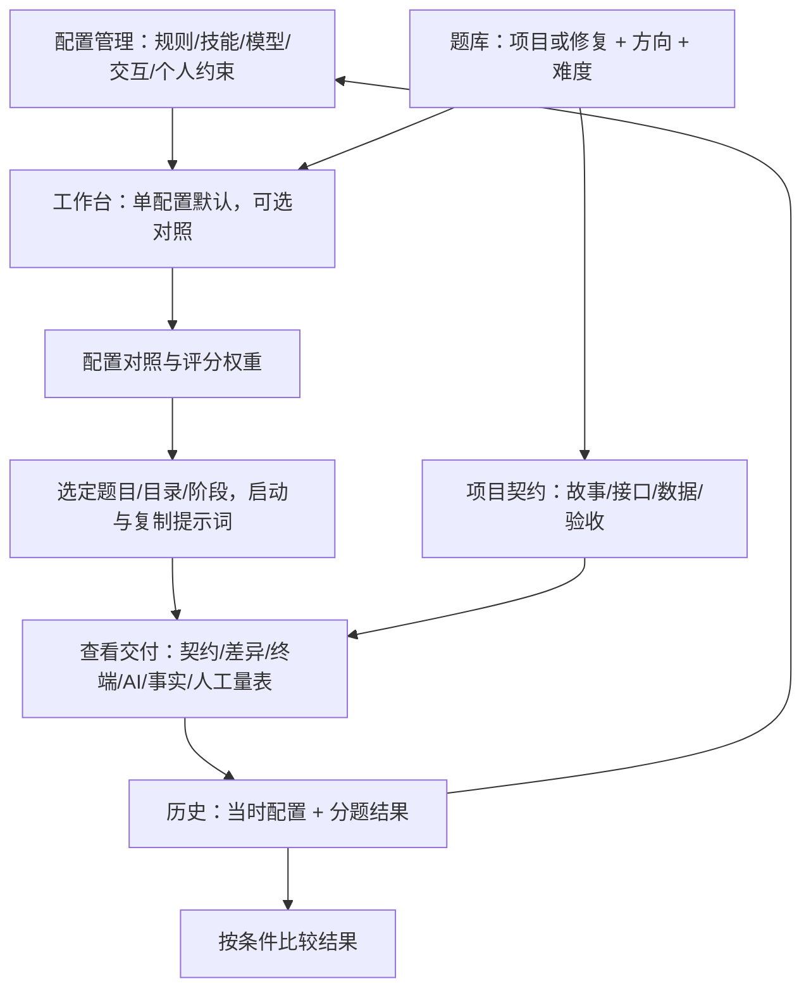

# Gemini 前端对齐审计

首次审计：2026-09-15；当前实现与Gemini新架构补核：2026-09-16。回应 U10：“是否完整理解 Gemini 按用户构想做的前端，而不是沿用之前的架构”。

**结论：此前接入不能称为完整采用了Gemini产品逻辑；本轮已补接固定契约与逐项验收。** 活动界面仍是workbench组件，未伪称直接把原arenaStore的模拟方法改成HTTP就完成整套迁移。契约编辑、筛选、导入、提示词、逐项复审和历史已接；配置矩阵、版本复用、AI意见处理等仍有缺口。

同时，Gemini 原型自身含有模拟执行与互相冲突的评分口径。用户采用它作为前端输入，不表示用户认可这些实现细节。正确依据顺序是用户原话与裁决 → 原型表达的有效流程 → 实际技术能力；所有偏离都需要说明。

## 1. 检查范围与版本

- 用户原文：私有 `.local/sources/2026-09-15.md`，及 requirements.md 中 U01–U11 的有效裁决。完整日记不提交。
- Gemini 输入：`D:/AAAcodex项目/杂/codex-harness-arena`，只读。接收回执 `.local/sources/gemini-frontend-20260915.json`。
- 9月15日首次核对32个接收文件均相同；本轮再次核对31个未变，README由外部更新，并新增ARCHITECTURE.md。源目录只读，变化没有被覆盖。新增文档SHA-256见第8节。
- 本轮起点HEAD：`08fc1d98019d91aa01a9c137565397caba93b973`；此前功能基准759c55f。当前交付版本见交接。
- 检查方式：对照用户问题、原型类型/状态/回调/显示分支、catalog 实际字段，以及当前 React/API/服务/评分器。重点追踪数据和操作流。本轮不是逐像素视觉验收，不声称复现了原型所有屏幕状态。

原型目录与主工程分别属于不同仓库；原型来源仓库不作为本项目上传目标。源码与文档继续交付到用户指定的本项目仓库。

## 2. 原型在表达怎样的完整逻辑

这个结构有四个值得保留的连接：配置与结果连起来；题目契约与验收连起来；阶段与实际文件连起来；单次记录与可复用历史连起来。只保留导航名称和颜色，不能证明这些连接已经完成。

## 3. 功能逐项对照

表中源路径相对 Gemini 输入的 src/；当前路径相对主工程。G 编号用于追踪，不代替路线 B 编号。

|编号|原型意图/源位置|当前真实行为|审计判定与去向|
|---|---|---|---|
|G01|App、ArenaHeader：六个入口|当前 App 有工作台/配置/题库/历史/结果/说明|保留入口；不能据此判定全部页面逻辑对齐|
|G02|ArenaHeader、index.css：浅色/炭黑、字体切换|保留主题与字体基础|已承接；后续视觉减法 B09|
|G03|BenchmarkRunnerView 的 benchMode=single|Prepare 默认一套配置|对齐，继续保留|
|G04|单题焦点、批量可选|Prepare 单题默认，可选批量准备|对齐主线；批量不代发桌面任务|
|G05|TaskBankView：paradigm/channel/difficulty/search|题库与准备页共用三轴+标题/描述/提示词搜索|已接并操作验证；准备度状态仍待补|
|G06|ConfigArenaView：模型与推理可选|真实模型缓存+手动标识，档位枚举|基础可用；缺按模型档位能力提示 B03|
|G07|ConfigArenaView：技能字符串列表|实际技能目录导入与hash冻结|必要技术替换；需补版本可读性 B03|
|G08|CustomConstraint：类别、内容、权重、启停|标题/内容/启停、验收四态与依据|证据已接，类别待B03；私人权重不直接加通用分|
|G09|specialFeatures 如 antiScopeCreep|后端可保存，但当前 UI/装载没有对应功能|语义未完成；迁移为真实规则，不能保留空开关 B03|
|G10|ConfigDiffMatrix：并排字段对照|准备页分段正文和 JSON|缺真正的差异矩阵；B03|
|G11|TaskBankView/ProjectSpecContract：故事/接口/数据/验收/技术|Spec类型、校验、编辑/预览、冻结提示词/历史已接|固定契约链路已验；探索确认与细化结构仍待补|
|G12|fullstackScope 描述项目交付范围|范围枚举已可编辑与阅读，进入提示词|已接；不强制所有题全栈|
|G13|TaskBankView新题表单/私有JSON导入意图|新增版本JSON题包预览、全包校验与事务导入副本|有效/错误题包、幂等与回滚已验|
|G14|multiTurnStages 与 stageAssertionCmd|真实 stages+可选按阶段检查|部分接入；原建议命令未自动执行是正确边界|
|G15|ScoringGuide多轮后需回归前轮|runOnFinal可明确让早期检查在最终快照再次执行|调度/判分合同已测；本轮Docker未运行，新增回归容器实跑待补|
|G16|CodexLauncherModal：工作区/提示词/执行/复审|真实独立目录、桌面打开、手动发送、回收|U08裁决后的必要调整；自定义原地目录另列待审 B04|
|G17|Review 的 spec/diff/terminal/judge/facts/rubric 六种材料|文件/差异/检查/AI/人工基础区块|冻结Spec与条目文件/检查引用已接；逐行定位、AI争议仍待B04|
|G18|故事 passed/partial/failed 与接口验收|五态逐项评价、人工操作说明、文件/检查引用|已接；接口自动操作回执尚无|
|G19|customChecklist/evaluationRubric/rubricScores|旧细则迁移为带来源稳定ID的criteria，原字段保留|已接；旧points不自动叠加计分|
|G20|ScoreFormulaCard：可见公式与试算|当前可调权重，说明页多为文字/JSON|需要分项解释、适用项和试算但不存示例为实分；B02|
|G21|人工细粒度与交付等级|真实0–100小数、新版本、等级|已接条目证据和强制修订理由；旧版本保留|
|G22|AIJudgeReport 引用、事实、双审意见|真实一次CLI辅助审查，验证引用存在|引用链部分完成；AST/DOM/双盲/相对标杆没有实现 B04/B08|
|G23|遥测输入/输出/推理/缓存/速度|实际日志最终累计；部分指标主页面未展示|缺reasoning主显示/校验、时间拆分及故障细类 B06|
|G24|异常类429/额度/上下文/超时/崩溃|人工中断+检查五态+粗粒度日志错误|不能宣称全自动恢复；B05/B06|
|G25|RunHistoryView 显示当时配置与逐题结果|Run完整冻结配置/题目，历史可打开产物|冻结契约/提示词/逐项评分历史已接；完整复用仍待B06|
|G26|历史/配置直接用于新评测的入口|当前可恢复配置副本，缺任意revision浏览与完整历史重建|缺口；B03/B06|
|G27|Leaderboard按模型/题类/模式筛选|同条件分组，避免随机全局榜|调整有依据；完整分维度比较仍缺 B06|
|G28|权重预设、双轨与项目三层评分并存|统一当前arena-review-v1，AI不计分|解决原型冲突；比例是待审产品约定 B02|
|G29|ErrorBoundary 及清空localStorage重置|当前有请求错误，无同等渲染错误边界|B05补保留草稿/记录的错误恢复，不恢复清库动作|
|G30|说明页详述固定场景、个性化和误差|现有说明有边界，其他页面关联不足|需在准备/结果就地显示，且进入模块合同；B08/B09|

## 4. 哪些原型内容不能当真实功能接入

|源码证据|实际行为|处理原则|
|---|---|---|
|services/arenaStore.ts 的 simulateScore（约580行起）|按随机数、技能数量、交互模式生成成绩、时间和Token|删除模拟成绩合理，但不能删掉这些指标的真实来源设计|
|同文件 isHeavy 分支|技能数≥4会被预设扣分、变慢|违反不预判特定技能好坏的用户要求，不迁移|
|HumanReviewModal.tsx 93–159|故事默认passed；测接口仅切布尔值；三个预填层分反填人工项；保存未带完整故事状态|保留逐条验收意图，重新接真实状态/证据/存储|
|CodexLauncherModal.tsx 的 unifiedCommand/autoPipeline脚本|包含未支持的codex harness run、示例API和不可靠CLI参数|按U08正式桌面流程替换；不复制假一键自动化|
|ScoringGuideView.tsx|同时宣传50/50和40/30/30、100%确定、四道抗幻觉墙|拆为明确公式与有限证据能力，不继承宣传承诺|
|ScoreFormulaCard / ManualScoringModal|高分初始值与无结果时的96/92兜底|只能作明确标记的公式演算，不能进入真实记录|
|IQBadge / LeaderboardView|误差徽章、评分阈值和基于配置开关的“纯净”比例|无实测根据不展示真实排名或误差|
|App.tsx handleSelectTaskForRun / handleRerun|部分入口只切换tab/选配置，没有完整带入题目与冻结条件|原型也有未贯通处；目标应补功能，不以原型有bug为由删入口|

原型中有些权重UI仍沿用旧四指标字段，运行公式却已换成新双轨。这需要迁移合同统一，不能让两个表单各自宣称改变了同一个总分。

## 5. 数据保真与行为保真的区别

9月15日的问题是字段保留但活动UI未消费。本轮在保留原型数组内容的同时增加schemaVersion=2、criteria/stage/check稳定ID、导入预览与冻结提示词，旧Run没有批量改写。

当前types/Contracts/Editors/Runner已消费projectSpec/fullstackScope/旧rubric和criteria。服务端准备时统一编排并冻结每轮提示词；ManualReview按完整条目集合提交状态与证据；历史读Run内的旧版本。AI获得完整Task仍只是辅助审查，不代替实际桌面或人工验收。

B01/B02 的完成标准是字段从创建到历史逐项一致，不是“数据库查得到这个JSON”。

## 6. 来源定位摘要

以下为关键文件 SHA-256 前16位，用于避免以后拿另一份原型作为本轮依据；完整32文件回执仅本地保存。

|文件（src/下）|摘要|审计重点|
|---|---|---|
|App.tsx|0f391be5997e0479|页面、选择/复用回调与错误边界|
|types/arena.ts|59fd1e61cef5700b|实体、ProjectSpec、评分/异常/用量|
|services/arenaStore.ts|0a426a45242ebcce|持久化原型、模拟与评分合成|
|services/benchmarkSuites.ts|bd90392aca1d2647|项目/修复题、阶段和验收条目|
|views/BenchmarkRunnerView.tsx|0d1d0aae1079723a|单配置/对比、选题、材料和评分入口|
|views/ConfigArenaView.tsx|ae32776a70065b38|配置、个人约束与起评入口|
|views/TaskBankView.tsx|cbc5550a691bce09|三轴筛选、契约编辑、选题回调|
|views/RunHistoryView.tsx|a54d649800ee918c|历史配置与逐题结果|
|views/LeaderboardView.tsx|5d96286b35cdf497|条件筛选与预设表现|
|views/ScoringGuideView.tsx|3de2267367a48ad7|用户疑问回应与未实现承诺|
|components/HumanReviewModal.tsx|ab58d016e8aca8ea|六类证据、逐项状态及保存缺口|
|components/ConfigDiffMatrix.tsx|e371e628fbde5b1d|配置并排解释|
|components/CodexLauncherModal.tsx|64e062a9bcdf2c7f|手动/自动示例、目录与生命周期|
|components/ManualScoringModal.tsx|335c7b5edc6067c3|细粒度输入与默认分|
|components/ScoreFormulaCard.tsx|a2e349e1da7ceb74|公式与试算|
|components/WeightPresetCustomizer.tsx|e06489685d1aa742|策略选择及旧维度字段|
|components/ArenaHeader.tsx|05b0756d501234f7|导航、主题与字体|
|components/IQBadge.tsx|d738f95036bada88|分数/误差显示|
|index.css|fe9fe5b8ba4c9b0e|视觉与动效基础|

## 7. 对“是否确定理解”的回答边界

现在可以给出有源码依据的产品解释与缺口清单，而不能承诺理解完全无偏差。尤其评分策略、需求探索型项目、外部目录原地验收仍需把提案标清，用户审查意见会进入 requirements 的裁决记录。

本轮不再要求用户凭一句“整体功能做完了”验收。审查对象是上述30项对照、模块合同和 [B01–B10路线](../PROJECT_SPEC.md#8-唯一实施路线与完成标准)。原有验证证明的基础能力保留，遗漏的产品能力按路线补齐。

## 8. Gemini新增ARCHITECTURE第7节的逐项映射

用户U11要求以Gemini新架构核对DDL/5组REST接口并汇报各模块进度。源文件位于只读输入目录根，SHA-256 `e947b14cc517bebbe6b23981598aa3d3f7c0ca6ff7ff65acb1987e30d6fe8394`。本地保存只读附件`.local/sources/gemini-architecture-20260915.md`；不把它覆盖成主工程的唯一路线。根目录ARCHITECTURE是指向本项目合同的入口。

### 数据库合同

Gemini的harness_configs/benchmark_tasks/benchmark_runs/battle_trials四张DDL表覆盖核心概念，但没有完整表达题目/配置revision、独立capture、评分修订、冻结策略和多轮证据。现有records/revisions已经保存这些数据，直接再建四张并让旧代码继续写原表会形成两套真相。本期保留Python + SQLite版本结构，通过明确Task/Run/Trial/Review字段和事务约束落实产品要求；没有宣称原样实现四张表。实际数据合同在DATA_AND_API第2/3/6节。

### 五组接口（历史组包含两个端点）

|Gemini第7节|本项目实际入口（前缀/api/arena）|等价范围与差异|
|---|---|---|
|POST /api/benchmark/spawn|POST /runs/prepare|冻结配置/题目/策略并生成独立目录；不接管任意用户目录|
|POST /api/benchmark/exec|trial/open、start、capture、continue、complete|按U08桌面正式执行；没有CLI自动执行或SSE日志流，不能称协议兼容|
|POST /api/benchmark/diff-facts|trial/capture、check与快照文件GET|真实变更事实与容器检查分开；文件数不直接转换为purity分|
|POST /api/judge/review|trial/judge|真实Harbor CLI辅助复审，标cli-review-only；不会反填人工分|
|GET /api/runs + PATCH rating|GET /state或/runs/{rid} + POST trial/review|版本化历史与评分；新契约附逐项依据、文件/检查引用及必要项结论|

这些是功能映射，不是路由别名。活动前端经workbench/api.ts调用真实后端；Gemini原目录arenaStore仍只读保存，不再参与本项目的业务数据路径。题包另有import-preview/import，详见实际API合同。

### 需要保留或纠正的设计

保留项目契约、逐项验收、多轮最终回归、配置对照和历史产品意图。U08桌面裁决优先于新文档中的CLI自动执行示例。新文档并存50/50与40/30/30评分、“5维”文字与四个数值维度、固定±误差/100%确定性、AST/DOM/双裁判承诺；这些仍不能当作真实已有能力。

本轮实现落实契约与逐项验收，不代表这5组接口的所有示例行为、原型全部界面或AI防误判体系都已完成。各部分当前进度只维护在PROJECT_SPEC第8节，避免再形成与代码不符的“后端全部完成”口径。
